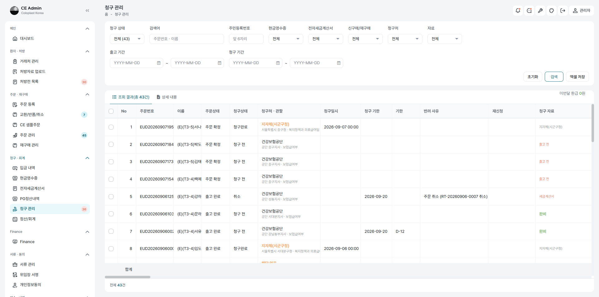
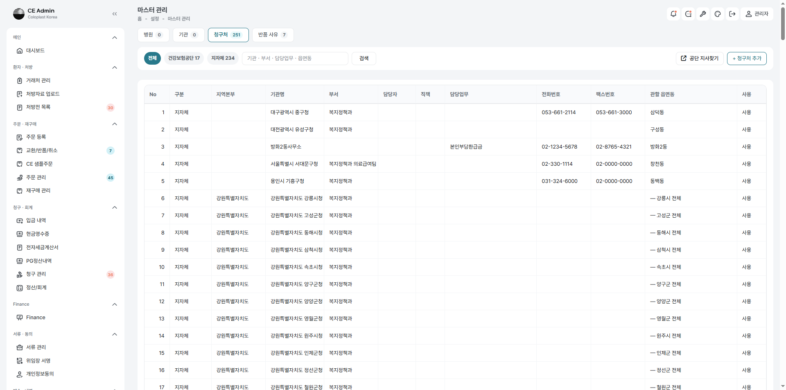
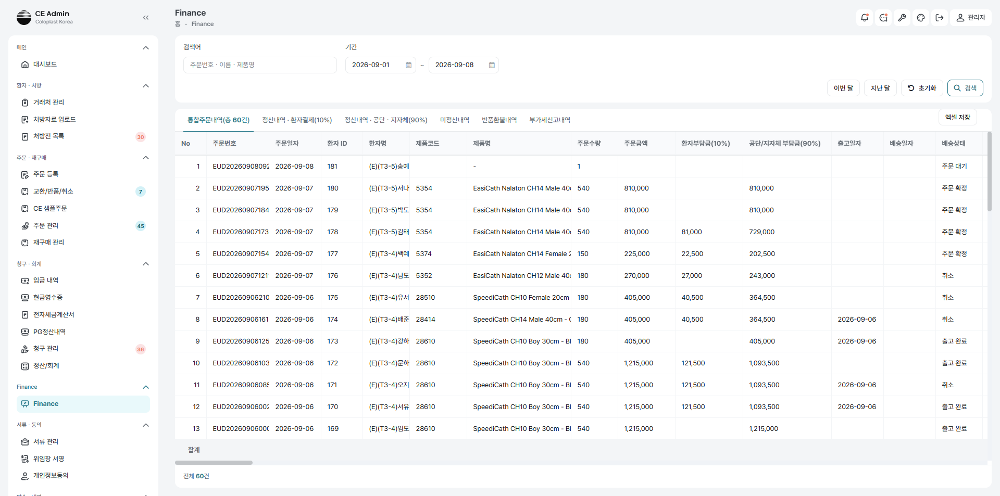
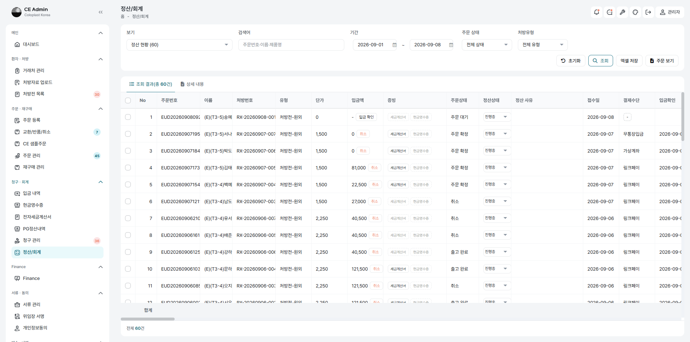
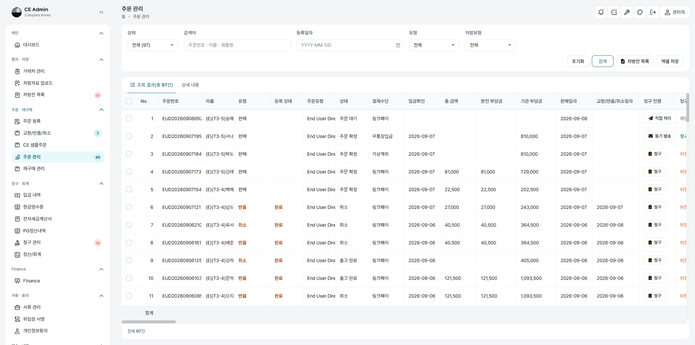
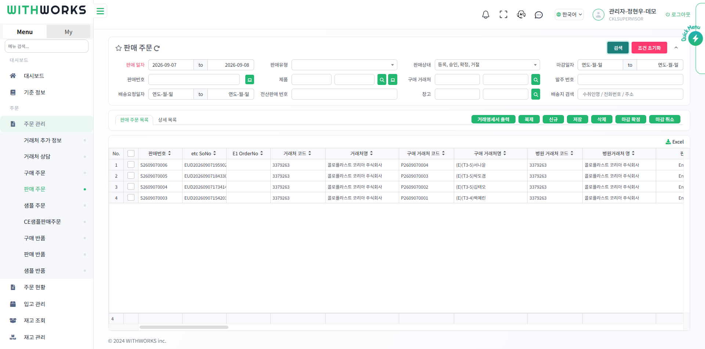

# CE-Admin 주간 보고 — 2026-09-02 ~ 2026-09-08

| 항목 | 내용 |
|---|---|
| 보고일 | 2026-09-08 (화) |
| 대상 기간 | 2026-09-02 ~ 2026-09-08 |
| 작성 | 개발 |

> 09-01 보고([2026-09-01.md](2026-09-01.md)) 이후 추가된 내용만 담았습니다.

---

## 1. 요약

**3차 4회 시험을 열일곱 사람으로 마치고, 5회를 시작했습니다.** 4회까지가 *무엇이
잘못됐는지 찾는 일*이었다면 5회는 *무엇을 어떻게 하는지 보이는 일*입니다. 사람마다
걸음별 기록과 **수행용 엑셀**을 함께 내어, 시험을 해 보지 않은 사람도 그 문서만으로
같은 길을 밟을 수 있게 했습니다. 지금까지 네 사람 중 셋을 완주했습니다.

**자격이 갈리는 자리마다 끊긴 데가 드러났고 모두 고쳤습니다.** 요양비는 자격에 따라
누가 내는지, 어디에 청구하는지, 어떤 증빙을 내는지가 전부 달라집니다. 그런데 그
갈림이 화면 어딘가에서 끊겨 있었습니다 — 돈이 없는 건을 「입금 확인」이라 적고,
지자체로 갈 건이 어디로 갈지 모르고, 받은 방법이 다른 화면 저장에 덮였습니다.

**지자체 청구처를 세웠습니다.** 기초(의료급여)는 공단이 아니라 시·군·구청에 **등기로**
청구하는데, 그 「어디로」가 담당자 머릿속에만 있었습니다. 전국 229곳을 마스터에 넣고
환자 주소에서 관할이 저절로 서게 했습니다.

**위드웍스 연계가 목록까지 이어졌습니다.** 여섯 화면이 판매현황과 같은 항목·같은
차례를 쓰고, 주문 확정이 창고 확정까지 갑니다.

---

## 2. 청구가 자격을 따라 갈라집니다

요양비는 자격이 모든 것을 가릅니다. 그 갈림을 화면 곳곳에서 세웠습니다.

| 자격 | 누가 내나 | 어디에 청구하나 | 어떻게 보내나 |
|---|---|---|---|
| 일반 | 본인 10% / 공단 90% | 건강보험공단 | 공단 사이트에 직접 올림 |
| 차상위경감 | **본인 0%** / 공단 100% | 건강보험공단 | 〃 |
| 기초(의료급여) | **본인 0%** / 지자체 100% | **지자체(시군구청)** | **등기 우편** |
| 산재 · 자동차보험 | **본인 100%** | 해당 없음 | 청구하지 않음 |

**청구처가 자격에서 저절로 나옵니다.** 자격을 「기초」로 고르면 청구처가
「지자체(시군구청)」로 바뀌고 관할 지자체 칸이 서며, 「산재」를 고르면 「해당 없음」이
되고 그 칸이 숨습니다. 담당자가 매번 기억해 고르지 않아도 됩니다.

**공단에 내지 않는 건은 공단으로 팩스를 보내지 않습니다.** 자격이 아니라 유형으로
까닭을 말하도록 문구도 바꿨습니다. 지자체 건에는 지급청구서와 구입확인서를 세웠습니다.

---

## 3. 지자체 청구처 — 어디로 부칠지가 화면에 섭니다

### 왜 필요했나

기초 건은 등기로 보내는데, **어느 시·군·구청 어느 부서로 부칠지**가 어디에도 없었습니다.
청구 관리 목록의 「청구처ㆍ관할」 칸은 공단 지사만 보고 있어서, 관할을 제대로 골라
두어도 지자체 건은 늘 **「관할 미지정」**으로 섰습니다. 등기를 부칠 곳이 바로 그 칸인데
목록을 믿을 수가 없었습니다.

한 겹 더 있었습니다. 청구처 마스터의 관할이 **읍·면·동으로만** 쌓이게 되어 있어
「서울특별시 중구」 한 줄로는 아예 적을 수가 없었습니다. 공단은 한 지사가 여러 동을
나눠 맡으니 그것이 맞지만, **지자체는 시·군·구청 하나가 그 안을 통째로 맡습니다.**

또 하나. 주소 검색(카카오)이 「**서울** 중구 세종대로 110」처럼 시도를 줄여 주는데,
관할을 뽑는 규칙은 「서울**특별시**」 같은 온전한 이름만 받았습니다. 그래서 관할
지자체가 **아무 말 없이 빈칸**이 됐습니다.

### 무엇을 했나

- 관할 읍·면·동을 **비울 수 있게** 했습니다 — 비우면 「그 시군구 전체」입니다
- 찾기가 **시군구로도** 찾습니다 — 주소는 대개 도로명이라 읍면동을 못 뽑는데, 여태
  그때마다 물러나 밖에 물으러 나갔습니다(우리 표에 있는데도)
- 시도 줄임말 표를 서버와 화면 양쪽에 두었습니다
- 청구 관리가 **고른 청구처의 이름**을 씁니다 — 「서울특별시 중구」 →
  **「서울특별시 중구청 · 복지정책과 의료급여팀」**
- 전국 시·군·구 **229곳**을 표 한 벌로 넣었습니다

### 지금 어떤 상태인가

청구처 마스터가 **공단 17 · 지자체 234**입니다. 관할이 「— 강릉시 전체」처럼 서고,
기초 건에서 「중구 전체를 맡는 청구처 1건」으로 찾혀 붙습니다.

**전화·팩스·주소는 아직 비어 있습니다.** 공공데이터에 시군구청 연락처 표준 데이터셋이
없어 한 번은 손으로 모아야 합니다 — 실제로 불러 확인한 결과는 아래 6장에 적었습니다.
표를 다시 넣어도 화면에서 손본 값은 덮지 않습니다.

---

## 4. 돈과 증빙이 사실대로 적힙니다

### 받지 않은 돈을 「입금 확인」이라 적던 것

차상위경감·기초는 본인부담이 0이라 환자에게 받을 것이 없습니다. 결제 안내도 나가지
않고 가상계좌도 발급되지 않습니다. 그런데 확정할 때 「가상계좌으로 **0원 입금
확인**했습니다」라고 적었습니다 — 받지도 않은 돈을 확인했다고 말하는 셈입니다.

하는 일은 그대로 둡니다(이 걸음이 세금계산서·거래명세서·창고 확정을 함께 움직입니다).
**무엇을 한 것인지만 바로 적습니다** → 「본인부담금이 없는 건입니다 — 주문을
확정했습니다」. 거래명세서에 찍히는 날도 그래서 「주문 확정일」입니다.

**연계할 때도 까닭을 보여 줍니다** — 「주문 접수 안내를 보냈습니다. 본인부담금이 없어
결제 안내는 보내지 않았습니다.」 안 보낸 것을 조용히 넘기지 않습니다.

### 받은 방법이 다른 화면 저장에 덮이던 것

결제 방식 칸은 확정 전에는 「무엇으로 안내할 것인가」지만 확정 뒤에는 「무엇으로
받았는가」라 **사실**입니다. 그런데 두 화면이 같은 칸을 뜻 다르게 썼습니다 — 정산에서는
셋(링크페이·가상계좌·무통장입금)을 고르고 상세 목록에서는 둘만 고릅니다.

무통장입금으로 받아 둔 건을 상세 목록에서 열면 고를 수 없는 값이라 **링크페이로
내려앉아 보이고**, 그대로 저장하면 그것이 덮였습니다. 이제 받은 뒤에는 서버가 그 칸을
건드리지 않고, 화면도 받은 대로 읽기만 보여 줍니다. 고치려면 정산/회계에서 입금 확인을
되돌립니다 — 그 자리가 증빙까지 함께 되돌리고, 무엇이 사라지는지 미리 적어 줍니다.

---

## 5. 위드웍스 연계가 목록까지 이어집니다

**여섯 화면이 같은 눈으로 봅니다.** Finance·주문 관리·입금 내역·현금영수증·청구 관리·
교환/반품/취소가 위드웍스 판매현황과 **같은 항목·같은 차례**를 씁니다. 주문 관리 목록은
135칸이고, 출고창고·납품창고를 비롯한 판매현황 값이 함께 섭니다.

**주문 확정이 창고 확정까지 갑니다.** 여태 판매주문은 「등록」으로만 서 있어, 돈이
들어와도 담당자가 위드웍스 화면에 들어가 손으로 확정을 눌러야 출고가 시작됐습니다.
이제 입금 확인(주문 확정)이 창고에 확정을 보냅니다. 재고가 모자라 확정되지 않아도
입금 확인은 되돌리지 않고 까닭만 남깁니다 — 돈은 이미 들어왔습니다.

**창고 값이 연계 즉시 채워집니다.** 여태 저쪽에서 `so.created` 를 한 번도 보내지
않았는데, 부르는 곳이 없었습니다. 이제 판매주문을 세운 그 자리에서 회신이 오고
출고창고·판매현황이 곧바로 섭니다.

**본인부담이 0원이어도 창고 확정은 그대로 갑니다.** 돈을 한 푼도 받지 않은 건에서도
재고가 잡히는 것을 확인했습니다.

---

## 6. 확인·조치가 필요한 사항

### 지자체 청구처의 연락처 — 손으로 한 번 모아야 합니다

공공데이터로 어디까지 되는지 **실제로 API를 불러 확인했습니다.**

| 무엇 | 되나 |
|---|---|
| 읍면동 **주소·우편번호** | **된다** — 행정안전부 「읍면동 하부행정기관 현황」 3,556건 |
| 시군구청 **청사 주소** | 표준 데이터셋 없음 (위 파일은 읍면동 청사입니다) |
| **대표전화** | 전국 단위 없음 — 지자체별 개별 파일에만, 그마저 일부 |
| **팩스·부서명** | 사실상 없음 |

**다만 지자체 청구는 등기 우편이라 팩스가 필요 없습니다.** 필요한 것은 시·군·구
229곳의 주소인데, 한 번 채우면 잘 바뀌지 않습니다. 3,556개를 자동으로 받는 것보다
229개를 손으로 넣는 쪽이 빠릅니다. **누가 언제 채울지 정해 주십시오.**

### 시험 자료가 실재 요양기관번호를 쓰고 있습니다

가상 병원 이름에 **실재하는 요양기관번호**가 붙어 있어, 병원을 고르면 처방전에 적힌
이름과 다른 병원이 들어갑니다. 이번 주에만 세 번 겪었습니다(37100017 → 경북대학교병원,
06351 → 삼성서울병원, 31100767 → 순천향대학교 부천병원).

시스템 결함은 아닙니다 — 번호가 겹치면 청구가 남의 병원으로 가므로 등록을 막는 것이
맞습니다. 다만 **다음 회차 시험 자료는 쓰이지 않는 번호로 만들어야** 합니다.

### 병원 마스터에 같은 번호를 쓰는 줄이 있습니다

31100767 하나에 「순천향대학교 **부속** 부천병원」과 「순천향대학교 부천병원」이 함께
있습니다. 어느 쪽을 골라도 청구가 갈 곳은 같지만, 건마다 다른 줄을 고르면 목록이 두
병원처럼 갈립니다. 조회 목록에 **「같은 번호 2줄 — 마스터 정리 필요」**를 띄우도록
했습니다. **마스터 정리는 담당자 판단이 필요합니다.**

### 검수 승인 권한이 활성 사용자 전원에게 있습니다

검수 요청 알림이 승인 권한자에게 가는데, 지금은 **활성 사용자 열 명 모두**가 승인할 수
있습니다. 권한 정리 방침을 정해 주십시오.

### 위드웍스 쪽에 남은 것

- 판매주문 **확정자 칸이 빕니다** — API로 확정하면 화면 사용자가 없습니다. 우리
  활동 기록에는 남으므로 급하지는 않습니다
- 주소 중복 제거 커밋(`8bcd4a7cc`)이 아직 배포되지 않았습니다

### 시험이 끝나면 되돌릴 것

- 청구처 팩스번호 원복 (`02-0000-0000` → 실제 번호)
- 팝빌 전송 내역 확인·삭제
- 테스트 설정을 운영으로 (웹 화면·문자·팩스·본인확인 시늉)
- **팝빌이 운영 계정이라 증빙 발행이 곧 국세청 신고입니다** — 발행 시늉 스위치 확인

---

## 7. 3차 5회 시험 진행

사람마다 갈래를 하나씩 맡아 접수부터 청구까지 한 바퀴를 돕니다.

| # | 이름 | 갈래 | 결과 |
|---|---|---|---|
| 1 | 김태오 | 일반 10/90 · 링크페이 | **완주** — 기준 한 바퀴 |
| 2 | 박도겸 | 차상위경감 0/100 · 가상계좌 | **완주** — 받을 돈이 없는 한 바퀴 |
| 3 | 서나윤 | 기초 · 지자체 등기 | **완주** — 공단이 아닌 데로 가는 한 바퀴 |
| 4 | 송예린 | 산재 100/0 · **미성년** | 진행 중 |
| 5~8 | 강도원·문채아·신우재·권서현 | 자동차보험·처방외·교환·재구매 | 남음 |

**수행용 엑셀을 함께 냅니다.** 표지·환경설정·테스트시나리오(TC-001~021)·결함관리·
캡처목록 다섯 시트이고, 케이스마다 화면·입력값·누른 단추·**그 단추가 무엇을 시키는지**·
기대 결과·캡처를 적었습니다. 골격은 하나이고 사람마다 다른 값만 낱말표에 두어, 차례를
고치면 여덟 사람 것이 함께 바뀝니다.

**미성년 갈래도 확인했습니다.** 만 9세 건에서 보호자 칸 넷이 서고, 서명은 본인 것이
숨고 **보호자 것만** 뜨며 「이 서명 하나로 위임장의 위임인·법정대리인 두 자리를
채웁니다」라고 알려 줍니다. 본인확인 안내도 「법정대리인(보호자) 휴대폰으로」로 바뀝니다.

**처음 오는 거래처는 자격을 가리지 않고 서명을 받습니다.** 산재처럼 우리가 대신 받을
급여가 없는 갈래에도 받습니다 — 서명 화면이 개인정보 동의도 함께 받고, 자격은 나중에
바뀌기 때문입니다.

---

## 8. 그 밖에 고친 것

| 무엇이 문제였나 | 지금 |
|---|---|
| 생년월일이 **하루 앞서** 보이던 것 | 날짜를 날짜로 내보냅니다. 그대로 저장하면 밀리거나 지워졌습니다 |
| 「동의 서명」이 잠긴 채 **까닭을 말하지 않던 것** | 남은 것을 단추 위에 적습니다 |
| 주민번호로 만든 거래처의 **생년월일이 비던 것** | 저장할 때 주민번호에서 채웁니다 |
| **빈 서명**이 그대로 접수되던 것 | 받지 않습니다 |
| 주문 수량이 **처방 총계를 넘어도** 넘어가던 것 | 저장·연계를 막습니다 |
| 접수 안내와 위임동의가 **한 번도 나가지 않던 것** | 나갑니다 |
| 「우리에게만」 팩스가 **한 번도 나가지 못하던 것** | 나갑니다 |
| 화면에서 고친 발신번호가 **문자에 먹지 않던 것** | 먹습니다 |
| 문자가 못 간 **까닭을 안 알려 주던 것** | 화면에 돌려줍니다 |
| 창고가 실물을 보고 적은 말을 **못 받던 것** | 받아 화면에 세웁니다 |
| 자격이 바뀌어도 **이미 보낸 주문 금액이 그대로이던 것** | 따라갑니다 |
| 일일 도뇨 횟수에 「회」가 붙던 것 | 1~10 · 10 이상 |

앱은 스토어에 낼 수 있게 서명을 마치고 1.2.0으로 올렸습니다. 약관·개인정보 방침·
계정 삭제 안내를 로그인 밖에 세웠습니다.
