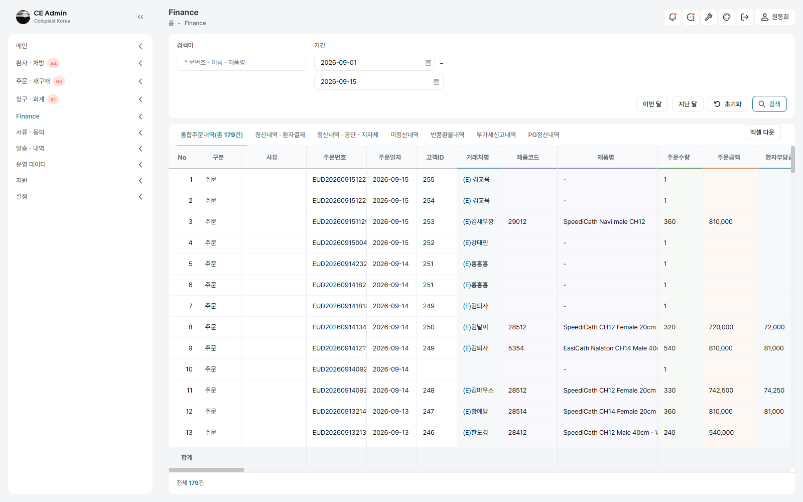
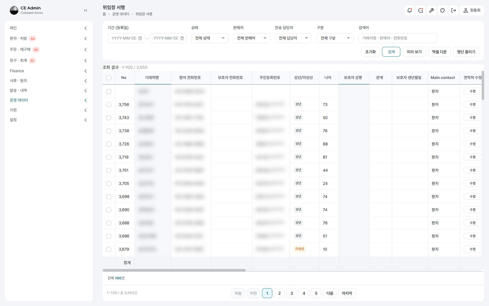
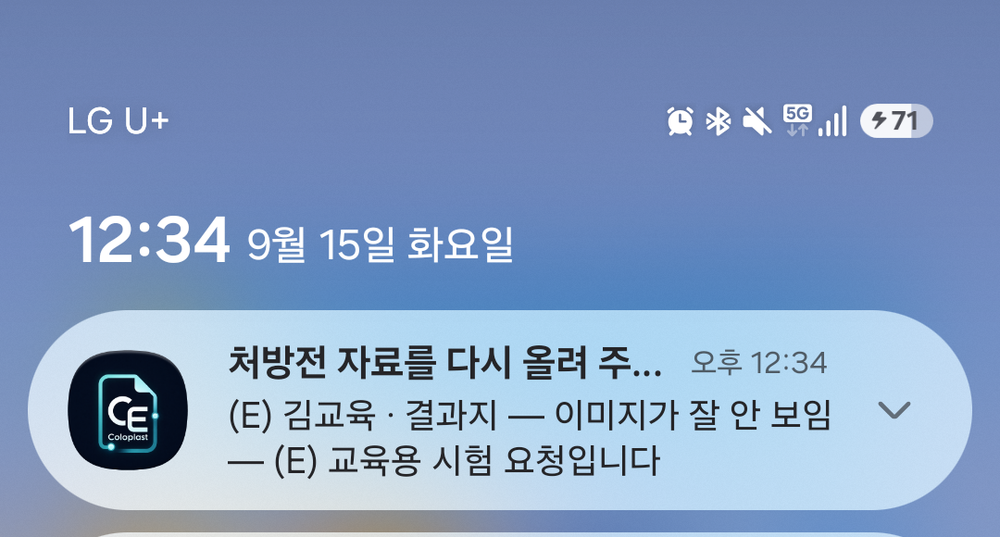
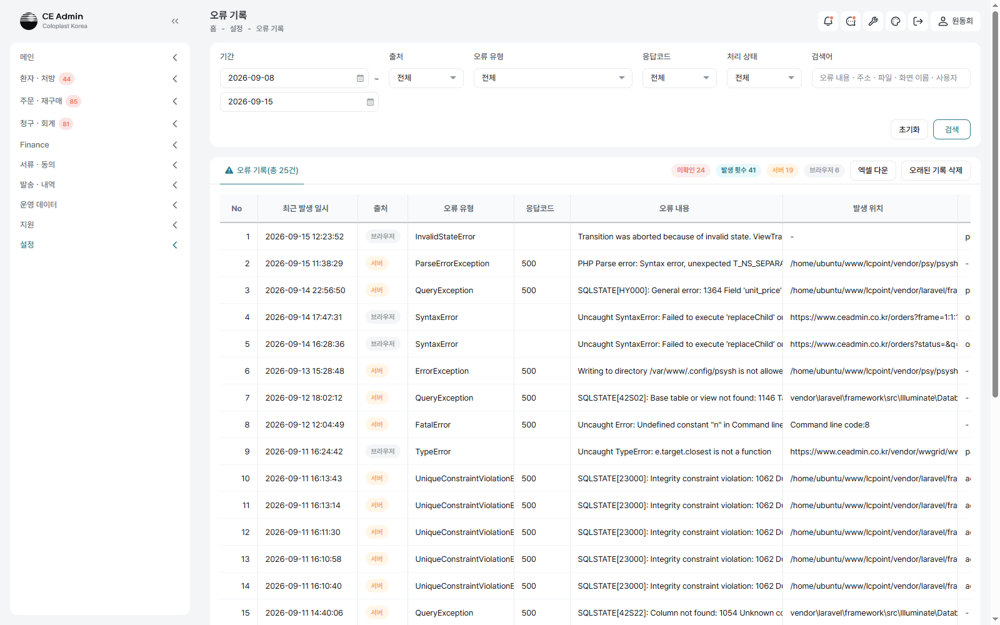

# CE-Admin 주간 보고 — 2026-09-09 ~ 2026-09-15

## 1. 요약

확인요청 두 차례(09-11 · 09-14)를 모두 반영하고, **주문을 창고로 넘긴 뒤에도
고치고 무를 수 있게** 했다. 여태 연계한 주문은 손댈 길이 없어 잘못 나간 건을
창고에 전화로 부탁했다 — 이제 화면에서 정정·취소하고 돈과 증빙까지 함께 맞춘다.

재무 화면은 2026-09-11 엑셀과 칸을 맞췄고, 토스 정산을 받아 PG 수수료·정산액을
화면에서 본다. 위임장 서명은 명단을 엑셀로 올려 한 번에 세운다.

반품·교환·취소 프로세스를 문서로 정리하고 **운영 화면에서 44개 항목 가운데 41개를
직접 밟아 검증**했다. 그 과정에서 운영에 영향을 주는 결함 둘을 찾아 고쳤다.

| 지표 | 값 |
|---|---|
| 기간 | 09-09(화) ~ 09-15(화) · 7일 |
| 커밋 | 360건 |
| 변경 | 767개 파일 · +96,829 / −2,325 |
| 새 파일 | 592개 |
| 반영한 확인요청 | 2차례(09-11 · 09-14) · 60건 이상 |
| 프로세스 검증 | 44개 항목 중 41개 통과 · 결함 2건 수정 |

---

## 2. 개발 — 적용한 업무

### 2-1. 연계한 뒤에도 주문을 정정하고 취소한다

**왜 필요했나** — 주문을 창고로 넘기고 나면 화면에서 할 수 있는 일이 없었다.
수량을 잘못 적었거나 환자가 무르겠다고 하면 창고 담당자에게 따로 연락해
판매주문을 지워 달라고 부탁했고, 그 사이 우리 화면과 창고가 서로 다른 것을
들고 있었다. 받은 돈과 발행한 증빙도 사람이 따로 챙겨야 했다.

**무엇을 했나** — 주문 등록 화면에 ［주문 정정］ ［주문 취소］ 두 단추를 두었다.
**창고가 어디까지 갔느냐가 길을 가른다.**

| 창고 단계 | 정정 | 취소할 때 하는 일 |
|---|---|---|
| 아직 안 넘김 | ○ | 우리 줄만 정리 |
| 출고 신규 | ○ | 위드웍스 판매주문을 그 자리에서 취소·삭제 |
| 할당·피킹 중 | ✕ | 창고에 **취소를 요청**해 두고, 담당자가 되돌리면 저절로 취소된다 |
| 출고 완료 | ✕ | 교환/반품/취소 화면으로 넘어간다 |

돈도 함께 맞춘다. 받은 건은 결제를 무르고, 아직이면 보낸 결제 링크를 해지한다 —
취소한 건의 링크가 살아 있으면 환자가 그 사이에 결제해 버린다.
**증빙은 자동으로 무르지 않는다.** 팝빌이 운영 계정이라 발행 취소가 곧 국세청
실신고여서, 담당자가 「세금계산서 취소」로 직접 무르도록 안내만 띄운다.

정정으로 금액이 바뀌면 결제도 따라 맞춘다 — 받기 전이면 링크를 해지하고 바뀐
금액으로 다시 보내게 하고, 받은 뒤 줄었으면 차액만 부분 환불한다. 늘어난 만큼은
무르지 않고 새 링크로 청구한다.

**지금 상태** — 운영에서 전 갈래를 밟아 확인했다. 할당·피킹이 걸린 건의 취소
요청만 남았다(3-1 참고).

### 2-2. 추가 주문

**왜 필요했나** — 처방 한 건에 주문이 하나뿐이라, 환자가 더 사겠다고 하면
새 처방으로 만들거나 수량을 고쳐야 했다. 둘 다 원래 주문의 자취를 흐린다.

**무엇을 했나** — 원 주문에 딸린 추가 주문을 세운다. 목록에 「주문 구분」 칸이
서서 원 주문과 추가 주문이 갈려 보인다. 배송지·청구처 같은 값은 원 주문과 같게
채워 두고, **결제 링크와 세금계산서는 추가 주문 것을 따로 낸다** — 환자가 받는
청구가 두 건이므로 그 편이 맞춰 보기 쉽다.

### 2-3. 재무 — 토스 정산과 엑셀 정합

**왜 필요했나** — PG 수수료와 정산 입금액을 알려면 토스 화면을 따로 열어야 했다.
재무 여섯 탭의 칸도 2026-09-11 엑셀과 어긋난 자리가 있었다.

**무엇을 했나**

- **PG정산내역을 Finance 탭 안으로** 들이고 토스 화면과 같은 네 갈래(요약·건별·
  일자별·결제수단별)로 나눴다. 환자결제·미정산 탭에는 **PG사 수수료 · 정산금액 ·
  정산일**을 실제 값으로 채운다.
- 엑셀이 노랗게 칠해 「추가 필요」라 한 **14칸**을 넣었다 — NB주민번호(공단이 통장에
  찍는 「NB + 주민번호 앞 여섯 자리」), 주문상태, 입금자명 등.
- 회색으로 칠해 「숨김」이라 한 칸을 탭마다 감췄다(59·71·69·68·58·77칸).
- 엑셀 받기를 진짜 통합문서(.xlsx)로 바꿨다.

### 2-4. 위임장 서명 — 명단 올리기와 보호자

**왜 필요했나** — 위임이 필요한 사람을 한 명씩 손으로 세웠다. 수십 명이면 그만큼
반복이고, 주민등록번호·보호자 정보는 엑셀에만 있었다.

**무엇을 했나** — ［명단 올리기］로 엑셀을 그대로 올린다. 이름과 전화번호가 같으면
기존 줄을 갱신하고 받아 둔 서명과 발송 이력은 그대로 둔다. 주민등록번호에서
**성년·미성년을 스스로 갈라** 표시하고, 미성년이면 서명 링크에 **보호자 서명
영역**이 선다 — 주문 등록의 위임장 서명과 같은 모습이다.

### 2-5. 파일 검수 — 밝기·명암이 끝까지 간다

**왜 필요했나** — 처방전을 밝게 맞춰도 그것은 화면에서만이었다. 공단에 나가는
팩스와 만들어 둔 PDF는 원본 그대로여서, 공단이 흐리다고 되돌려 보내는 일이 있었다.

**무엇을 했나** — 검수 창에서 맞춘 밝기·명암이 **팩스통합본과 PDF에도 그대로**
들어간다. 이미 만들어 둔 PDF가 있으면 그 자리에서 다시 만든다. PDF로 올라온
자료에도 같은 도구를 쓸 수 있다.

### 2-6. 앱과 운영 관리

- **자료 다시 올리기 요청** — 잘못 올라온 처방전을 올린 사람이 앱에서 스스로 고친다.
  검수가 끝난 건은 잠긴다.
- **운영 오류 기록** — 화면에서 난 오류를 모아 보고, SupportWorks로 보낸다.
- **웹훅 관리** 화면을 두어 주고받은 것을 확인한다.
- 모바일 앱 1.3.1(빌드 8) — iOS 알림 토큰 등록, 서류 유형을 서버 목록으로 채움.

### 2-7. 화면 글과 알림 정리

- 화면에 나가는 말을 **표준 사무 용어**로 맞췄다(세우다→생성, 알리다→전송,
  무르다→취소·환불, 적다→입력·저장, 자취→이력 등 31개 파일 91곳).
- **단추 한 번에 알림 한 장.** ［주문 정정］ 한 번에 알림이 넉 장씩 쌓이던 것을
  한 장에 줄로 모았다. 색은 그 가운데 가장 센 갈래를 따르므로 성공 알림에 밀려
  경고가 사라지지 않는다.

---

## 3. 확인·결정이 필요한 사항

### 3-1. 위드웍스 — 창고 담당자 도움이 필요한 시험 1건

할당·피킹이 걸린 주문의 취소 요청(`so_cancel_request` → `eud_cancel_yn = 'Y'`)을
확인하려면 그 상태의 주문이 있어야 하는데, 운영에 한 건도 없다.
**S2609080002 / 출고 SH2609080002** 를 대상으로 잡아 두었다 —
창고에서 지정 피킹으로 할당만 걸어 주시면 그 뒤를 바로 확인한다.

### 3-2. 위드웍스 — 판매상태 고르개에 취소(99)가 없다

우리가 취소한 판매주문은 저쪽 판매 주문 화면에서 **조회할 길이 없다**.
판매상태 고르개가 등록·승인·확정·거절 넷뿐이라 취소된 건이 목록에서 사라진다.
저쪽 화면 수정이 필요하다.

### 3-3. 승인 권한 없는 계정이 필요하다

교환·반품의 검수 확정·전자 승인은 승인 권한으로 막혀 있는데, 지금 등록된 14명이
**모두 승인 권한을 갖고 있어** 막히는 것을 확인할 계정이 없다.
권한 없는 시험 계정을 하나 만들어도 될지 결정이 필요하다.

### 3-4. 재무 엑셀 — 칠을 지워 둔 15칸

2026-09-11 엑셀에 회색도 노랑도 아닌, **칠을 아예 지운 칸**이 여섯 시트 공통으로
열다섯 있다(결제일·관할 지자체·구분(SB/SCI)·등록 일시·등록자·마지막 확정 수량·
병원명·보호자명·수정 일시·수정자·신구매/재구매·인마켓 마감일·처방 유형·
처방전 발행일·환급해당기관). 뜻을 정할 수 없어 **그대로 보이게 두었다.**
숨겨야 한다면 알려 주시면 바로 반영한다.

### 3-5. M2 일정

10월 1일 CE Admin Pilot Launch 기준으로 M2 항목별 타임라인을 정리해
`일정표_milestone/UNICORN_milestone_20260915_v4_작성지시.md` 에 담아 두었다.
M3·M4 날짜와 CE Admin Sprint 3-4 공식 종료 확인이 필요하다.

---

## 4. 이번 주 검증 — 반품·교환·취소 프로세스

프로세스를 문서로 정리하고 운영 화면(ceadmin.co.kr)과 창고 화면(demoworks.co.kr)에서
**44개 항목 가운데 41개를 직접 밟았다.** 팝빌은 발행 시뮬레이션, 토스는 시험 환경으로
두고 진행했다.

**확인한 것** — 여섯 갈래(고객 변심 교환·불량 교환·반품 및 환불·불량 반품·
출고 전 취소·자격 변경) 전부 완주. 단계 수와 담당자, 승인 주체가 절차서와 같다.
승인 게이트(흐름 건너뛰기 차단·승인 대기 묶음·일괄 승인·승인 자취), 환불(세 수단·
현금영수증 네 갈래·원 주문 취소 조건), 금액조정(0원 거절·조정 주문 생성),
마이너스 발행(전량 취소·부분 보류·발행 불포함 사유), 기한(입고 +2/+3 영업일).

**고친 결함 둘**

| 결함 | 내용 |
|---|---|
| 부분 교환이 금액조정에서 멈춤 | 흐름에는 단계가 있는데 **금액 입력 칸이 화면에 없었다.** 「마이너스 발행」 카드가 환불완료 단계에 걸려 있는데 교환 흐름에는 그 단계가 아예 없어서다. 부분 반품은 환불완료를 지나므로 드러나지 않았다 |
| 정정해도 결제를 맞추지 않음 | 2026-09-14 지시가 **한 번도 돌지 않고 있었다.** ［주문 정정］이 보내는 세 요청 가운데 첫 요청이 주문 금액을 먼저 맞춰 버려, 정정이 읽는 「정정 전 금액」이 이미 새 값이었다. 기준을 **실제로 오간 돈**(받은 금액 · 보낸 링크 금액)으로 바꿔 고쳤다 |

**바로잡은 문서** — 위드웍스 판매유형 실제값은 1501(판매) · 1504(취소) ·
1505(반품) · 1506(교환) · 1092(금액조정)다. 창고에 안 넘긴 주문은 화면에 취소
단추가 없고 ［삭제］로 지운다.

프로세스 문서 · 검증 결과 : https://claude.ai/code/artifact/b738a4a5-d5ee-4551-8573-c7125674e6af
상세 기록 : `테스트/통합테스트/테스트 시나리오 엑셀/2026-09-15/문제와 해결.txt`

---

## 5. 다음 주 계획

- 통합테스트 2026-09-15 회차(CASE-52 ~ 68 · 17건) 완주 — 처방외·산재·자동차보험·
  교환·반품·취소·창고 출고 전 정정/취소를 100% 브라우저로
- 남은 검증 3건 — 창고 할당 건 취소 요청, 승인 권한 거절, 요청 중 재클릭 차단
- SSO — OpenID Connect 전환에 따른 URS/FRS 갱신, 운영 정보 수령
- 10월 1일 Pilot Launch 기준 잔여 항목 점검
