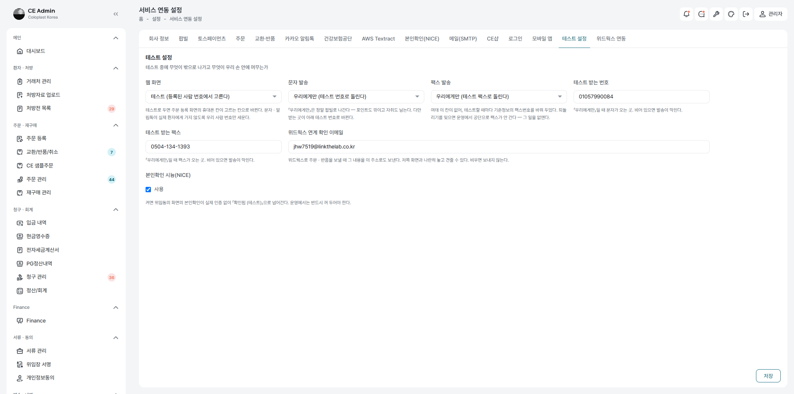
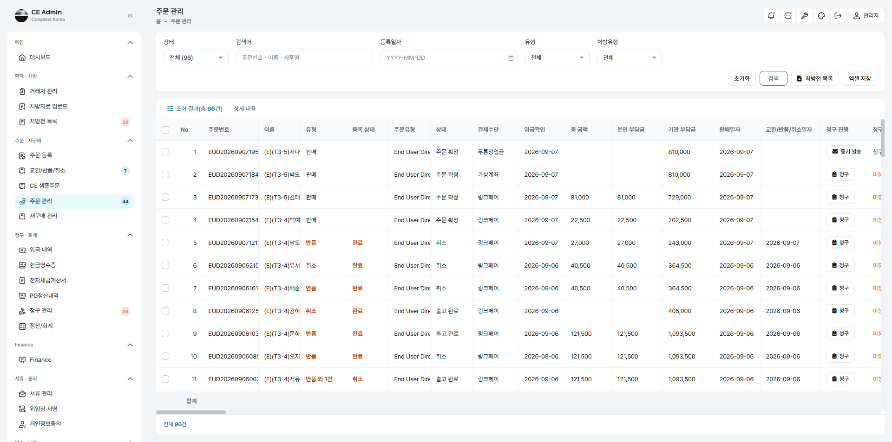
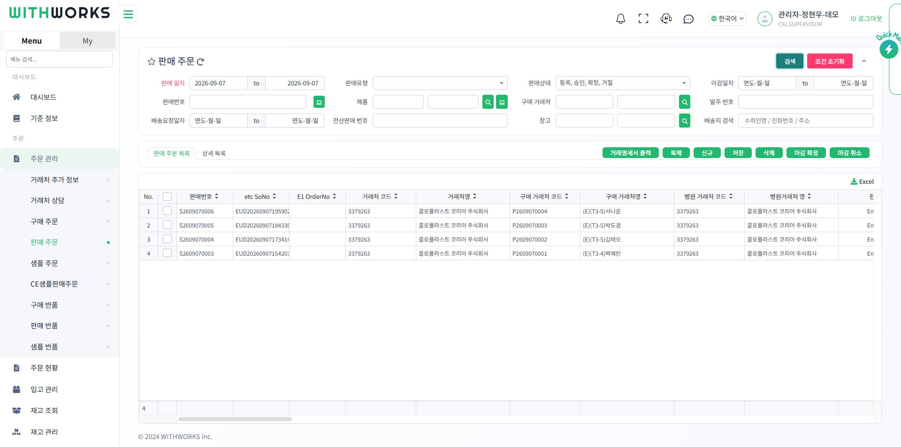
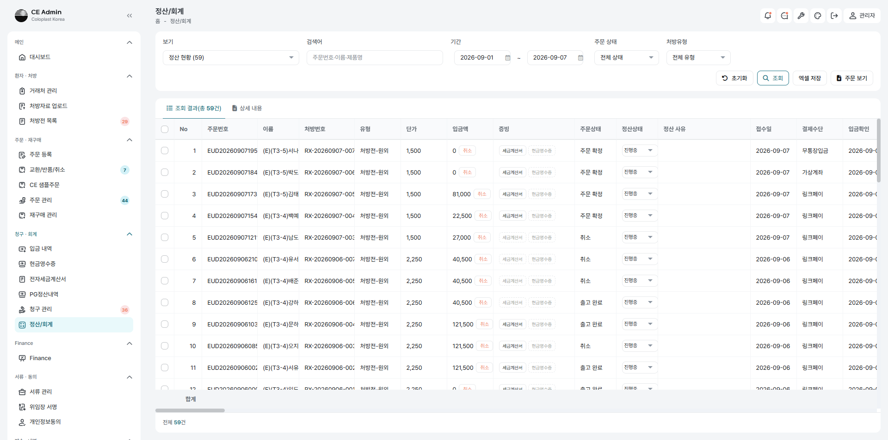
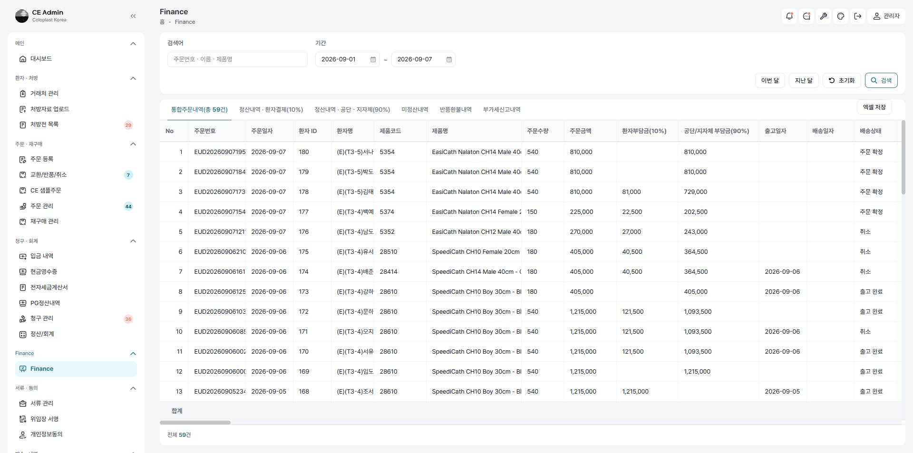
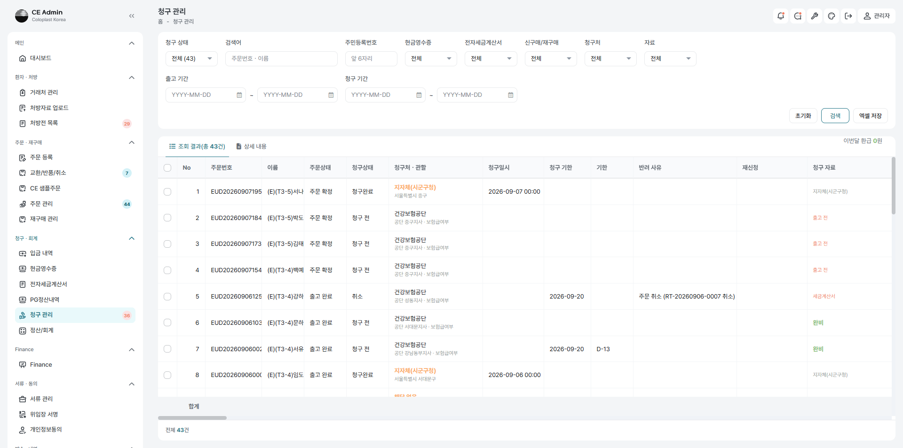
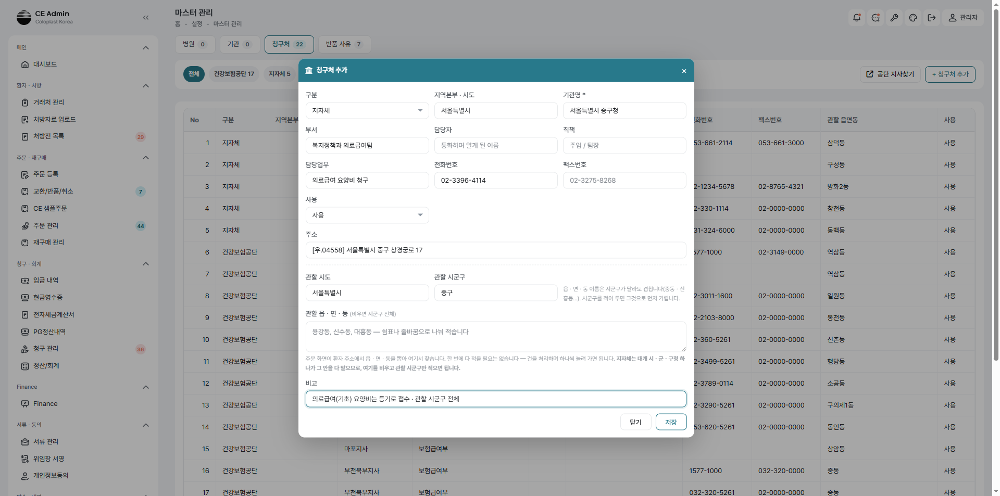
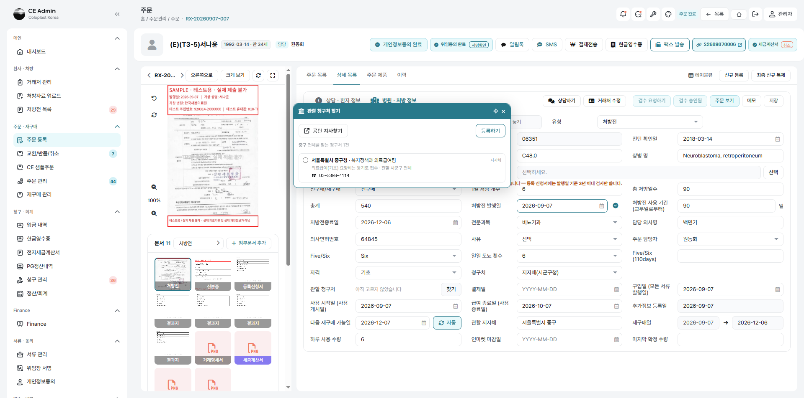
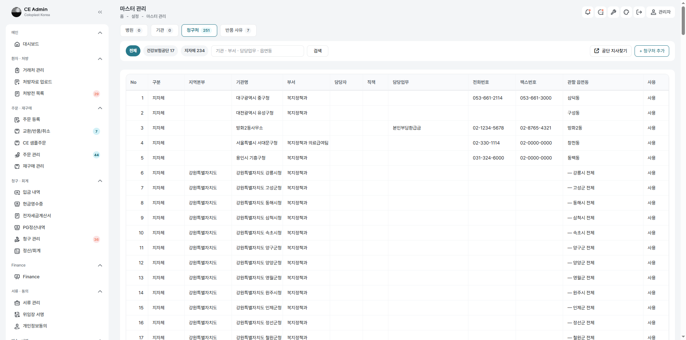

# CE Admin 주간보고 — 2026년 36주차 (09-01 ~ 09-07)

| | |
|---|---|
| 대상 | CE Admin (ceadmin.co.kr) · 위드웍스 WMS (demoworks.co.kr) |
| 커밋 | **215건** · 1,974개 파일 · +24,460 / −3,189줄 |
| 배포 | 운영(3.34.53.36 · `~/www/lcpoint`)에 수시 반영 |
| 작성 | 2026-09-07 |

---

## 한 줄로

**3차 4회를 열일곱 사람으로 마치고, 「보여 줄 수 있는 시험」인 5회를 시작해 세 사람을
완주했다.** 4회까지가 *무엇이 잘못됐는지 찾는 일*이었다면 5회는 *무엇을 어떻게 하는지
보이는 일*이다. 그 과정에서 **자격이 갈리는 자리마다 끊긴 데가 드러났고 모두 고쳤다.**

---

## 1. 이번 주에 한 일

### 1.1 3차 4회 마무리 — 열일곱 사람

16번 남도윤(미성년) · 17번 백예린(회귀)을 끝으로 **열일곱 사람을 모두 밟았다.**
미성년 갈래에서 나온 것이 특히 많았다.

| 고친 것 | 무엇이 문제였나 |
|---|---|
| 미성년 보호자 칸 | 거래처 화면에 아예 없어 서명으로 들어온 보호자가 남지 않았다 |
| 미성년 서명 | 본인·보호자 두 번 받던 것을 **하나로** |
| 거래처 상세 500 | `guardian_birth_date` 가 casts 에 없었다 |
| 결제 방식 자리 | 병원ㆍ처방 정보 → **상담ㆍ환자 정보**로 옮김 (처방전 없이도 사는 길이 있다) |
| 검수 요청 알림 | 승인 권한자에게 알림·채팅으로 간다 (요청한 사람은 뺀다) |
| 담당자 배정 | 목록에서 골라 한꺼번에 배정 · 남의 건을 열면 알려 준다 |

### 1.2 시험 설정과 발송 — 밖으로 나가는 것을 붙잡았다

운영 계정으로 시험하는 자리라 **무엇이 정말 밖으로 나가는가**를 가리는 일이 컸다.

| 고친 것 | 무엇이 문제였나 |
|---|---|
| 「우리에게만」 팩스 | **한 번도 나가지 못했다** — 수신자가 객체인데 문자열을 돌려주고 있었다 |
| 화면 발신번호 | `config` 가 env 를 먼저 읽어 화면에서 바꿔도 안 먹었다 |
| 테스트 받는 번호 | 두 화면에 흩어져 서로 덮었다 → **한 화면에서만** 고친다 |
| 문자 실패 까닭 | 「0건 발송, 1건 실패」만 뜨고 왜인지 안 알려 줬다 |
| 「문자 시뮬레이션」 | 아무 일도 하지 않는 스위치라 걷어냈다 |

**지금 켜 둔 상태** — 웹 화면 **테스트** · 문자·팩스 **우리에게만** · 받는 번호
`010-5799-0084` · 받는 팩스 `0504-134-1393` · 본인확인 시늉 **켬**.



### 1.3 위드웍스 연계 — 목록을 같은 눈으로 본다

Finance·주문 관리·입금 내역·현금영수증·청구 관리·교환/반품/취소 **여섯 화면**이
위드웍스 판매현황과 **같은 항목·같은 차례**를 쓰게 했다(`ceWwCols()`).

- 주문 관리 목록 **135칸** — 출고창고·납품창고·판매현황 값이 함께 선다
- 창고·판매현황 값은 `so.created` 웹훅으로 **연계 즉시** 채워진다
- 입금 확인(주문 확정)이 `so_confirm` 으로 **창고 확정까지** 보낸다





### 1.4 3차 5회 — 보여 줄 수 있는 시험

**목적이 다르다.** 4회는 결함을 찾는 일이었고, 5회는 **밟은 자취를 남기는 일**이다.
사람마다 `기록.md`(걸음마다 화면·값·단추·트리거)와 **수행용 엑셀**을 함께 낸다.

| # | 이름 | 갈래 | 결과 |
|---|---|---|---|
| 1 | 김태오 | 일반 10/90 · 링크페이 | **완주** — 기준 한 바퀴 |
| 2 | 박도겸 | 차상위경감 0/100 · 가상계좌 | **완주** — 받을 돈이 없는 한 바퀴 |
| 3 | 서나윤 | **기초 · 지자체 등기** | **완주** — 공단이 아닌 데로 가는 한 바퀴 |
| 4~8 | 송예린·강도원·문채아·신우재·권서현 | 산재·자동차보험·처방외·교환·재구매 | 남음 |



**시나리오 엑셀**은 사람마다 다시 쓰지 않는다. 골격(케이스 차례·트리거 설명·서식)은
하나이고 사람마다 다른 값만 낱말표에 둔다.

```
python 테스트/테스트3차/5회/_계획/시나리오엑셀_생성.py 서나윤
```

시트 다섯 — 표지 · 환경설정 · 테스트시나리오(**TC-001~021**) · 결함관리 · 캡처목록.
세 시트가 모두 **TC 차례**로 서서 나란히 짚어 갈 수 있다.

---

## 2. 이번 주에 고친 결함

### 2.1 돈이 없는 건을 「입금 확인」이라 적고 있었다

차상위경감·기초는 본인부담이 0이라 받을 것이 없다. 그런데 「가상계좌으로 **0원 입금
확인**했습니다」라고 적었다 — 받지도 않은 돈을 확인했다고 말하는 셈이다.

하는 일은 그대로 둔다(이 걸음이 세금계산서·거래명세서·창고 확정을 함께 움직인다).
**무엇을 한 것인지만 바로 적는다** → 「본인부담금이 없는 건입니다 — 주문을 확정했습니다」

Finance 에서 세 사람이 나란히 보인다 — **환자부담금 칸이 김태오(81,000)에만 있고
박도겸·서나윤은 비어 있다.** 갈래가 그대로 금액으로 갈린다.



### 2.2 지자체로 갈 건이 어디로 갈지 모르고 있었다 — **서나윤이 드러냄**

기초(의료급여)는 공단이 아니라 **지자체에 등기로** 청구한다. 그 「어디로」가 두 군데에서
끊겨 있었다.

| | 무엇이 문제였나 | 고친 것 |
|---|---|---|
| (가) | 주소 검색이 「**서울** 중구 …」로 시도를 줄여 주는데 관할 추출 규칙은 「서울**특별시**」만 받았다. **관할 지자체가 조용히 빈칸**이 됐다 | 시도 줄임말 표를 서버·화면 양쪽에 둠 |
| (나) | 청구 관리의 「청구처ㆍ관할」이 **공단 지사 마스터만** 봤다. 지자체는 임자가 없어 늘 「관할 미지정」 | 지자체 건은 `local_gov` 를 보여 줌 |

**등기를 어디로 부칠지가 바로 그 칸이라 목록을 믿을 수 없었다.** 배포 뒤 확인했다.



### 2.3 거래처 수정 창의 생년월일이 하루 앞섰다

창을 열면 `1992-03-13T15:00:00.000000Z` 가 그대로 보였다. 날짜 칸은 시각 붙은 값을
받지 못하고 **UTC라 하루가 앞선다.** 그대로 저장하면 생년월일이 밀리거나 지워진다.
보호자 칸에서 먼저 겪고 고쳐 둔 일인데 **본인 칸에는 손을 대지 않고 있었다.**

### 2.4 그 밖에

| 고친 것 | 무엇이 문제였나 |
|---|---|
| 주민번호 → 생년월일 | ［신규］로 만든 거래처의 생년월일이 비었다 (팝업이 안 보내고 서버도 안 뽑았다) |
| `so.created` 웹훅 | 저쪽에서 **한 번도 오지 않았다** — 부르는 곳이 없었다 |
| 창고·판매현황 값 | `validated()` 가 규칙에 없는 칸을 **조용히 버렸다** (Lot 때 겪은 것이 되풀이) |
| 일일 도뇨 횟수 | 「회」를 떼고 1~10·10 이상으로 |
| 처방전 없는 주문 | 처방전을 지운 뒤 더블클릭이 막혔다 → 빈 초안을 만들어 연다 |

---

## 3. 아직 남은 것

| | 무엇 | 어떻게 |
|---|---|---|
| ⚠️ | **결제수단 고른 직후 목록이 옛 상태로 보인다** | 그 줄만 다시 그리면 된다. 「확정이 안 됐다」고 오해하기 쉽다 |
| ⚠️ | **등기 발송을 마쳐도 「청구 준비」가 미비** | 청구 준비 판정이 공단 기준이라 지자체 건은 늘 미비로 읽힌다 |
| ⚠️ | 위드웍스 판매주문 **확정자가 빈다** | API 확정이라 화면 사용자가 없다. 저쪽 보완 필요 (급하지 않음) |
| | 검수 승인 권한이 **활성 사용자 열 명 전원** | 권한 정리는 향후 논의 |
| | 위드웍스 미배포 커밋 `8bcd4a7cc` | 주소 line_1/line_3 중복 제거 |
| | 시험 자료가 **실재 요양기관번호**를 빌려 씀 | 박도겸(37100017)·서나윤(06351) 두 번. 다음 회차 자료는 미사용 번호로 |

### 지자체 청구처 마스터 — **이번 주에 세웠다**

관할이 「서울특별시 중구」라는 글자 하나뿐이라 등기를 어디로 부칠지는 담당자가 매번
찾아야 했다. **끊긴 자리가 하나 더 있었다** — 청구처 마스터의 관할이 읍ㆍ면ㆍ동으로만
쌓이게 되어 있어, 「서울특별시 중구」 한 줄로는 아예 적을 수가 없었다. 공단은 한 지사가
여러 동을 나눠 맡아 그것이 맞지만, **지자체는 시ㆍ군ㆍ구청 하나가 그 안을 통째로 맡는다.**

| 고친 것 | |
|---|---|
| 관할 읍ㆍ면ㆍ동을 **비울 수 있게** | 비우면 「그 시군구 전체」다 |
| 찾기가 **시군구로도** 찾게 | 주소는 대개 도로명이라 읍면동을 못 뽑는다. 여태 그때마다 물러나 밖에 물으러 나갔다 — 우리 표에 있는데도 |
| 청구 관리가 **고른 청구처의 이름**을 쓰게 | 「서울특별시 중구」 → **「서울특별시 중구청 · 복지정책과 의료급여팀」** |
| 표 한 벌로 넣는 명령 | `billing-offices:seed-local` — 이백스물아홉 곳을 한 번에 |






**전국 229곳을 넣었다** — 청구처 마스터가 공단 17 · **지자체 234**가 되었다.



> **짝짓기에서 하마터면 크게 틀릴 뻔했다.** 처음에는 시도를 느슨하게 보아 열 곳이
> 엉뚱하게 겹쳤다 — 「중구」는 서울ㆍ부산ㆍ대구ㆍ인천ㆍ울산에 다 있고 동ㆍ서ㆍ남ㆍ북구도
> 그렇다. **부산 사람 서류가 대구로 갈 뻔했다.** 시도까지 꼭 맞아야 같은 곳으로 본다.

**전화ㆍ팩스ㆍ주소는 아직 비어 있다.** 공공데이터에 시군구청 연락처 표준 데이터셋이 없어
한 번은 손으로 모아야 한다. 다만 명령이 **빈 칸만 채우므로**, 나중에 채운 표를 다시
넣어도 화면에서 손본 것을 덮지 않는다.

```
php artisan billing-offices:seed-local database/data/local_billing_offices.csv --dry
```

### 공공데이터로는 어디까지 되나 — 실제로 불러 확인했다

지금은 관할이 **「서울특별시 중구」라는 글자 하나**뿐이라, 등기를 어디로 부칠지는
담당자가 매번 찾아야 한다.

공공데이터로 어디까지 되는지 **실제로 불러 확인했다.**

| 무엇 | 되나 |
|---|---|
| 읍면동 **주소·우편번호** | **된다** — 행정안전부 「읍면동 하부행정기관 현황」 3,556건 |
| 시군구청 **청사 주소** | 표준 데이터셋 없음 (위 파일은 읍면동 청사다) |
| **대표전화** | 전국 단위 없음 — 지자체별 개별 파일에만 |
| **팩스·부서명** | 사실상 없음 |

**그런데 지자체 청구는 등기 우편이라 팩스가 필요 없다.** 필요한 것은 시군구 **226건**의
주소인데, 그건 한 번 채우면 잘 바뀌지 않는다. 3,556개를 자동으로 받는 것보다 226개를
손으로 넣는 쪽이 빠르다.

→ 이미 있는 **`billing_offices`**(공단 지사 마스터)에 지자체 갈래를 더하고,
`local_gov` 로 그 표를 찾아 **등기 주소가 자동으로 서게** 한다.

---

## 4. 다음 주

1. 5회 남은 **다섯 사람** — 송예린(산재·미성년) · 강도원(자동차보험·미성년) ·
   문채아(처방외·미성년) · 신우재(교환 9.x) · 권서현(재구매·재등록)
2. **지자체 청구처의 전화ㆍ팩스ㆍ주소 채우기** — 틀은 세웠고 값만 남았다
3. 위 「아직 남은 것」의 ⚠️ 셋
4. 5회가 끝나면 **파워포인트 자료**로 옮긴다 (사람마다 기록.md 가 그대로 슬라이드가 된다)

---

## 붙임 — 시험 종료 시 되돌릴 것

- 청구처 팩스번호 원복 (`02-0000-0000` → 실제 번호)
- 팝빌 전송 내역 확인·삭제
- 테스트 설정을 **운영**으로 (웹 화면·문자·팩스·본인확인 시늉)
- `POPBILL_ISSUE_SIMULATE` 확인 — **팝빌이 운영 계정이라 발행이 곧 국세청 신고다**
