# CE Admin 테스트 시나리오 (상세)

> 케이스마다 **화면 → 입력 항목 → 누를 단추 → 누른 뒤 확인할 것** 차례로 적었습니다.
> 「확인」이 모두 맞으면 그 케이스는 통과입니다.

- **대상** ceadmin.co.kr
- **작성** 2026-09-03 · **고침** 2026-09-09 (신분증 갈래 — 3.4.1 · 3.6 · 4.2.2)
  · 2026-09-07 (테스트 설정 · 담당자 배정 · 미성년 · 판매현황 칸)
- **바탕** 테스트 시나리오.txt · Unicorn 요청서(2026-09-01 · 09-02)
- **화면 캡처** `시나리오_화면/`
- **2차 시험 경과** `테스트2차/진행_경과.md`
- **3차 2회 경과** `테스트3차/2회/진행_경과.md` · 결함 `테스트3차/2회/_계획/고친것과에러.md`
  · 창고 절차 `테스트3차/2회/_계획/위드웍스_출고_절차.md` · 환자별 자취 `테스트3차/2회/{이름}/정리.md`
- **3차 3회 계획** `테스트3차/3회/_계획/시험표.md` · 문제와 해결 `테스트3차/3회/_계획/문제와해결.md`
  · 환자별 자취 `테스트3차/3회/{번호}_{이름}/정리.md`

> **2차(2026-09-03 ~ 09-04)와 3차 2회(2026-09-04 ~ 09-05)에서 고친 것이
> 이 문서에 반영돼 있습니다.**
> 실제로 밟아 보고 알게 된 자리(위드웍스 화면 이름·단추, 빠져 있던 검수 승인 단계,
> 시나리오 문구가 구현과 달랐던 곳)를 그때그때 고쳐 적었습니다.
> 2차에서 결함 14건, 3차 2회에서 **CE 12건ㆍ위드웍스 4건**,
> 3차 3회에서 **CE 6건**을 더 찾아 고쳤습니다.
> 환경 때문에 못 한 케이스는 각 자리에 표시했습니다.

---

## 목차

| 장 | 이름 | 케이스 |
|---|---|---|
| 00 | 전제조건과 스위치 | 준비 |
| 01 | 처방자료 업로드 | 1.1 – 1.6 |
| 02 | 주문 목록과 상세 목록 저장 | 2.0 – 2.8 |
| 03 | 동의 — 개인정보ㆍ위임ㆍ신분증 | 3.1 – 3.6 |
| 04 | 공단 팩스 | 4.1 – 4.6 |
| 05 | 주문 제품과 연계 | 5.1 – 5.9 |
| 06 | 결제 안내 | 6.1 – 6.5 |
| 07 | 입금과 자동 처리 | 7.1 – 7.8 |
| 08 | 창고 상태 흐름 | 8.1 – 8.6 |
| 09 | 교환ㆍ반품ㆍ취소 | 9.1 – 9.9 |
| 10 | 서류와 세무 발행 | 10.1 – 10.5 |
| 11 | 회귀 확인 | 11.1 – 11.10 |
| 부록 1 | **2차 시험 기록** (결과ㆍ고친 결함 14건ㆍ알게 된 것) | 2026-09-03 ~ 09-04 |
| 부록 2 | **3차 2회 시험 기록** (환자 7명 끝까지ㆍ결함 16건ㆍ창고 연계) | 2026-09-04 ~ 09-05 |
| 부록 3 | **3차 3회 시험 기록** (화면의 모든 칸 채우기ㆍ결함 6건ㆍ팩스 실전송) | 2026-09-05 |
| 부록 4 | **3차 4회 시험 기록** (17명 자료ㆍ지자체 등기 갈래ㆍ공단 재등록 알림) | 2026-09-05 ~ |

---

# 00. 전제조건

## 스위치 맞추기

**화면** `설정 › 서비스 설정`

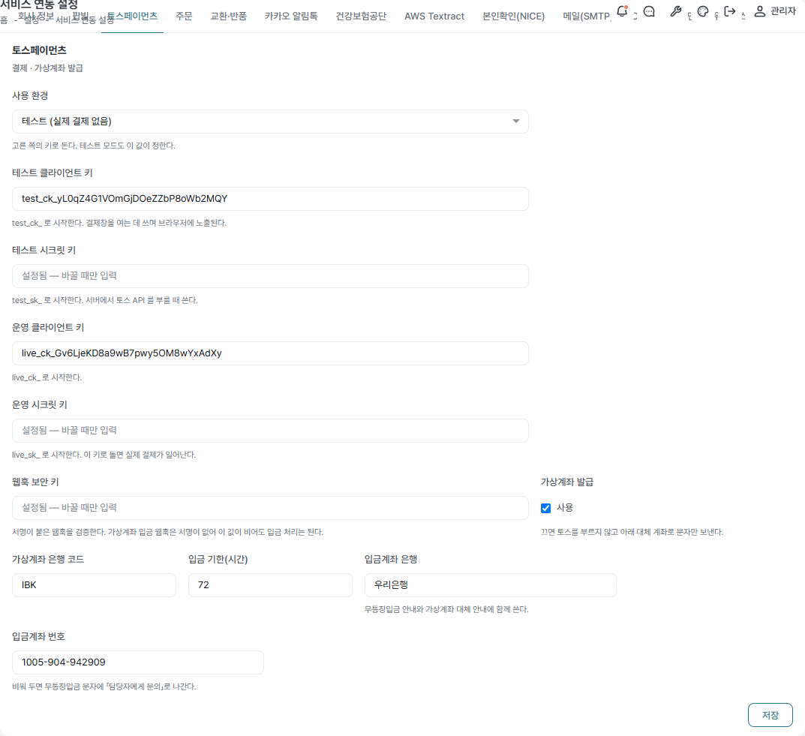

왼쪽 목록에서 **토스페이먼츠** 를 고릅니다.

| 칸 | 시험할 때 값 | 왜 |
|---|---|---|
| 사용 환경 | **테스트 (실제 결제 없음)** | 운영으로 두면 실제 결제가 일어납니다 |
| 테스트 클라이언트 키 | `test_ck_…` | 이미 들어 있습니다 |
| 테스트 시크릿 키 | 채워져 있음 | 빈칸으로 두면 그대로 둡니다 |
| 가상계좌 발급 | **켬** | 6.2 에 필요합니다 |
| 입금 기한(시간) | `72` | |

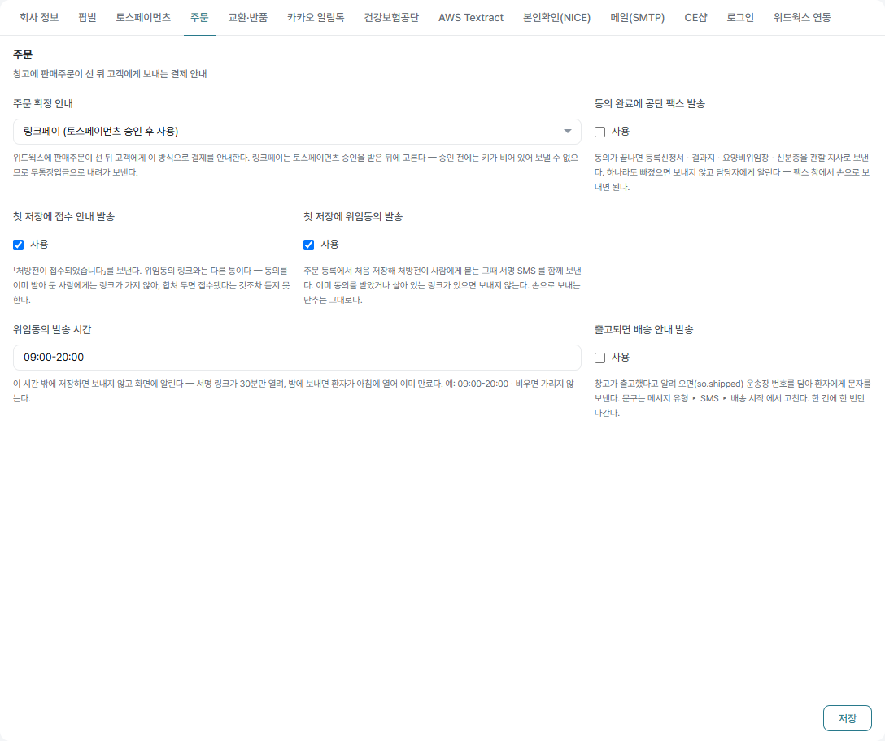

왼쪽 목록에서 **주문** 을 고릅니다.

| 칸 | 시험할 때 값 | 어느 케이스 |
|---|---|---|
| 주문 확정 안내 | **링크페이** | 6.1 |
| 첫 저장에 접수 안내 발송 | **켬** | 2.1 |
| 첫 저장에 위임동의 발송 | **켬** | 2.1 |
| 위임동의 발송 시간 | `09:00-20:00` | 2.3 |
| 동의 완료에 공단 팩스 발송 | **끔** → 4장에서만 켬 | 4.1 |
| 신분증이 들어오면 공단 팩스 다시 시도 | **끔** → 4.2.2 에서만 켬 | 4.2.2 |
| 출고 시 배송 안내 | **켬** | 8.3 |

## 테스트 설정 탭 (2026-09-07 보탬)

**화면** `설정 › 서비스 연동 설정` → 왼쪽 목록에서 **테스트 설정**

시험에 쓰는 스위치를 한자리에 모았습니다. **.env 를 고치러 서버에 들어가지 않아도 됩니다.**

| 칸 | 시험할 때 값 | 무엇이 달라지나 |
|---|---|---|
| 웹 화면 | **테스트** | 주문 등록 화면의 전화번호 1ㆍ2 가 **고르는 칸**이 됩니다 — CE Admin 에 등록된 사람 번호에서 고릅니다. 손으로 치다 한 자만 틀려도 남의 전화로 안내가 갑니다 |
| 문자 발송 | **우리에게만** | 문자가 「테스트 받는 번호」로 돌아갑니다. 환자 번호가 적혀 있어도 그리로 가지 않습니다 |
| 팩스 발송 | 아래 「팩스를 시험하는 세 가지 길」 참고 | |
| 테스트 받는 번호 | 시험용 휴대폰 | 「우리에게만」일 때 여기로 옵니다. **비우면 문자가 나가지 않고 막힙니다** |
| 테스트 받는 팩스 | `02-0000-0000` | 팩스가 「우리에게만」일 때 |
| 본인확인 시늉(NICE) | **켬** | 실명확인을 실제로 부르지 않습니다 |
| 위드웍스 연계 확인 이메일 | `jhw7519@linkthelab.co.kr` | 위드웍스로 주문ㆍ반품을 보낼 때마다 **보낸 값 그대로**와 **저쪽이 이어서 할 일**이 이 주소로 옵니다. 저쪽 화면과 나란히 놓고 견줍니다. 비우면 보내지 않습니다 |

> **세무 발행에는 시늉 스위치를 두지 않았습니다.** 팝빌이 운영 계정이라 발행이
> 곧 국세청 신고입니다 — 화면에서 끌 수 있게 두면 「껐겠거니」 하고 누릅니다.

**확인**

- [ ] 「웹 화면」을 **테스트** 로 두면 주문 등록 화면의 전화번호가 `이름 · 번호` 고르는 칸이 된다
- [ ] **운영** 으로 되돌리면 다시 손으로 적는 칸이 된다
- [ ] 문자를 「우리에게만」으로 두고 보내면 **테스트 받는 번호로만** 온다

## 실제로 나가는 것 셋 ⚠

| | 왜 |
|---|---|
| **세무 발행** | 팝빌이 운영 모드입니다. 발행이 곧 국세청 신고입니다. **확인 즉시 취소**합니다 |
| **공단 팩스** | 팝빌 운영으로 **실제 나갑니다**. 아래 「팩스를 시험하는 세 가지 길」 참고 |
| **문자ㆍ알림톡** | 문자 발송이 「실제」면 적힌 번호로 나갑니다. 「우리에게만」으로 두십시오 |

## 팩스를 시험하는 세 가지 길 (2026-09-05 보탬 · 3차 3회)

2회까지는 팩스에 시늉 스위치가 **없어** 시험할 때마다 팝빌로 진짜 나갔습니다.
3회에서 스위치를 만들었고(`cd516c7`), 쓸 수 있는 길이 둘로 늘었습니다.

스위치는 **설정 › 서비스 연동 설정 › 테스트 설정 › 팩스 발송** 입니다 (2026-09-07 부터
화면에서 고칩니다 — 그전에는 `.env` 였습니다).

| | 어떻게 | 무엇을 볼 수 있나 | 언제 쓰나 |
|---|---|---|---|
| ① **닿지 않는 번호로 실전송** (권장) | 팩스 발송 **실제** + 청구처 팩스번호 **`02-0000-0000`** | **끝까지** — 팝빌 접수번호가 진짜로 남아 팝빌 화면에서 확인·삭제할 수 있다 | 팩스가 실제로 접수되는지까지 봐야 할 때 |
| ② **우리에게만** | 팩스 발송 **우리에게만** + 「테스트 받는 팩스」 | ①과 같되 받는 곳을 청구처마다 고치지 않아도 된다 | 여러 청구처를 잇달아 시험할 때 |
| ③ 시늉 | 팩스 발송 **시늉** | 합본 만들기ㆍ서류 세기ㆍ받는 곳 고르기까지. 마지막 한 걸음만 막힌다. 접수번호 자리에 `SIMFAX-…` | 팩스를 아예 내보내고 싶지 않을 때 |

> **왜 `02-0000-0000` 인가** — 국내 유선 번호는 **가입자 국번이 0 으로 시작하지 않습니다.**
> 곧 이 번호는 누구에게도 할당되지 않아, 접수는 되지만 **종이가 나오는 곳이 없습니다.**
> 아무 번호나 쓰면 남의 팩스로 환자 서류가 갑니다.

**어디에 적어 두나** — 관할 청구처(`billing_offices.fax`)입니다. 팩스 창의 받는 번호가
그 값을 따라옵니다. **시험이 끝나면 실제 지사 번호로 되돌려야 합니다.**

> 시늉 스위치의 **기본값은 꺼짐**입니다 — 운영에서 조용히 안 나가는 일이 없어야 합니다.

## 자동 발행 개시일

자동 발행은 켜져 있으나 **개시일이 2026-10-01** 입니다. 그 전에는 발행이 건너뛰어집니다.
7장을 시험하려면 개시일을 앞당기고, **끝나면 되돌립니다**.

## 준비할 자료

| 필요한 것 | 수 | 비고 |
|---|---|---|
| 처방전 이미지 | 6 | 자격 여섯 갈래 각 1 |
| 미성년자 처방전 | 2 | 주민번호 앞자리가 미성년 |
| 등록신청서ㆍ결과지ㆍ신분증 | 각 6 | 임의 생성 가능 |
| 시험용 휴대폰 | 1 | 문자ㆍ동의 링크를 받습니다 |

---

# 01. 처방자료 업로드

**화면** `환자ㆍ처방 › 처방자료 업로드`

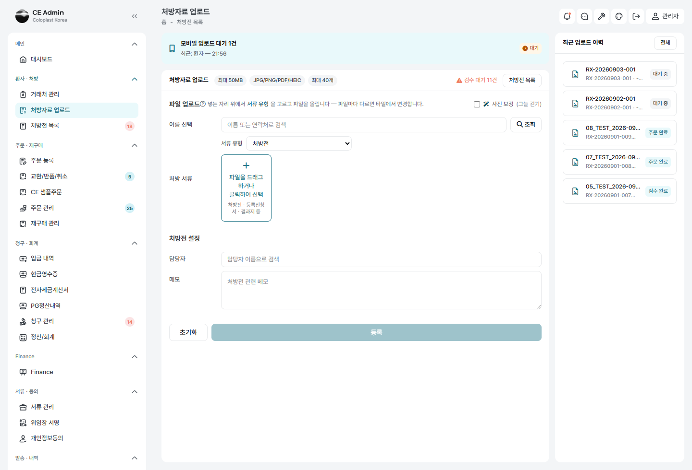

## 1.1 — 유형별로 올려 저장

| 순서 | 하는 일 |
|---|---|
| ① | **이름 선택** 칸에 이름 또는 연락처를 적거나 **［조회］** 로 찾아 고른다 |
| ② | **담당자** 를 고른다 — 이름을 치면 자동완성이 뜬다 |
| ③ | 가운데 타일 자리에 파일을 끌어다 놓거나 **［+ 파일 추가］** |
| ④ | 타일마다 **서류 유형** 을 지정 — 처방전 1 · 등록신청서 1 · 결과지 3 |
| ⑤ | **［업로드］** |

**확인**

- [ ] 처방전 목록에 새 처방번호 `RX-YYYYMMDD-NNN` 이 선다
- [ ] 상태가 **검수 필요**
- [ ] 첨부 5건이 유형대로 붙어 있다
- [ ] **처방전은 1건만** 생성됐다
- [ ] **담당자가 붙어 있다** — 비면 창고 소식이 갈 곳이 없다(8.6)

### 담당자 목록은 관리자도 포함한다 (2026-09-05 고침 · 3차 3회 ②)

이 화면만 `role='manager'` 만 보아, **관리자로 등록된 사람은 목록에 서지 않았다.**
열 사람 가운데 다섯이 관리자라 절반은 고를 수 없었고, 자기 이름을 쳐도
「그런 담당자가 없습니다」가 떴다. 처방전 목록 화면과 같은 잣대(admin+manager)로 맞췄다.

### 서류 유형은 열넷뿐이다 — 없는 서류는 올리지 않는다 (2026-09-05 보탬)

```
처방전 · 등록신청서 · 결과지 · 신분증 · 개인정보 동의서 · 요양비위임장 ·
요양비 지급청구서 · 의료용품구입확인서(지자체용) · 등기처리 영수증 ·
거래명세서 · 세금계산서 · 현금영수증 · 카드매출 · 기타
```

여기에 없는 서류(예: **주문등록증**)는 **올리지 않는다.** 「기타」로 밀어 넣지도 않는다 —
갈래가 없다는 것은 이 시스템이 그 서류를 다루지 않는다는 뜻이지, 아무 데나 담아 두라는
뜻이 아니다. 목록은 `환경 설정 › 서류 유형`(CommonCode `doc_type`)에서 늘린다.

## 1.2 — 처방전 2건 (경계)

**입력** 유형을 「처방전」으로 둔 파일 **2건**
**누름** ［업로드］

**확인**

- [ ] 「**처방전은 한 번에 1건까지 올릴 수 있습니다 — 2건을 고르셨습니다**」로 막힌다
- [ ] 처방전이 두 건으로 갈라지지 않는다

### 1.1.1 — 결과지가 여러 장일 때 (2026-09-05 실측 · 3차 3회)

**단계** 결과지 **18장**을 한 번에 골라 올린다

**확인**

- [ ] 열여덟 장이 모두 타일로 서고, 갈래가 다 「결과지」다
- [ ] 저장 뒤 첨부 표에 `test_result` 가 **18줄**
- [ ] 공단 팩스 합본에 **다 실린다**(김지훈 건은 위임장ㆍ등록신청서ㆍ결과지 18ㆍ신분증 = **21장**)
- [ ] 팩스 자취의 **제목이 잘리지 않고 남는다** — 4.1.1 참고

## 1.3 — 등록신청서 2건 · 결과지 41건 (경계)

**확인**

- [ ] 등록신청서 → 「1건까지」로 막힌다
- [ ] 결과지 41건 → 「40건까지」로 막힌다
- [ ] 신분증ㆍ기타는 여러 장 통과한다 (수를 세지 않음)

## 1.4 — 사진 보정

**입력** 휴대폰으로 비스듬히 찍어 한쪽이 어두운 처방전
**누름** 「**사진 보정 (그늘 걷기)**」 체크 → ［업로드］

**확인**

- [ ] 바탕이 희게 되고 글씨가 또렷하다
- [ ] **도장과 손글씨 서명이 사라지지 않았다**
- [ ] 같은 폴더에 `_원본` 파일이 남아 있다 (되돌릴 수 있다)

## 1.5 — 모바일 업로드 이어받기

**확인**

- [ ] 업로드 화면 위쪽 「모바일 업로드 대기 N건」에 선다
- [ ] 눌러서 이어 검수할 수 있다

## 1.6 — 삭제 후 재업로드

**단계** 첨부 하나를 지우고 같은 유형으로 다시 올린다

**확인**

- [ ] 같은 처방번호에 붙는다
- [ ] 새 처방전이 생기지 않는다

---

# 02. 상세 목록 저장

**화면** `주문ㆍ재구매 › 주문 등록` → 처방전을 고르면 열립니다

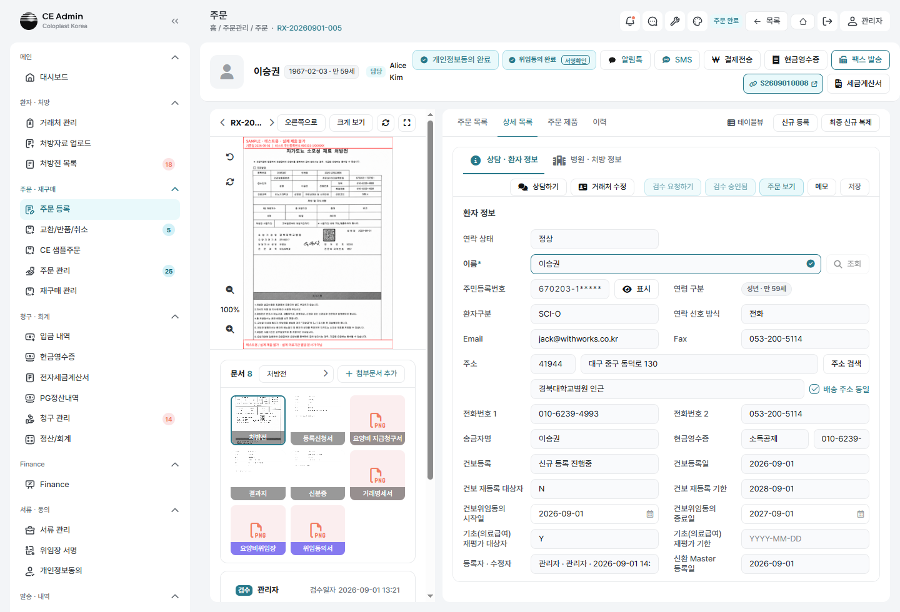

탭이 넷입니다 — **주문 목록 · 상세 목록 · 주문 제품 · 이력**.
상세 목록 안은 다시 둘로 갈립니다 — **상담ㆍ환자 정보** / **병원ㆍ처방 정보**.

## 2.0 — 주문 목록 탭 「작업 대기 리스트」 (2026-09-07 보탬)

아직 확정되지 않은 주문이 섭니다. **이 화면 안에서 다른 건으로 건너뛰는 자리**입니다.

### 2.0.1 — 더블클릭해서 그 건으로 간다

| 어떤 줄인가 | 무슨 일이 일어나나 |
|---|---|
| 담당자가 **없는** 줄 | 바로 열리고, **연 사람이 담당자가 된다** (`?claim=1`) |
| **내가 담당자**인 줄 | 바로 열린다 |
| **다른 사람이 담당자**인 줄 | 열기 전에 **안내창**이 뜬다 → 2.0.3 |

**확인**

- [ ] 담당자가 빈 줄을 열면 화면 머리의 「담당」이 **내 이름**으로 바뀐다
- [ ] 이미 담당자가 있는 줄을 열어도 **담당자가 나로 바뀌지 않는다**

### 2.0.2 — 담당자 배정

| 순서 | 하는 일 |
|---|---|
| ① | 표 왼쪽 **체크칸**으로 넘길 건을 고른다 (여러 건 가능) |
| ② | 검색 띠의 **［담당자 배정］** |
| ③ | 팝오버에서 **담당자**를 고른다 — 고른 건이 주문번호ㆍ처방번호ㆍ이름ㆍ**지금 담당자**와 함께 선다 |
| ④ | **［배정하기］** |

**확인**

- [ ] 「○○○ 님에게 N건을 배정했습니다」 토스트
- [ ] 표의 **담당자 칸이 그 자리에서 바뀐다** (화면을 새로 고치지 않아도)
- [ ] 배정받은 사람에게 **알림(토스트)**이 뜨고 **「담당 배정」 채팅방**에 자취가 남는다
- [ ] **여러 건을 넘겨도 알림은 한 번**이다 (건마다 울리지 않는다)
- [ ] 이미 그 사람 것이던 건은 「이미 ○○○ 님의 건 N건은 그대로」로 세어 준다
- [ ] 처방전이 **없는** 주문도 배정된다 → 2.0.4
- [ ] 아무것도 고르지 않고 누르면 「담당자를 배정할 건을 목록에서 고르십시오」

> 담당자를 고를 수 있는 사람은 **admin + manager** 입니다 — 처방자료 업로드 화면과 같습니다.

### 2.0.3 — 남의 건을 열려 할 때

**전제** 다른 사람이 담당자인 줄을 더블클릭

**확인**

- [ ] 「**이미 다른 담당자가 배정되어 있습니다**」 창이 뜬다
- [ ] 주문번호ㆍ처방번호ㆍ이름ㆍ**담당자**가 보인다
- [ ] 안내 — 「두 사람이 동시에 수정하면 **나중에 저장한 내용이 먼저 저장한 내용을 덮어씁니다**」
- [ ] 단추가 셋 — **［닫기］ ［변경 없이 확인］ ［담당자 변경］**

| 단추 | 무슨 일이 일어나나 |
|---|---|
| 닫기 | 그 자리에 머문다 |
| **변경 없이 확인** | **담당자를 그대로 두고** 그 건을 연다. 확인만 할 때 |
| **담당자 변경** | 그 한 건만 담은 배정 팝오버가 열린다. **나로 바꾸면 그대로 그 건으로 이어 간다** |

**확인**

- [ ] ［변경 없이 확인］ 으로 열어도 **담당자가 그대로**다 (주소에 `claim=1` 이 붙지 않는다)
- [ ] ［담당자 변경］ 에서 **나로** 바꾸면 그 건이 열린다
- [ ] ［담당자 변경］ 에서 **남에게** 넘기면 배정만 되고 **열리지는 않는다**

> **왜 막나** — 저장이 덮어쓰기입니다. 그 사이 누가 고쳤는지 견주지 않으므로,
> 두 사람이 같은 건을 열어 두고 각자 저장하면 나중에 저장한 쪽이 먼저 저장한 쪽의
> 수정 내용을 지웁니다. **먼저 저장한 사람은 자기 것이 사라진 줄도 모릅니다.**

### 2.0.4 — 처방전이 없는 주문도 열린다

**전제** 처방전 없이 선 주문, 또는 **처방전을 올렸다가 지운** 주문

**확인**

- [ ] 더블클릭하면 **열린다** — 예전에는 「이 주문에는 처방전이 이어져 있지 않습니다」로 막혔다
- [ ] **빈 처방전이 새로 서서** 그 주문에 이어지고, 환자ㆍ연락처가 주문에서 따라온다
- [ ] 주문 이력에 「처방전이 없어 빈 처방전을 세워 이었습니다 (RX-…)」 가 남는다
- [ ] **지워진 처방전은 되살아나지 않는다** — 거기서 처방전을 다시 올린다
- [ ] `주문 관리 › 주문 상세` 의 **［주문 보기］** 도 처방전이 없어도 보인다 (예전에는 단추가 사라졌다)

## 청구전략 여섯 갈래

| 유형ㆍ자격 | 본인 | 내는 기관 | 기관 | 현금영수증 | 세금계산서 | 위임동의 |
|---|---:|---|---:|---:|---:|:---:|
| 처방전 · 일반 | 10% | 건강보험공단 | 90% | — | 90% | **필요** |
| 처방전 · 차상위경감 | 0% | 건강보험공단 | 100% | — | 100% | **필요** |
| 처방전 · 기초 | 0% | 지자체(시군구청) | 100% | — | 100% | **필요** |
| 처방전 · 산재 | 100% | — | — | 100% | — | 해당 없음 |
| 처방전 · 자동차보험 | 100% | — | — | 100% | — | 해당 없음 |
| 처방외 | 100% | — | — | 100% | — | 해당 없음 |

### 본인부담 0 이라고 한 갈래가 아니다 (2026-09-05 확정 · 3차 4회 ⑤)

**차상위경감**과 **기초**는 본인부담이 둘 다 0 이라 같아 보이지만 **가는 길이 다르다.**

| | 차상위경감 | 기초 |
|---|---|---|
| 가입 자격 | **건강보험** 가입자 | **의료급여** 대상 |
| 청구처 | **공단** 지사 (`kind=nhis`) | **지자체** 시군구청 (`kind=local`) |
| 보내는 법 | **팩스** | **등기** — 팩스로 보내지 않는다 |
| 서류 | 위임장ㆍ등록신청서ㆍ결과지ㆍ신분증 | 위 **+ 지급청구서[별지12호] + 구입확인서** |
| 재평가 | 없음 | 없음 |

**재평가는 어느 쪽에도 없다.** 재등록(2년)은 **공단** 건에만 있다 → 2.8.

## 2.0.5 — 결제 방식은 상담ㆍ환자 정보에 있다 (2026-09-07 옮김)

병원ㆍ처방 정보에 있던 것을 **송금자명ㆍ현금영수증 바로 아래**로 옮겼다.

- [ ] 「결제 방식」이 **상담ㆍ환자 정보** 탭에 선다 (현금영수증 → 결제 방식 → 건보등록)

> **처방전 없이도 산다.** 처방외 주문이 그렇고, 처방전을 지운 뒤 다시 올리는
> 사이도 그렇다. 그런 건에서 병원ㆍ처방 정보는 통째로 빈 판인데, 어떻게 받을지는
> 그때도 정해야 한다. 결제 방식은 처방이 아니라 사람에게 붙는다.

## 2.1 — 첫 저장에 문자 두 통

**전제** 사람이 아직 붙지 않은 처방전 · 업무시간(09:00–20:00) 안 · 자격 「일반」

### ［상담ㆍ환자 정보］ 탭에 적을 것

| 칸 | 넣을 값 |
|---|---|
| 이름* | 시험 환자명 |
| 주민등록번호 | 처방전에서 읽은 값 (뒷자리는 임의) |
| 환자구분 | `SCI-O` 또는 `SCI-C` |
| 전화번호 1 | **시험용 휴대폰 번호** |
| Email | 시험용 메일 |
| 주소 | ［주소 검색］ 으로 고름 |
| 현금영수증 | 소득공제 / 지출증빙 |

### ［병원ㆍ처방 정보］ 탭에 적을 것

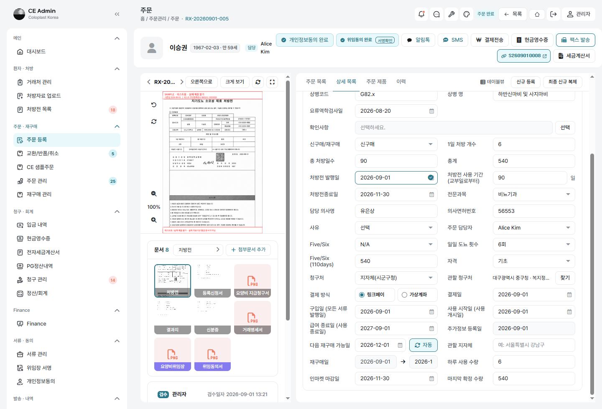

| 칸 | 넣을 값 |
|---|---|
| 신구매/재구매 | **신구매** |
| 1일 처방 개수 / 총 처방일수 | 처방전대로 (**총계**가 자동 계산) |
| 처방전 발행일 · 처방전종료일 | 처방전대로 |
| 담당 의사명 · 의사면허번호 | 처방전대로 |
| 전문과목 | 비뇨기과 등 |
| **자격** | **일반** |
| 청구처 | 건강보험공단 |
| 관할 청구처 | ［찾기］ 로 고름 |
| **결제 방식** | **⦿ 링크페이** (기본) / ○ 가상계좌 |

**누름** ［저장］

**확인** — 시험용 휴대폰에 **문자 두 통**

- [ ] ① `[콜로플라스트] ○○○님, 처방전이 접수되었습니다. / 처방번호: RX-…`
- [ ] ② 위임동의 서명 링크 (30분 유효)
- [ ] 화면 위 청구전략 배지가 「처방전 · 일반」
- [ ] `발송ㆍ내역 › 메시지 관리` 에 두 줄이 쌓인다

## 2.2 — 두 번째 저장 (경계)

**단계** 2.1 의 건에서 아무 칸이나 고쳐 다시 ［저장］

**확인**

- [ ] 접수 안내도 위임동의도 **다시 나가지 않는다**

## 2.3 — 업무시간 밖 (경계)

**단계** `설정 › 주문 › 위임동의 발송 시간` 을 지금 밖으로 바꾸고 첫 저장

**확인**

- [ ] 접수 안내는 **나간다** (시간을 가리지 않음)
- [ ] 위임동의는 **나가지 않고** 「발송 시간(…) 밖이라 보내지 않았습니다」로 알린다

## 2.4 — 연락처 없이 저장 (경계)

**확인**

- [ ] 저장은 된다
- [ ] 「연락처가 없어 …」로 알린다

## 2.5 — 여섯 갈래 배지

**단계** 유형ㆍ자격을 여섯 조합으로 바꿔 가며 화면 위 배지를 본다

**확인**

- [ ] 위 표와 한 글자도 다르지 않다
- [ ] 산재ㆍ자동차보험ㆍ처방외에는 위임동의 단추 옆에 「**위임 해당 없음**」이 선다

## 2.5.1 — 주민등록번호를 적으면 생년월일이 선다 (2026-09-05 고침 · 3차 3회 ①)

**볼 자리 둘** ① 거래처 관리 → ［거래처 등록］ 창  ② 주문 등록 → 상담ㆍ환자 정보

**확인**

- [ ] **두 화면 모두** 주민등록번호를 적는 대로 생년월일이 그 자리에서 채워진다
- [ ] 사람이 손으로 고쳐 둔 생년월일은 **덮이지 않는다**
- [ ] 이름표 옆에 「`1985-02-16 · 만 41세`」가 서고, 아래 배지에 「성년 · 만 41세」

> 예전에는 **거래처 창에만 이 수가 없어** 사람이 앞 여섯 자리를 손으로 옮겨 적어야 했다.
> 적지 않으면 빈 채로 남는데, **나이는 성년과 미성년을 가르는 값**이다(2.6ㆍ3.4ㆍ4.2.1).

## 2.6 — 미성년자

**전제** 주민번호 앞자리가 만 19세 미만

**확인**

- [ ] 「연령 구분」이 **미성년**
- [ ] 서명 화면에 법정대리인 이름ㆍ관계ㆍ생년월일ㆍ연락처ㆍ서명ㆍ신분증 칸이 선다
- [ ] NICE 본인확인도 법정대리인으로 한다

## 2.7 — 결제 방식이 사람에게 남는다

**단계** ⦿ 가상계좌로 바꿔 ［저장］ → 같은 사람의 **다른 처방전**을 연다

**확인**

- [ ] 새 건의 결제 방식이 **가상계좌**로 열린다
- [ ] `거래처 관리` 에도 그 값이 남아 있다

## 2.8 — 공단 재등록 기한과 2주 전 알림 (2026-09-05 새로 만듦 · 3차 4회 ⑦)

**규칙** 공단에 신규 등록하면 **2년 뒤 다시 등록해야 한다.** 기한을 놓치면 자격이
끊기고, 그 뒤에 나간 물건은 청구할 수 없다 — **값은 우리가 떠안는다.**
환자는 자기 등록이 언제 끝나는지 모른다. **담당자가 확인해 알려 주어야 한다.**

**단계** ⦿ 재등록 기한(`nhis_renew_due`)이 오늘부터 **2주 안**인 사람을 만든다
→ `php artisan nhis:renew-notice --dry` 로 몇 건인지 본다 → `--dry` 없이 부른다

**확인**

- [ ] 기한 2주 전부터 담당자에게 **알림이 뜬다** (`LEAD_DAYS = 14`)
- [ ] **이미 지난 건도** 석 달까지는 함께 알린다 — 놓친 건이야말로 알려야 한다
- [ ] 석 달 넘게 지난 건은 알리지 않는다 (그때는 재등록이 아니라 새로 등록하는 일이다)
- [ ] 채팅에 자취가 남아 **나중에 돌아와 볼 수 있다**
- [ ] **같은 사람에게 하루 한 번만** 알린다 (`nhis_renew_told_at`)
- [ ] 알림은 **마지막 처방의 배정 담당자**에게 간다 · 없으면 그 사람을 만든 사람
- [ ] **환자에게 문자가 저절로 나가지 않는다** — 무엇이라 말할지는 상담 뒤에 정한다
- [ ] 날마다 **아침 아홉 시**에 저절로 돈다 (`routes/console.php`)

> 아직 없는 것 둘 — ① 재등록 대기 **목록 화면** ② 재등록 **안내 문자 자리와 상담 기록**.
> `테스트3차/4회/_계획/필수추가.md` 에 적었다.

---

# 03. 동의 — 개인정보ㆍ위임


화면 위쪽에 **［개인정보동의］ ［위임동의］** 단추가 있고, 받고 나면 배지로 바뀝니다.

## 3.1 — 링크를 열고 서명까지

**단계 (휴대폰)**

| 순서 | 하는 일 | 볼 것 |
|---|---|---|
| ① | 문자의 링크를 연다 | 머리 밑에 **보낸 사람** — 「콜로플라스트 코리아 ○○○ 님이 보냈습니다 · 1588-7866」 |
| ② | ［본인확인］ — NICE | 이름ㆍ생년월일ㆍ통신사ㆍ휴대폰번호 |
| ③ | **개인정보 수집·이용 동의** 항목에 체크 | 필수 항목이 다 있다 |
| ④ | 신청자 정보를 적는다 | 주소ㆍ이메일ㆍ보험ㆍ지원 자격 등 |
| ⑤ | 서명 칸에 서명 → ［제출］ | |

### 「보험」과 「지원 자격」은 주문의 「자격」과 이어진다 (2026-09-05 고침 · 3차 2회 ⑮)

| 동의 화면 | 값 | 처방전 「자격」으로 |
|---|---|---|
| 지원 자격 | 차상위경감대상자 | 차상위경감 |
| 지원 자격 | 기초생활수급자 | 기초 |
| 지원 자격 | 일반 | 일반 |
| **보험** | **산업재해** | **산재** |
| **보험** | **자동차보험** | **자동차보험** |
| 보험 | 보훈 | (자격 갈래에 없어 옮기지 않는다) |

> 지원 자격이 **먼저**입니다 — 차상위경감ㆍ기초는 보험이 무엇이든 그것으로 청구합니다.
> 고르지 않았으면 보험에서 읽습니다.
>
> **담당자가 이미 골라 둔 자격은 덮지 않습니다.**
>
> 예전에는 보험 고르개에 **자동차보험이 없어**(일반ㆍ보훈ㆍ산업재해 셋뿐) 교통사고
> 건이 동의서에 「일반」으로 남았습니다 — 청구는 본인 100 으로 하면서 **환자가 서명한
> 종이만 다른 말을 하는** 셈이었습니다.

**확인**

- [ ] **「동의가 완료되었습니다」** 초록 화면이 뜬다
- [ ] 주문 등록 화면의 배지가 「**위임동의 완료**」ㆍ「**개인정보동의 완료**」로 바뀐다
- [ ] ［서명확인］ 을 누르면 서명 이미지가 보인다
- [ ] 첨부에 **요양비위임장** PDF 가 생긴다
- [ ] `서류ㆍ동의 › 개인정보동의` 목록에도 한 줄 선다

## 3.2 — 30분이 지난 링크 (경계)

**확인**

- [ ] 만료 화면이 뜬다
- [ ] 배지가 「위임동의 만료」가 되고 **［재발송］ 단추가 눌린다** (회색으로 죽어 있지 않다)

## 3.3 — 전자서명 불가 → 종이로

**단계** `문서 › ［+ 첨부문서 추가］` → 유형 **개인정보 동의서** 로 서명본을 올린다

**확인**

- [ ] 상단 배지가 「**개인정보동의 완료**」로 바뀐다
- [ ] 눌러 보면 「서면으로 받아 두었습니다 / 올린 때 …」로 뜬다

## 3.4 — 미성년자 서명

**확인**

- [ ] 법정대리인 정보ㆍ서명ㆍ신분증이 모두 저장된다
- [ ] 요양비위임장 PDF 에 대리인 서명이 얹힌다

### 3.4.1 — 신분증 없이 서명 (2026-09-09 보탬)

**여태는 신분증이 없으면 서명 단추가 잠겼습니다.** 그 자리에 신분증이 없거나 사진이
흐려 못 올리는 사람이 있는데, 그때 통째로 막히니 **받아 둘 수 있었던 서명마저**
못 받았습니다. 이제 신분증 없이도 받습니다 — 다만 한 번 묻습니다.

**단계** 미성년 건의 위임동의 링크에서 보호자 이름ㆍ관계ㆍ생년월일ㆍ서명만 채우고
**신분증은 비운 채** ［동의 서명] 을 누릅니다

**확인**

- [ ] 「아직 남았습니다」 목록에 **신분증이 서지 않는다** (나머지가 다 차면 단추가 열린다)
- [ ] 누르면 확인 창이 뜬다 — 「**신분증은 필수 입니다. 그래도 저장하시겠습니까?
      담당자가 다시 연락을 드릴수 있습니다.**」 · 단추는 ［취소]［저장]
- [ ] ［저장] 을 누르면 **서명이 저장되고** 배지가 「위임동의 완료」로 바뀐다
- [ ] ［취소] 를 누르면 아무것도 저장되지 않고 화면에 그대로 머문다
- [ ] 보호자 **이름ㆍ관계ㆍ생년월일ㆍ서명**은 여전히 막는다 (신분증만 빠져도 되는 것이다)
- [ ] 화면을 건너뛰고 서버로 곧바로 넣어도 그 넷은 **422 로 되돌아온다**
- [ ] 그 뒤 **공단 팩스는 나가지 않는다** — 「신분증 이(가) 아직 없습니다」 (4.2.1)

> **왜 「필수」라 적어 놓고 넘기는가** — 공단에 낼 때는 정말 필수입니다. 다만
> 그 자리에서 받지 못한다고 서명까지 버릴 까닭은 없습니다. 빠진 신분증은
> **3.6 신분증 링크**로 그 하나만 다시 청합니다.

## 3.5 — 이미 동의한 사람 (경계)

**단계** 같은 사람의 두 번째 처방전을 첫 저장

**확인**

- [ ] 위임동의 링크가 나가지 않고 「이미 위임동의를 받은 분입니다」로 알린다

## 3.6 — 신분증만 따로 받기 (2026-09-09 보탬)

**위임동의를 새로 보낼 수는 없습니다** — 받아 둔 서명이 무효가 됩니다. 그래서
신분증 하나만 청하는 링크를 따로 둡니다.

**화면** 주문 등록 위쪽 ［신분증] (위임동의 **오른쪽**)

| | |
|---|---|
| 단추 이름 | 받아 둔 신분증이 하나도 없으면 「**신분증**」 · 있으면 「**신분증 있음**」 |
| 「있음」으로 세는 것 | 첨부 `id_card` · 링크로 받은 **본인** · 링크로 받은 **보호자** |
| 링크가 받는 것 | 사진뿐 — 서명판도 개인정보 동의도 세우지 않는다 |
| 칸 | **본인 신분증** · **법정대리인 또는 가족 신분증**(미성년 건에만) |
| 링크 수명 | 30분 |

**단계**

1. ［신분증] 을 눌러 팝오버를 연다
2. 수신 번호ㆍ이름을 확인하고 ［발송]
3. 문자로 온 링크를 열어 사진을 올리고 ［제출]

**확인**

- [ ] 이미 받아 둔 것이 있으면 팝오버에 「**이미 받아 둔 신분증이 있습니다 — 첨부ㆍ본인ㆍ보호자**」가 뜬다
- [ ] 미리보기가 「건강보험 등록에 필요한 **신분증 제출** 요청입니다」로 적힌다 (위임동의 문구와 다르다)
- [ ] 링크를 열면 제목이 「**신분증 제출**」이고 **서명판이 없다**
- [ ] 성인 건이면 **보호자 칸이 서지 않는다**
- [ ] 아무것도 올리지 않으면 ［제출] 이 **잠긴다** · 「올려주셔야 하는 것: …」
- [ ] 한 장만 올려도 보낼 수 있고, 빠진 것은 「**아직 올리지 않은 것: …**」으로 적힌다
- [ ] 제출하면 「제출되었습니다 / 신분증을 받았습니다」
- [ ] 주문 등록의 서류 목록에 「**본인 신분증**」ㆍ「**보호자 신분증**」이 선다
- [ ] 단추 이름이 「**신분증 있음**」으로 바뀐다
- [ ] 저장 이력에 「**신분증 접수 → 본인ㆍ보호자**」가 남는다

> **신분증은 공개 디스크에 두지 않습니다.** `storage/app/private/consents/{patient-id,guardian-id}/`
> 에 있어 주소로는 닿지 않고, `/files/consents/{id}/{patient-id|guardian-id}` 로만
> 로그인ㆍ권한을 거쳐 나갑니다. 여는 것도 이력에 남습니다.
>
> ⚠ **새로 만들어지는 저장 자리의 권한** — `patient-id` 디렉터리는 처음 만들어질 때
> `www-data:www-data 0700` 으로 서서 CLI(`ubuntu`)에서 읽지 못했습니다. 웹은 정상이지만
> 다른 자리와 맞추려면 `ubuntu:www-data 2770` 으로 고쳐 두어야 합니다 (2026-09-09 실측).

---

# 04. 공단 팩스

> ⚠ **이 장에서만 자동 팩스를 켭니다.** 공단으로 실제 팩스가 나갑니다.
> 켜기 전에 시험 건의 **관할 청구처가 제대로 잡혀 있는지** 확인합니다.

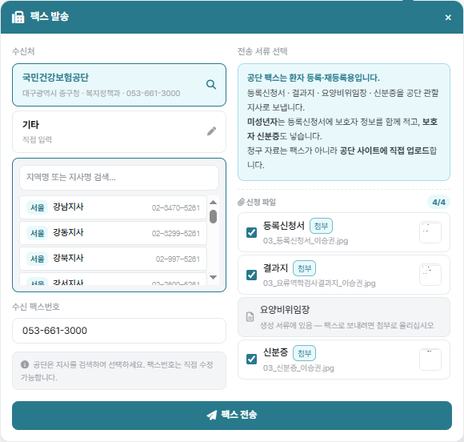

**화면** 주문 등록 위쪽 ［팩스 발송］

### 공단에 보내는 서류 (2026-09-04 확정)

| 서류 | 어디에 있나 | 언제 |
|---|---|---|
| 등록신청서 | 첨부 `registration_form` | 늘 |
| 결과지 | 첨부 `test_result` | 늘 |
| 신분증 | 첨부 `id_card` | 늘 |
| **요양비위임장** | **생성 서류** `PrescriptionDocument` | 늘 — 서명하면 시스템이 만든다 |
| **법정대리인 신분증** | **동의 기록** `consents/guardian-id/…` | **미성년 건에만** |
| 〃 — 신분증 링크로 받은 것 | **동의 기록** `consents/{patient-id,guardian-id}/…` | 3.6 으로 따로 받았을 때 |

> **위임동의서(개인정보 동의서)는 보내지 않습니다** — 공단에 내는 서식은 요양비위임장입니다.
>
> 위임장과 법정대리인 신분증은 **첨부가 아닙니다.** 첨부 목록만 보고 세면 늘 「없다」로
> 읽혀 자동 팩스가 나가지 않습니다 — 2차 시험에서 실제로 그랬습니다.

### 받는 곳은 관할 청구처를 따른다 (2026-09-04 고침 · 3차 2회 ⑯)

| 청구처 | 팩스 창의 받는 곳 | 공단 지사 찾기 |
|---|---|---|
| 건강보험공단 | 「국민건강보험공단」 + 지사 이름 | **연다** |
| **지자체(시군구청)** | **그 구청 이름 + 「관할 지자체」** | **열지 않는다** |

> 기초(의료급여) 건은 공단이 아니라 **시군구청**에 냅니다. 그런데 팩스 창이 늘
> 「국민건강보험공단」으로 적고 공단 지사 찾기까지 열었습니다 — 받는 곳이 종이에
> 그대로 찍혀 나가는 자리라, 잘못 찍히면 그 종이는 못 씁니다.
> 지금은 `RX_BILLING_OFFICE.kind` 를 따릅니다. 서버가 남기는 자취도 함께 고쳤습니다.

## 4.1 — 서류가 다 있을 때 (자동)

**전제** 자격 일반ㆍ신구매 · 등록신청서ㆍ결과지ㆍ신분증이 이미 올라와 있음 · 관할 청구처 지정됨
**단계** 동의 링크에서 서명을 마친다

**확인**

- [ ] 요양비위임장이 첨부에 생긴다
- [ ] 팩스가 관할 지사로 나간다
- [ ] 채팅 「**공단 팩스**」 방에 「공단(0XX-XXX-XXXX)으로 등록 서류를 보냈습니다」
      (창고 소식이 쌓이는 「창고 알림」 방과는 **다른 방**입니다 — 8.6ㆍ9.9 참고)
- [ ] `발송ㆍ내역 › 발송/발행 내역` 에 팩스 줄이 선다

### 4.1.1 — 첨부가 많아도 자취가 남는다 (2026-09-05 고침 · 3차 3회 ③)

**전제** 결과지가 **열여덟 장**인 건에서 ［팩스 전송］

**예전에는** 화면에 **「❌ Server Error」** 만 떴다. 팩스 제목에 첨부마다
「갈래: 파일이름」을 그대로 이어 붙여 **천 자를 넘겼고**,
`fax_histories.title`(varchar 200)에 들어가지 못했다.

**무엇이 더 나빴나** 그 자리는 **팩스를 이미 보낸 뒤**다. 팝빌로 나가고 나서 자취를
남기다 죽는다 — 화면은 실패로 보이는데 팩스는 갔다.
담당자는 다시 보내고 **같은 팩스가 두 번 간다.**

**확인**

- [ ] 제목이 갈래로 묶여 짧게 남는다 —
      「`[CE] RX-… 요양비위임장·등록신청서·결과지 18장·신분증`」(45자)
- [ ] 자취를 남기지 못한 때에는 **「팩스는 나갔으나 전송 자취를 남기지 못했습니다 —
      다시 보내지 마시고 관리자에게 알려 주십시오」** 로 알린다 (성공으로도 실패로도 아니다)

## 4.2 — 서류가 빠졌을 때 (수동)

**전제** 결과지를 올리지 않은 채로 서명

**확인**

- [ ] **팩스가 나가지 않는다**
- [ ] 채팅에 「결과지 이(가) 아직 없습니다」
- [ ] 결과지를 올린 뒤 팩스 창에서 손으로 보낼 수 있다

> **3차 3회 실측** — 김지훈 건은 자료에 신분증이 없어 팩스 창이 **「신청 파일 3/4」**
> 로 서고 「**신분증 이(가) 아직 등록되지 않았습니다**」가 떴습니다. 신분증을 만들어
> 그 자리에서 올리니 **4/4** 가 되어 보낼 수 있었습니다. **4.2 가 실제로 막습니다.**

> **결과지는 신규등록ㆍ재등록 모두 필수입니다.** 3차 2회에서는 다섯 건 모두
> 결과지를 만들어 그 단계에서 올린 뒤 보냈고, 팩스 제목과 합본에 실제로 실렸습니다
> (아래 표의 접수번호로 확인). **아직 안 해 본 것** — 결과지를 **빼고** 눌렀을 때
> 막히는지는 3차 2회에서 시험하지 않았습니다(다섯 건 모두 갖춘 채로만 보냈습니다).

| 환자 | 등록 갈래 | 팩스 접수번호 | 합본에 실린 것 |
|---|---|---|---|
| 김태윤 | 신규 등록 | `026090415402900003` | 위임장 · 등록신청서 · **결과지** · 신분증 |
| 이하은 | **재등록** | `026090415591300008` | 위임장 · 등록신청서 · **결과지** · 신분증 |
| 박준혁 | 신규 등록(**미성년**) | `026090416133600004` | 위임장 · **법정대리인 신분증** · 등록신청서 · **결과지** · 신분증 |
| 최서윤 | 신규 등록(차상위) | `026090416442900003` | 위임장 · 등록신청서 · **결과지** · 신분증 |
| 정우진 | 지자체(기초) | `026090416570200002` | 위임장 · 등록신청서 · **결과지** · 신분증 |

> 정우진 건은 두 번 나갔습니다(`…16543300001` → `…16570200002`) — 받는 곳을
> 공단에서 관할 지자체로 바로잡아 다시 보낸 자취입니다.

### 4.2.1 — 미성년인데 법정대리인 신분증이 없을 때 (경계 · 2026-09-04 보탬)

**전제** 미성년 건인데 보호자가 신분증을 올리지 않은 채 서명

**확인**

- [ ] **팩스가 나가지 않는다**
- [ ] 모자란 것에 「**법정대리인 신분증**」이 선다
- [ ] 보호자 신분증이 있으면 요양비위임장과 **함께** 실려 나간다

### 4.2.2 — 빠졌던 신분증이 들어오면 다시 잰다 (2026-09-09 보탬 · **설정으로 켠다**)

**공단 팩스는 위임동의 서명이 끝나는 그 순간에만 쟀습니다.** 그때 신분증이 없으면
「신분증이 아직 없습니다」로 걸리고, **뒤에 신분증이 들어와도 다시 재는 자리가
없었습니다** — 담당자가 팩스 창을 열어 손으로 보내야 했습니다.

**스위치** `설정 › 서비스 연동 설정 › 주문` → **신분증이 들어오면 공단 팩스 다시 시도**
(**기본값 꺼짐**)

**신분증이 닿는 길 둘이 모두 다시 잽니다**

| 길 | 어디서 |
|---|---|
| 신분증 링크로 받는다 | 3.6 의 ［제출] |
| 첨부로 올린다 | 주문 등록의 첨부에 `신분증` 으로 올릴 때 |

**단계**

1. 3.4.1 로 **신분증 없이** 서명을 마친다 → 팩스가 나가지 않는 것을 본다
2. 스위치를 **켠다** (「동의 완료에 공단 팩스 발송」도 켜져 있어야 한다)
3. 3.6 으로 신분증을 받거나, 첨부에 `신분증` 을 올린다

**확인**

- [ ] 신분증이 닿는 순간 **팩스가 나간다** (다른 서류가 다 있을 때)
- [ ] 다른 서류가 아직 빠져 있으면 나가지 않고 「**… 이(가) 아직 없습니다**」로 알린다
- [ ] **이미 보낸 건은 다시 나가지 않는다** — `NhisFaxLog` 를 보고 스스로 물러난다 (4.4 와 같은 잣대)
- [ ] 신구매ㆍ재등록이 아니거나 산재ㆍ자동차보험ㆍ처방외면 **애초에 재지 않는다** (4.3)
- [ ] 「동의 완료에 공단 팩스 발송」이 **꺼져 있으면** 이것만 켜도 나가지 않는다
- [ ] 스위치가 **꺼져 있으면** 신분증이 들어와도 아무 일도 일어나지 않는다 (예전 그대로)
- [ ] 팩스가 실패해도 **신분증 접수는 되돌아가지 않는다** (받은 것은 받은 것이다)

> **왜 설정으로 두었나** — 담당자가 팩스 창에서 손수 서류를 고르고 보내기를 기대하는
> 자리가 있습니다. 말없이 나가기 시작하면 그쪽이 놀랍니다. 켤지 말지는 담당자가 정합니다.

## 4.3 — 보내지 않는 갈래 (경계)

**단계** 산재ㆍ자동차보험ㆍ처방외 건에서 서명을 마친다

**확인**

- [ ] 팩스를 시도하지 않는다 · 알림도 오지 않는다

### 4.3.1 — 지자체 건은 팩스로 보내지 않는다 (2026-09-05 고침 · 3차 4회 ⑤)

**청구처가 지자체(시군구청)면 이 건은 등기로 부치는 건이다.** 팩스가 아니다.
그런데 5번 정시우(기초ㆍ용인시 기흥구청)에서 **［공단 팩스 전송] 단추가 살아 있었다.**
눌렀다면 구청 대표번호로 팩스가 나가고, 우리는 보냈다고 여겨 **등기를 부치지 않는다.**

**단계** 청구처를 지자체(`kind=local`)로 두고 팩스 자리를 연다

**확인**

- [ ] 팩스 자리에 「이 건은 **등기로 부치는 건**입니다」가 뜬다
- [ ] 보내는 단추가 **잠겨 있다**
- [ ] 화면을 건너뛰고 `sendFax` 를 불러도 **422 로 되돌아온다** (서버에서도 막는다)
- [ ] 대신 **10.4 등기 발송** 자리에서 서류가 모두 만들어진다

## 4.4 — 두 번 보내지 않는다 (경계)

**단계** 4.1 을 마친 건에 위임동의를 재발송해 다시 서명

**확인**

- [ ] 팩스가 **다시 나가지 않는다**

## 4.5 — 공단 밖으로 보내기

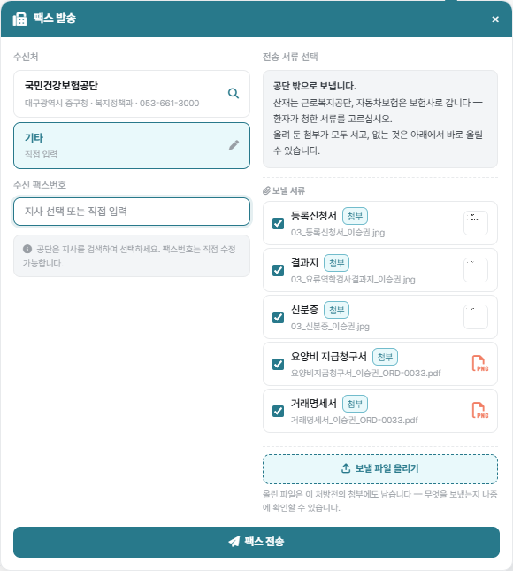

| 순서 | 하는 일 |
|---|---|
| ① | 산재 건에서 ［팩스 발송］ |
| ② | 수신처를 **［기타 · 직접 입력］** 으로 바꾼다 |
| ③ | **수신 팩스번호** 를 직접 적는다 |
| ④ | **［보낼 파일 올리기］** 로 파일을 여러 장 올린다 |
| ⑤ | 보낼 것을 체크하고 ［팩스 전송］ |

**확인**

- [ ] 안내가 「**공단 밖으로 보냅니다**」로 바뀐다
- [ ] 목록 머리가 「신청 파일 3/4」에서 「**보낼 서류**」로 바뀐다
- [ ] 올려 둔 첨부가 **다 선다**
- [ ] 「등록 안 됨」 줄이 서지 않는다
- [ ] 올린 파일이 첨부에도 남는다

## 4.6 — 파일을 못 찾을 때 (경계)

**확인**

- [ ] 「보낼 파일을 서버에서 찾지 못해 보내지 않았습니다」로 **막힌다**
- [ ] 「보냈습니다」로 답하지 않는다

---

# 05. 주문 제품과 연계

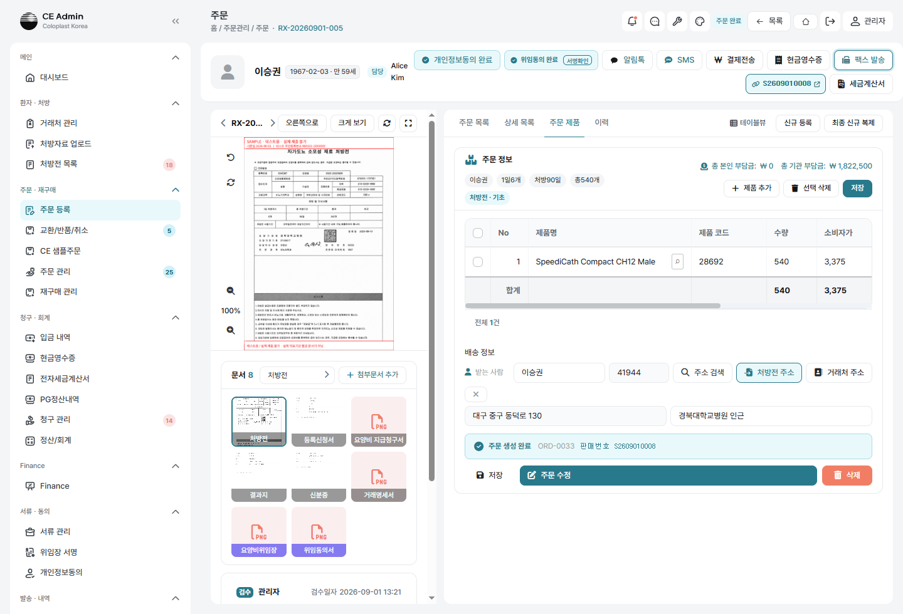

### 먼저 — 검수 승인 (2026-09-04 보탬)

처방전이 **「검수 필요」** 면 주문을 창고로 보낼 수 없습니다. 5장에 들어가기 전에
화면 위쪽 ［**검수 승인하기**］ → 확인창의 ［검수 승인하기］ 를 눌러 **「검수 완료」**
로 만드십시오. 이 단계가 빠져 있어 2차 시험에서 한참 막혔습니다.

## 5.1 — 동의 없이 주문 (경계)

**단계** 동의를 받지 않은 「일반」 건에서 제품을 고르고 ［주문 생성 및 연계］

**확인**

- [ ] 「요양비 위임 동의 · 개인정보 수집·이용 동의 이(가) 아직입니다」로 막힌다
- [ ] **창고에 아무것도 가지 않는다**

## 5.2 — 산재는 개인정보동의만으로 통과

**단계** 산재 건에서 개인정보동의만 받고 ［주문 생성 및 연계］

**확인**

- [ ] **통과한다**
- [ ] 안내 문구에 「위임동의」가 없다

## 5.3 — 제품 고르기 · 장비코드

| 순서 | 하는 일 |
|---|---|
| ① | 제품 줄의 **［🔍］** 를 누른다 |
| ② | `28410` 을 적고 검색 |
| ③ | 결과 줄을 고른다 |

**확인**

- [ ] 결과 줄에 품번 바로 뒤 **`NBC0121000005`** 가 보인다
- [ ] 고르면 수량이 처방 총계로 자동 채워진다
- [ ] 단가ㆍ본인부담ㆍ기관부담이 청구전략대로 셈해진다

## 5.4 — 처방 총계를 넘는 수량 (경계)

**단계** 총계가 120 인 건에서 주문 수량을 **180** 으로 고치고 ［주문 생성 및 연계］

**확인**

- [ ] 막힌다 — 창이 뜬다
      「**주문 수량 합계 180개가 처방 총계 120개보다 60개 많습니다.**
      넘은 만큼은 공단에 청구할 수 없습니다. 수량을 고친 뒤 다시 진행해 주십시오.」
- [ ] 창을 닫고 수량을 되돌리면 그대로 진행된다

> **주문 수량은 처방전에서만 읽습니다** (2026-09-05 지시). 등록신청서ㆍ결과지ㆍ
> 주문등록증에서 처방 정보를 끌어오지 않습니다 — 그 서류들이 다른 수량을 적고
> 있어도 처방전의 「총 테스트 수량」이 기준입니다.

### 5.4.1 — 수량을 고치면 합계도 따라 움직인다 (2026-09-05 고침 · 3차 3회 ④)

**단계** 수량을 120 → 180 → 120 으로 오간다

**확인**

- [ ] 그 줄의 「총 금액ㆍ기관 부담금ㆍ본인 부담금」이 바뀐다
- [ ] **표 아래 「합계」도 함께 바뀐다**

> 예전에는 합계줄을 표 그릴 때 한 번만 찍어, 줄은 405,000 인데 합계는 270,000
> 그대로였다. 담당자가 합계를 읽어 환자에게 금액을 말하면 틀린 금액이 나가고,
> **두 숫자가 한 화면에서 서로 다른 말을 한다.**

## 5.5 — 주문 생성 및 연계

**적을 것**

| 칸 | 넣을 값 |
|---|---|
| 배송지 | 처방전 주소와 같으면 ［처방전 주소］ |
| 받는 사람 | 환자명 |
| 배송 요청일 | |

**누름** ［주문 생성 및 연계］

**확인**

- [ ] 주문번호 `EUD…` 가 서고 상태 **주문 대기** — 꼴은 5.7 에서 따로 본다
- [ ] 위드웍스에 판매주문 `S…` 가 서고 상태 **등록(02)**
- [ ] 수량은 **낱개(EA)** · 단가는 우리 값
- [ ] 「주문 목록」 탭에 그 주문이 선다
- [ ] 위드웍스 출고 건의 **받는 곳에 주소가 실려 있다** (5.5.1)

### 5.5.1 — 받는 주소가 없으면 창고로 못 나간다 (2026-09-05 보탬 · 3차 2회 ⑦)

**전제** 배송지를 비운 채 ［주문 생성 및 연계］

**확인**

- [ ] **토스트로 막힌다** — 「받는 주소가 없어 창고로 보낼 수 없습니다 —
      「거래처 주소」나 「처방전 주소」로 배송지를 먼저 채워 주십시오.」
- [ ] 화면을 우회해도 **서버가 422 로 막는다**

> **왜 뒤늦게 못 고치나** — 주소 없이 나간 출고는 **3PL 송장출력이 500 으로 죽고**,
> 창고가 손을 댄 뒤에는 저쪽이 「이미 창고 작업이 시작된 주문」이라며 주문 수정을
> 막습니다. 3차 2회에서 세 건이 그렇게 나가 한 건은 끝내 배송중까지 못 갔습니다.
>
> **순서를 지키십시오** — 거래처 상세(주소 포함)를 **먼저** 채우고 주문을 냅니다.
> 거래처를 최소 항목만으로 만들고 주문부터 내면 주소가 빈 채로 실려 나갑니다.

### 5.5.2 — 나간 뒤 주소 고치기 (2026-09-05 보탬)

**단계** 주문 관리 → ［주문 수정］ 으로 배송지를 채워 다시 보낸다

**확인**

- [ ] 「✅ 주문이 수정되었습니다. (Withworks 동기화 완료)」
- [ ] 위드웍스 **출고 건의 받는 주소까지** 바뀐다 (판매주문만 바뀌면 소용없다)
- [ ] 창고가 이미 할당ㆍ피킹한 건은 **422 로 막힌다** — 그때는 손쓸 길이 없다

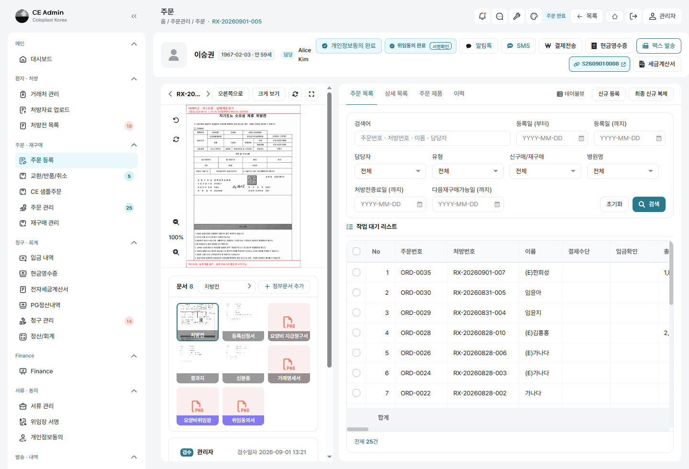

## 5.6 — 문자 두 통 (자동)

**확인 — 본인부담 있는 건** (일반ㆍ산재ㆍ자동차보험ㆍ처방외)

- [ ] ① `주문이 접수되었습니다 / 주문번호 / 본인 부담금: N원`
- [ ] ② 결제 안내 (링크 또는 계좌)

**확인 — 본인부담 0 인 건** (차상위경감ㆍ기초)

- [ ] ① `주문이 접수되었습니다 / 주문번호` — **「본인 부담금: 0원」 줄이 없다**
- [ ] ② 결제 안내는 **나가지 않는다**

## 5.7 — 주문번호 꼴

```
EUD 20260903 161830 1
└┬┘ └───┬──┘ └──┬─┘ │
 │      │      │    같은 초에 몇 번째인가
 │      │      만든 시각
 │      만든 날
 End User Direct
```

**확인**

- [ ] 새 주문번호가 `EUD` + 년월일 + 시분초 + 한 자리 (**18자**)
- [ ] 번호의 시각이 주문이 선 때와 맞는다
- [ ] 옛 `ORD-…` 번호 건은 **그대로**다 — 바뀌지 않는다

### 5.8 — 같은 초에 두 건 (경계)

**단계** 동의 링크를 여럿에게 뿌려 두 사람이 거의 같은 때에 서명을 마치게 한다
(또는 담당자 둘이 같은 초에 ［주문 생성 및 연계］)

**확인**

- [ ] 두 주문이 다 선다 — **끝자리만 다르다** (`…1`, `…2`)
- [ ] 환자 화면에 오류가 뜨지 않는다

### 5.9 — 판매번호가 주문번호 옆에

**볼 화면** 주문 목록 · 주문 상세 · 출고 상세 · 반품 상세 · 청구 원본 · 지자체 청구 · 좌우 청구 · 증빙 열람

**확인**

- [ ] 창고에 넘긴 건은 주문번호 옆에 **판매 `S…`** 가 선다
- [ ] 아직 안 넘긴 건에는 **아무것도 서지 않는다** (「· —」 같은 빈 자리가 없다)

---

# 06. 결제 안내

## 6.0 — 창의 「결제 금액」이 맞는가 (2026-09-05 고침 · 3차 3회 ⑤)

**단계** 화면을 열어 둔 채 ［주문 생성 및 연계］ → 바로 ［결제전송］

**확인**

- [ ] 창 머리의 **「결제 금액」이 본인부담금과 같다** (0원이 아니다)
- [ ] 아래 전송 이력의 금액과도 같다

> 예전에는 서버가 화면을 그릴 때 주문의 `total_amount` 를 한 번 찍었다. 그때는 아직
> 주문이 없어 **0원**이었다 — 같은 창 안에서 「결제 금액 0원」과 이력의 「27,000원」이
> 나란히 서서 서로 다른 말을 했다. 새로고침해야 제 금액이 보였다.

## 6.1 — 링크페이

**확인**

- [ ] 문자에 `/pay/…` 주소가 온다
- [ ] 열면 금액이 맞다
- [ ] 카드 결제가 진행된다 (테스트 키)

## 6.2 — 가상계좌

> 🚫 **2차 시험에서 못 함** — 토스 상점(MID)에 가상계좌가 켜져 있지 않아 발급 자체가
> 막힙니다(테스트 키 `NOT_SUPPORTED_METHOD` · 운영 키 `NOT_AVAILABLE_PAYMENT_BY_MERCHANT`).
> 토스페이먼츠 계약ㆍ상점 설정을 고친 뒤에 합니다.

> ⚠ **토스 상점에 가상계좌가 켜져 있어야 합니다.** 지금은 막혀 있습니다
> (테스트 키 `NOT_SUPPORTED_METHOD` / 운영 키 `NOT_AVAILABLE_PAYMENT_BY_MERCHANT`).

**확인**

- [ ] 계좌가 발급된다
- [ ] 문자에 은행ㆍ계좌번호ㆍ예금주ㆍ금액ㆍ**입금 기한**이 온다
- [ ] `거래처 관리` 에 결제 방식과 계좌가 저장된다

## 6.3 — 되살리기

**단계** 6.2 의 건에서 결제 안내를 다시 보낸다

**확인**

- [ ] **새로 발급하지 않고** 같은 계좌를 다시 보낸다
- [ ] 「이미 발급된 계좌를 다시 보냈습니다」

## 6.4 — 되살리지 않는 경우 (경계)

**확인** — 아래 넷이면 **새로 발급**한다

- [ ] 기한이 지났다
- [ ] 이미 입금됐다
- [ ] 받을 돈이 달라졌다
- [ ] 계좌번호가 없다

## 6.5 — 발급 실패 (경계)

**확인**

- [ ] 「이 상점에 가상계좌가 켜져 있지 않아 발급하지 못했습니다 — …」로 알린다
- [ ] **주문은 그대로 남는다**
- [ ] 정산/회계에서 다시 시도할 수 있다

---

# 07. 입금과 자동 처리

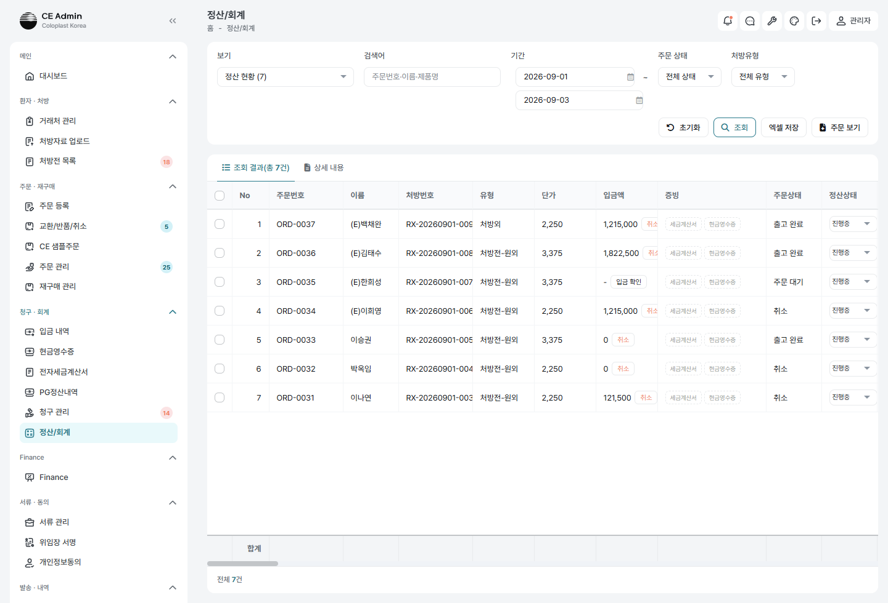

> ⚠ **발행 케이스는 확인 즉시 취소합니다.** 팝빌이 운영 모드라 발행이 곧 국세청 신고입니다.
> 자동 발행 개시일을 앞당겨 켜고, 끝나면 되돌립니다.

### 입금되면 무엇이 생기는가 (2026-09-04 확정)

| 서류 | 언제 | 비고 |
|---|---|---|
| **거래명세서** | 늘 | 세무 서류가 아니라 물건과 함께 나가는 종이 |
| **세금계산서** | 청구전략에 있을 때 | 공단ㆍ지자체 몫 |
| **현금영수증** | 청구전략에 있을 때 · **가상계좌ㆍ무통장만** | 본인부담 몫 |
| **카드 매출전표** | **카드로 받았을 때** | 토스 승인 내용을 옮겨 그린다 |

> **카드 건에는 현금영수증을 내지 않습니다** — 매출전표가 그 자리의 증빙입니다.
> 둘 다 내면 같은 금액이 두 번 신고됩니다.
>
> 매출전표는 토스가 준 `card` 블록과 `receipt.url` 로 그립니다. 토스 영수증 페이지는
> 자바스크립트로 그려져 그대로 PDF 로 뜰 수 없어, 값만 가져와 우리 서식에 옮기고
> 대조할 수 있게 그 주소를 전표 끝에 적습니다.

## 7.1 — 카드 결제 완료 (자동)

> 🚫 **2차 시험에서 못 함** — 토스 테스트 결제창까지는 열리나 카드사(신한) 인증창이
> 실제 카드를 요구합니다. 웹훅(7.2ㆍ7.3)도 `paymentKey` 로 토스에 다시 물어 확인하므로
> 실제 결제가 있어야 합니다. 토스페이먼츠 계약 수정 뒤에 합니다.
>
> 입금 뒤 잇달아 일어나는 다섯은 **7.4(손으로 입금 확인)에서 확인했습니다** —
> 못 한 것은 「무엇이 그 다섯을 켜는가」 쪽입니다.

**단계** 링크페이로 카드 결제를 마치고 결제창이 우리 화면으로 돌아온다

**확인 — 잇달아 다섯**

- [ ] ① 입금 확인됨 · 결제수단 「링크페이」
- [ ] ② 청구전략대로 세금계산서 또는 현금영수증 발행
- [ ] ③ **거래명세서**가 첨부에 생긴다
- [ ] ③-1 **카드 매출전표**가 첨부에 생긴다 (`카드매출전표_이름_주문번호.pdf`)
      · 카드사ㆍ카드번호ㆍ승인번호ㆍ승인일시ㆍ할부가 토스 승인과 같다
      · 끝에 토스 영수증 주소가 적혀 있다
- [ ] ③-2 **현금영수증은 나가지 않는다** (매출전표가 증빙)
- [ ] ④ 위드웍스 판매주문이 **확정(95)** 으로 바뀐다
- [ ] ⑤ 우리 주문 상태가 **주문 확정**

## 7.2 — 결제 후 화면을 닫았을 때 (경계)

**단계** 결제 직후 브라우저를 닫아 우리 화면으로 돌아오지 않게 한다

**확인**

- [ ] 토스 웹훅(`PAYMENT_STATUS_CHANGED`)으로 **7.1 과 같은 일이 다 일어난다**

## 7.3 — 가상계좌 입금 (자동)

**확인**

- [ ] 입금 웹훅(`VIRTUAL_ACCOUNT_DEPOSIT`)으로 7.1 과 같은 일
- [ ] **계좌 발급만으로는 일어나지 않는다** — 돈이 들어와야 한다

## 7.4 — 담당자가 손으로 입금 확인

**화면** `청구ㆍ회계 › 정산/회계`
**단계** 그 줄의 **결제수단** 칸을 눌러 방식을 고른다 (고르는 순간이 곧 입금 확인)

**확인**

- [ ] 7.1 과 같은 일이 일어난다
- [ ] 위쪽 요약 카드가 함께 움직인다

## 7.5 — 전략별 발행 금액

| 자격 | 나가는 것 |
|---|---|
| 일반 | 세금계산서 **90%** (공단 몫)만 — 본인부담 10%로 현금영수증을 따로 내지 않는다 |
| 차상위경감ㆍ기초 | 세금계산서 **100%** |
| 산재ㆍ자동차보험ㆍ처방외 | 현금영수증 **100%** |

> **어느 갈래든 카드로 받았으면** 현금영수증 대신 **카드 매출전표**가 섭니다.

## 7.6 — 창고 확정 실패 (경계)

**단계** 재고가 없는 제품으로 주문해 확정을 실패시킨다

**확인**

- [ ] 발행과 거래명세서는 **그대로 끝난다**
- [ ] 확정 실패가 자취에 남는다
- [ ] **입금이 취소되지 않는다**

## 7.7 — 거래명세서 날짜

| 갈래 | 찍히는 날 |
|---|---|
| 본인부담 있는 건 | 카드 결제일 → 현금영수증 발행일 → 세금계산서 발행일 → 입금 확인일 |
| 본인부담 0 인 건 | 주문 확정일 |

- [ ] **만든 날이 아니다** — 어제 결제한 건을 오늘 뽑아도 **어제 날짜**

## 7.8 — 발행 내용

**세금계산서**

- [ ] 품목마다 한 줄
- [ ] **규격 칸에 장비코드**
- [ ] 줄 금액의 합이 총액과 **한 원도 틀리지 않는다**

**현금영수증**

- [ ] 품명이 「제품명 (장비코드) 외 N건」

---

# 08. 창고 상태 흐름

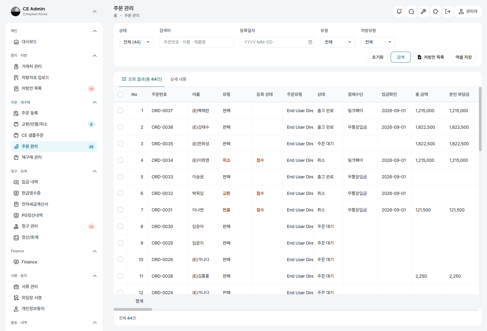

| 위드웍스 사건 | 우리 상태 | 함께 일어나는 일 |
|---|---|---|
| `so.confirmed` | 주문 확정 | 알림 |
| `so.allocated` | 재고 할당 | — |
| `so.picked` | 피킹 완료 | — |
| `so.invoiced` | 송장 출력 | 송장번호 저장ㆍ알림 |
| `so.shipped` | 출고 완료 | **배송 시작 SMS** (송장번호 포함) |
| `so.cancelled` | 취소 | 알림 |
| `so.delivered` | 배송 완료 | ⚠ **저쪽이 아직 보내지 않음** |

> **「알림」은 누구에게 가는가** (2026-09-04 고침 · 커밋 `b901e55`) —
> 그 주문의 **담당자 한 사람**에게 토스트가 뜨고, 그 사람의 **「창고 알림」 채팅방에
> 자취가 남습니다**. 담당자는 주문의 운영 담당자, 없으면 처방전에 배정된 사람입니다.
> 둘 다 비어 있으면 예전처럼 admin 채널로 전원에게 띄웁니다.
> 알리는 것은 위 표의 **다섯**뿐입니다 — 할당ㆍ피킹은 알리지 않습니다
> (창고 단계마다 알리면 한 주문에 여섯 번 울립니다).

### 위드웍스 어느 화면에서 밟는가 (2026-09-05 다시 확인 · 3차 2회에서 7건을 실제로 밟음)

네 단계 모두 위드웍스 **「출고 관리」** 메뉴에서, 확정 때 생긴 출고 건(`SH…`) 위에서 합니다.
아래 차례를 **그대로** 지켜야 합니다 — 자세한 것은
`테스트3차/2회/_계획/위드웍스_출고_절차.md`.

| 단계 | 위드웍스 화면 | 누를 것 | 판정 근거 |
|---|---|---|---|
| 재고 할당 | 출고 관리 › **통합 출고 관리** | 줄 **더블클릭** → 아래 **［미할당］** 탭 → 줄 체크 → ［**부분 할당**］ → 확인창 **Yes** | 상세의 `alloc_qty` 합 > 0 |
| 피킹 완료 | 출고 관리 › **작업 관리**(`/management`) | ① **작업 수량** 을 먼저 채우고 ② **작업 바코드** 를 넣은 뒤 ［**피킹 확정**］ → **Yes** | `picking_qty` 합 ≥ `qty` 합 (**전량만**) |
| 송장 출력 | 출고 관리 › 통합 출고 관리 | ［**운송장 엑셀업로드**］ | `trackings` 또는 출고의 `mst_tracking_no` 에 번호가 섬 |
| 출고 확정ㆍ마감 | 출고 관리 › **출고 확정/마감** | ［**출고 확정&마감**］ → **Yes** | 출고 헤더 `status = '95'` |

> **찾을 때 주의** — 출고 예정 일자가 주문일보다 며칠 뒤라 기본 검색 기간(오늘까지)에
> 걸리지 않습니다. 「출고 예정 일자」 끝을 넉넉히 늘리고 출고번호로 찾으십시오.

> **［지정 할당］은 쓰지 마십시오** — 로케이션 재고를 손으로 골라야 하는데
> 검색이 「No data」로 뜹니다. ［부분 할당］으로 갑니다.

> **［피킹］ 화면의 「지정 피킹」도 쓸 수 없습니다** — 이미 할당한 건이면 저쪽 소스가
> 그대로 말합니다. 「해당 건은 이미 할당되어 있습니다. 지정피킹은 할당 없이 사용하는
> 기능으로, **작업관리 화면에서 피킹해 주세요.**」

> ⚠ **피킹은 순서가 전부입니다** — 화면이 이렇게 셈합니다.
> `목표수량 = 작업수량 × 바코드에 적힌 수량`. **작업수량이 비면 1 로 채웁니다.**
> 그래서 바코드를 먼저 넣으면 목표수량이 **1** 이 되어 한 번에 한 개씩만 피킹됩니다
> (3차 2회에서 그렇게 두 번 헛돌아 540 → 538 이 되었습니다).
> 그리고 **부분 피킹은 웹훅을 쏘지 않습니다** — 전량이라야 `so.picked` 가 옵니다.

> **바코드를 비우면 「전산 피킹」 창**이 뜨고 아이디ㆍ비밀번호를 받습니다.
> 서버는 **이메일**로 사람을 찾으므로 로그인 아이디(JHW)를 넣으면 막힙니다.
> **바코드를 채우면 이 확인 자체를 건너뜁니다** — 그 길로 가십시오.

> **송장은 엑셀로만 들어갑니다** — 출고 확정/마감 화면의 송장 칸은 **검사용**이라
> 어디에도 쓰지 않고, 택배사 코드가 `USC00010`(직배송)이면 송장을 요구조차 하지
> 않습니다. 결함이 아니라 절차입니다. 엑셀 서식은 아래.

| 열 | A | **B** | **C** | **D** | E | F | **G** | H | I | J | K |
|---|---|---|---|---|---|---|---|---|---|---|---|
| 머리 | No | **집화일자** | **운송장번호** | **받는분** | 전화 | 주소 | **주문번호** | 품목명 | 수량 | 라인 | 에러 |
| 값 | 1 | `2026-09-05` | `6012345678915` | 받는 사람 | | | **판매 `S…`** | | 540 | | |

> 1행이 머리, 2행부터 값입니다. 굵은 넷만 맞으면 들어갑니다.
> **주문번호 칸에는 우리 `EUD…` 가 아니라 위드웍스 판매번호 `S…` 를 적습니다.**
> 한 장에 여러 건을 담아 한꺼번에 올릴 수 있습니다.

> **확정이 막히면** — 통합 출고 관리의 ［확정］은 「출고박스수량」과 「입고유형」이
> 비면 막습니다. CE Admin 이 API 로 세운 출고는 확정 때 기본값(상자 1ㆍ정상입고)이
> 자동으로 채워집니다(위드웍스 커밋 `8ad341e08`). 그 전에 만든 건은 손으로 채우십시오.

### 웹훅으로 받는 값 넷 (2026-09-05 확정 · 3차 2회 ⑩ㆍ⑭)

| 값 | 어느 사건에 실려 오나 | 우리 어디에 앉나 |
|---|---|---|
| **LOT** | `so.allocated` · `so.picked` · `so.shipped` 의 `details[].lot_no` | `order_item_lots.lot_no` |
| **유효기간** | 같은 자리 `details[].expiry_date` | `order_item_lots.expiry_date` |
| **송장번호** | `so.invoiced` · `so.shipped` 의 `ship.tracking_no` | `orders.withworks_tracking_no` |
| **출고일** | `so.shipped` 의 `ship.shipped_at` | `orders.shipped_at` |

> 넷 다 **주문 관리 목록에서 보입니다.** Lotㆍ유효기간 칸은 지금 표의 **58ㆍ59번째**라
> 한참 오른쪽입니다 — 앞으로 당길지는 아직 정하지 않았습니다.

## 8.1 — 단계마다 상태가 따라 움직인다

**단계** 위드웍스에서 확정 → 할당 → 피킹 → 송장 → 출고를 차례로 진행

**확인**

- [ ] 주문 관리 목록의 상태가 위 표대로 한 단계씩 바뀐다
- [ ] 할당ㆍ피킹도 **그 자리에서** 사건이 나간다 (출고 헤더 상태가 안 바뀌어도)
- [ ] 확정ㆍ송장ㆍ출고에서 **담당자에게 알림**이 뜬다 (할당ㆍ피킹에는 뜨지 않는다 → 8.6)

## 8.2 — 뒤로 물리지 않는다 (경계)

**단계** 출고까지 간 건에 「할당」 웹훅을 다시 보낸다

**확인**

- [ ] 상태가 **되돌아가지 않는다**
- [ ] 취소만은 어디서든 받는다

## 8.3 — 출고 완료 → 배송 안내 (자동)

> 나가는 것이 **둘**입니다 — 환자에게 가는 **문자**와, 담당자에게 가는 **알림ㆍ채팅**(8.6).
> 서로 다른 길이라 하나가 막혀도 다른 하나는 갑니다.

**확인**

- [ ] 송장번호를 담은 배송 안내 문자가 **환자에게** 나간다
- [ ] 송장이 아직 없으면 **그 줄만 빼고** 보낸다
- [ ] 같은 건에 두 번 나가지 않는다
- [ ] 담당자에게는 「창고 — 출고되었습니다」 알림이 따로 뜬다 (8.6)

## 8.4 — 상태별로 걸러 보기

**확인**

- [ ] 상태 고르개에 **여덟 갈래**가 다 있다
      (전체 · 주문 대기 · 주문 확정 · 재고 할당 · 피킹 완료 · 송장 출력 · 출고 완료 · 배송 완료 · 취소)
- [ ] 고르면 그 상태만 남는다

## 8.5 — 청구ㆍ정산 목록에서 빠지지 않는다 (경계)

**단계** 「재고 할당」ㆍ「피킹 완료」ㆍ「송장 출력」에 멈춘 건을 만든다

**확인**

- [ ] 청구 관리ㆍ정산/회계ㆍ발행 대기 목록에 **그대로 보인다**

## 8.6 — 담당자 알림과 채팅 자취 (2026-09-04 보탬)

**전제** 주문에 **담당자가 지정돼 있어야** 합니다 —
주문의 운영 담당자, 없으면 처방전에 배정된 사람.

| 순서 | 하는 일 |
|---|---|
| ① | 담당자로 로그인해 둔 채로 |
| ② | 위드웍스에서 확정ㆍ송장ㆍ출고 가운데 하나를 밟는다 |
| ③ | 화면 오른쪽 위 알림과 `채팅 › 창고 알림` 방을 본다 |

**확인**

- [ ] **그 담당자에게만** 토스트가 뜬다 (다른 사람 화면에는 안 뜬다)
- [ ] 「창고 알림」 방에 자취가 남는다 —
      `창고 알림 · 주문번호 · 고객명 · 송장번호 — 출고되었습니다`
- [ ] 그 줄이 **「알림」으로** 선다 (사람이 보낸 것으로 보이지 않는다)
- [ ] 화면을 닫아 두었다가 다시 열어도 **그 줄이 그대로 있다**
- [ ] **할당ㆍ피킹에는 알림이 뜨지 않는다** — 알리는 것은 다섯뿐이다

### 8.6.1 — 담당자가 없을 때 (경계)

**확인**

- [ ] 담당자가 비어 있으면 **모두가 보는 알림**으로 뜬다 (아무에게도 안 알리지 않는다)
- [ ] 그때는 **채팅에 남지 않는다** — 「창고 알림」 방은 사람마다 하나라 임자가 있어야 한다

---

# 09. 교환ㆍ반품ㆍ취소

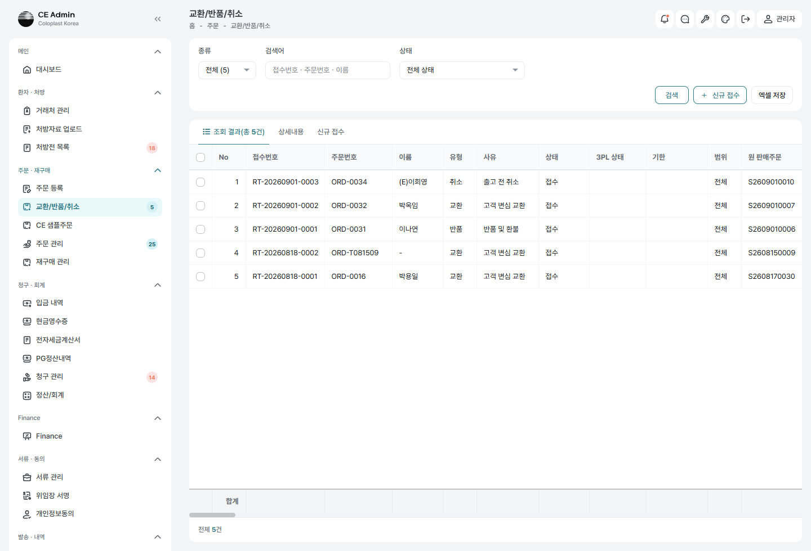

> **배송비는 없습니다.** 어느 화면에도 「배송비 부담」 칸이 없어야 합니다.

| 유형 | 갈래 | 금액 조정 | 재고 이동 |
|---|---|:---:|:---:|
| 일반 교환 (단순 변심) | 고객 변심 교환 | — | 있음 |
| 불량 교환 | 불량 교환 | — | 있음 |
| 일반 반품 (환불) | 반품 및 환불 | 전액 | 있음 |
| 불량 반품 | **불량 반품** | 전액 | 있음 |
| 부분 교환 | 고객 변심 교환 · 부분 | **필요** | 있음 |
| 부분 반품 | 반품 및 환불 · 부분 | **필요** | 있음 |
| 자격 변경 | 자격 변경 (환불ㆍ추가 입금) | **필요** | **없음** |

### 반품ㆍ취소에는 무엇이 생기는가 (2026-09-04 확인)

**새로 만드는 서류는 없습니다.** 되돌리기만 합니다 —
수정(마이너스) 세금계산서ㆍ현금영수증을 새로 내지 않고 **원본을 취소**합니다.

| 무엇 | 어떻게 |
|---|---|
| 세금계산서 | 팝빌 **취소**(`cancelIssue`) → `cancelled` |
| 현금영수증 | 팝빌 **취소** → `cancelled` |
| 카드 매출전표 | 결제 취소가 되면 전표가 **「취소거래」**로 다시 그려진다 |
| 공단 청구 | 청구 대상에서 뺀다 |
| 거래명세서 | **그대로 둔다** — 물건은 나간 채로 있다 |
| 위드웍스 | 반품ㆍ교환은 **반품주문**(1505)을 세우고, **출고 전 취소만** 원 판매주문을 취소 |

> 반품 흐름의 마지막 단계 이름이 「**발행 완료**(`credited`)」라 새로 발행하는 것처럼
> 읽히지만, 실제로는 **되돌리기**입니다. 증빙 취소는 이 단계에서 일어납니다.

## 접수 화면에 적는 것

| 칸 | 넣을 값 |
|---|---|
| 종류 | 교환 / 반품 / 취소 |
| 사유 | 단순 변심 · 사이즈 교환 · 상품 불량 · 오배송 · 배송 지연 · 자격 변경 · 기타 |
| 하위 갈래 | (취소일 때만) 출고 전 취소 / 자격 변경 |
| 주문 검색 | ［🔍］ 로 원 주문을 고른다 |
| 되돌릴 수량 | 표에서 줄마다 고친다 — **줄이면 부분** |
| 환불 수단 | 계좌 환불 / 카드 결제취소 / 가상계좌 환불 |

## 9.1 — 일반 교환

**확인**

- [ ] 갈래가 「고객 변심 교환」
- [ ] **배송비 부담 칸이 어디에도 없다**
- [ ] 위드웍스에 교환 주문이 선다

## 9.2 — 불량 교환 · 불량 반품

**입력** 사유를 「상품 불량」 또는 「오배송」

**확인**

- [ ] 교환은 「불량 교환」, 반품은 **「불량 반품」** 으로 갈린다
- [ ] 승인자가 Consumer Operation manager
- [ ] 입금을 다시 확인하지 않는다

## 9.3 — 부분 반품

| 순서 | 하는 일 |
|---|---|
| ① | 접수 화면에서 **되돌릴 수량**을 줄인다 |
| ② | 「**부분입니다 — 되돌린 뒤 「금액조정」 단계에서 남는 금액을 적습니다**」가 뜨는지 본다 |
| ③ | 접수 → 승인 → 환불까지 진행 |

**확인**

- [ ] 흐름에 **「금액조정」 단계가 끼어 있다**
- [ ] 상세에 조정 금액 칸이 서고 줄에서 셈한 값이 미리 채워져 있다
- [ ] 금액을 적지 않고 금액조정으로 넘어가려 하면 **막힌다**

## 9.4 — 조정 금액 셈

**입력** 본인부담 121,500원 · 540개 주문에서 **270개**만 되돌린다

**확인**

- [ ] 남는 금액이 **60,750원** 으로 미리 채워진다

## 9.5 — 자격 변경

**입력** 취소 › 사유 「자격 변경」

**확인**

- [ ] 갈래가 「자격 변경 (환불ㆍ추가 입금)」
- [ ] **창고에 알리지 않는다** — 되돌려 받을 물건이 없다
- [ ] 조정 방향을 **환불 / 추가 입금** 둘 중에 고를 수 있다
- [ ] 흐름 — 접수 → 승인 → 결제취소 → 금액조정 → 발행 → 완료

## 9.6 — 전체 반품

**단계** 접수 → 수거중 → 검수중 → 검수 확정 → 전자 승인 → 환불완료 → **［발행 완료］**

> 증빙 취소는 **「발행 완료」 단계에서** 일어납니다. 「환불완료」까지만 밟으면
> 원 주문은 「취소」로 가지만 세금계산서는 아직 살아 있습니다 — 끝까지 밟으십시오.

**확인**

- [ ] 세금계산서ㆍ현금영수증이 **취소**된다
- [ ] 원 주문 상태가 「취소」
- [ ] 위드웍스에 **반품주문(유형 1505)이 선다**

> **원 판매주문은 취소되지 않습니다** — 그것이 맞습니다(2026-09-04 확인).
> 반품은 물건을 수거해야 하므로 창고에 되돌려 받는 주문이 필요하고, 원 주문을
> 지우면 나간 자취가 사라집니다. **원 판매주문을 취소하는 것은 출고 전 취소뿐**입니다(9.7).

## 9.7 — 출고 전 취소

**확인**

- [ ] 수거ㆍ검수 단계가 없다
- [ ] 원 판매주문이 취소된다

## 9.8 — 반품 접수 표의 장비코드

**확인**

- [ ] 제품코드 옆에 「**장비코드**」 칸이 서고 값이 채워져 있다

## 9.9 — 접수자 알림과 승인 요청 (2026-09-04 보탬)

절차서의 「inform」 자리 둘입니다. **창고 알림(8.6)과 같은 방**에 쌓입니다.

| 언제 | 누구에게 | 무엇이 |
|---|---|---|
| 창고가 반품을 움직였을 때 (`ro.*`) | **접수자 한 사람** (배정된 사람, 없으면 접수한 사람) | 알림 + 채팅 |
| 다음이 승인 차례일 때 | **승인할 수 있는 권한을 가진 이들** | 알림 + 채팅 (「승인 요청」 방) |

**확인**

- [ ] 창고 사건이 오면 **접수자에게만** 뜬다 (전원에게 뿌리지 않는다)
- [ ] 「창고 알림」 방에 자취가 남는다
- [ ] 검수 확정ㆍ전자 승인 차례가 되면 **승인자에게** 「…을 기다립니다」가 간다
- [ ] 「승인 요청」 방에도 남는다

---

# 10. 서류와 세무 발행

## 10.1 — 청구 서류 묶음

### 묶음에 무엇이 드는가 (2026-09-04 확정)

| 서류 | 언제 |
|---|---|
| 처방전 | 늘 |
| **요양비 지급청구서**(별지 제12호) | **기초 건에만** |
| 개인정보 수집·이용 동의서 | 늘 |
| 거래명세서 | 늘 |
| 전자세금계산서 | 늘 |
| **카드 매출전표** | **카드로 받았을 때만** |
| 의료용품 구입 확인서 | 자리만 두고 「따로 뽑으라」고 적는다 (그때그때 그리는 서류) |

> **현금영수증은 공단에 내지 않습니다**(2026-09-04 확정) — 본인부담 몫의 증빙이라
> 환자에게 가는 것이고, 공단이 보는 것은 세금계산서입니다.
> 청구 준비 조건에서도 걷었습니다 — 조건으로 두었더니 본인부담이 0인 건
> (차상위경감ㆍ기초)은 낼 현금영수증이 없어 영영 「청구 준비 안 됨」에 머물렀습니다.

**확인**

- [ ] **기초** 건에만 **요양비 지급청구서**(별지 제12호)가 함께 붙는다
- [ ] 「(서명 또는 인)」 칸에 위임동의 서명이 얹혀 있다
- [ ] 회색 난(지급의뢰일ㆍ심사결정액ㆍ본인부담액ㆍ지급액)은 **비어 있다**
- [ ] **카드 건에는 매출전표가 들고, 아니면 그 자리 자체가 없다**
- [ ] **현금영수증은 들지 않는다**
- [ ] 본인부담이 0인 건도 **「청구 준비 됨」에 이를 수 있다**

## 10.2 — 첨부 문서 유형

**확인** — 고를 수 있는 유형에 다 있다

- [ ] 처방전 · 등록신청서 · 결과지 · 신분증
- [ ] 요양비위임장 · **개인정보 동의서**
- [ ] 거래명세서 · 현금영수증 · 세금계산서 · 카드매출
- [ ] 의료용품구입확인서(지자체용) · 등기처리 영수증 · **요양비 지급청구서** · 기타

## 10.3 — 전자세금계산서 주문 불러오기

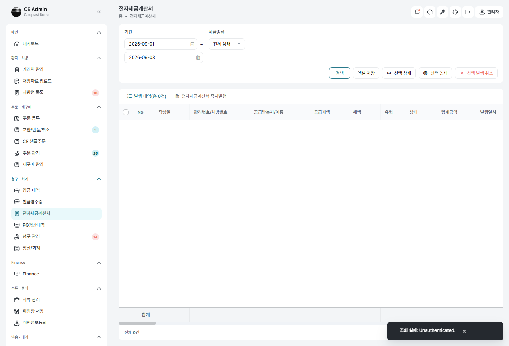

| 순서 | 하는 일 |
|---|---|
| ① | `청구ㆍ회계 › 전자세금계산서` |
| ② | 품목 목록 머리의 **［주문 불러오기］** |
| ③ | 주문번호나 환자명으로 찾아 고른다 |

**확인**

- [ ] 품목 줄이 **제품마다** 채워진다
- [ ] **규격ㆍ장비코드** 칸이 채워진다
- [ ] 금액이 청구전략 몫대로 나뉘고 **합계가 맞는다**
- [ ] 공급받는자ㆍ비고(주문번호)가 채워진다
- [ ] 이미 발행된 건을 고르면 **한 번 묻는다**

## 10.4 — 지자체 등기 발송

**확인**

- [ ] 기초 건에서 발송일ㆍ등기번호ㆍ영수증을 적어 둘 수 있다
- [ ] 이미 부친 것이 보인다 (두 번 부치지 않게)
- [ ] **팩스 단추가 없다** (→ 4.3.1)

### 봉투에 무엇이 드는가 (2026-09-05 고침 · 3차 4회 ⑥)

지자체 건은 **사람이 인쇄해 봉투에 넣는 길**이라, 목록에 없는 서류는 그대로 빠진다.
정작 청구의 뼈대인 둘이 빠져 있었다.

| 서류 | 만드는 곳 |
|---|---|
| **요양비 지급청구서**[별지 제12호] | `MedicalAidClaimForm::applies/attach` |
| **의료용품 구입확인서** | `documents.purchaseConfirm` |
| 요양비위임장 · 등록신청서 · 결과지 · 신분증 · 통장사본 | 그대로 |

- [ ] 청구 도우미의 **지자체 서류 목록에 일곱 가지가 모두** 선다

## 10.5 — 증빙 보내기 (산재ㆍ자동차보험)

**확인**

- [ ] 문자에는 열어 볼 주소가, 메일에는 파일이 붙어 나간다
- [ ] 같은 유형이 두 벌이면 **한 장만** 간다
- [ ] 파일이 없으면 보내지 않고 그렇게 말한다

---

# 11. 회귀 확인

## 11.1 — 배송비가 어디에도 없다

**훑을 화면** 주문 목록 · 주문 상세 · 출고 상세 · 정산 상세 · 거래처 상세 · 주문 등록 · 교환반품취소 · 마스터

**확인**

- [ ] 「배송비」 글자가 **한 곳도 없다**
- [ ] 거래명세서 뒷면 안내에도 없다
- [ ] 옛 26건의 총액은 **그대로**다 (3,000원이 적힌 채)

## 11.2 — 장비코드가 서는 자리 여덟

- [ ] 제품 조회 결과
- [ ] 주문 상세 (단일ㆍ다중)
- [ ] 출고 상세
- [ ] 반품 상세
- [ ] 반품 접수 표
- [ ] 거래명세서
- [ ] 세금계산서 규격 칸
- [ ] 현금영수증 품명

## 11.3 — Finance 그룹

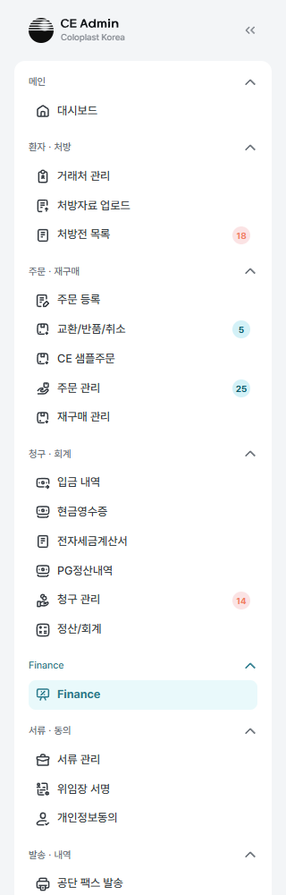

- [ ] 왼쪽 메뉴에 **Finance** 가 제 묶음으로 서 있다
- [ ] 「PG결제」가 「**PG정산내역**」으로 바뀌어 있다

## 11.4 — 채팅

> 「창고 알림」 방은 **사람마다 하나**이고, 창고 소식(8.6)과 반품 소식이 같은 방에 쌓입니다.
> 아래는 사람이 주고받는 채팅 쪽 확인입니다.

- [ ] 파일 **여러 장**을 한 번에 올릴 수 있다
- [ ] 첫 장만 글을 싣는다
- [ ] 알림이 **한 번만** 온다
- [ ] ［첨부 모두 받기］ 로 zip 이 내려온다 (같은 이름도 번호로 갈린다)
- [ ] 「창고 알림」 방의 자동 알림 줄은 **보낸 사람 없이** 선다 (8.6 · 9장과 같은 방)

## 11.5 — 토스 환경 전환

**단계** 설정에서 사용 환경을 운영 → 테스트로 바꿔 본다

- [ ] 키와 테스트 모드가 **함께** 바뀐다
- [ ] 배포 없이 그 자리에서 적용된다

## 11.6 — 화면 낱말 (2026-09-07 보탬)

- [ ] 「**시험**」이라 적힌 자리가 **한 곳도 없다** — 모두 「테스트」다
- [ ] 설정 › 서비스 연동 설정의 탭 이름이 「**테스트 설정**」이다
- [ ] 건강보험공단 탭에 **하이팩스 칸이 없다** (읽는 코드가 없어 걷어냈다)
- [ ] 고르는 칸에 **설명이 붙어 있지 않다** — 전화번호에 「(적혀 있던 번호)」,
      담당자에 「(나)」 같은 것. 값만 선다

## 11.7 — 미성년 갈래 (2026-09-07 보탬)

**전제** 만 19세 미만인 사람의 건

### 11.7.1 — 거래처에 보호자 자리가 있다

- [ ] 거래처 **등록ㆍ수정 창**에 「보호자」 줄이 선다 — 관계ㆍ성명ㆍ생년월일ㆍ연락처
- [ ] 주민번호를 치면 생년월일이 채워지고 **보호자 줄이 저절로 선다**
- [ ] **성년이면 서지 않는다.** 다만 이미 적어 둔 보호자가 있으면 성년이어도 선다
      (감추면 화면에 없는 채로 저장되어 지워진다)
- [ ] 거래처 **상세**에도 「보호자 ○○○ (관계) · 생년월일 · 연락처」가 선다

### 11.7.2 — 위임동의가 보호자를 다시 묻지 않는다

- [ ] 서명 화면을 열면 **거래처에 적힌 보호자가 미리 채워져 있다**
- [ ] 서명이 끝나면 받은 보호자가 **거래처에 적힌다** — 비어 있던 칸만
      (담당자가 손으로 고쳐 둔 값은 덮지 않는다)
- [ ] 이력에 「위임동의에서 받은 보호자를 거래처에 적었습니다 (○○○)」

### 11.7.3 — 서명을 한 번만 받는다

- [ ] 미성년이면 **위임인 서명란이 서지 않는다** — 보호자 서명 하나뿐이다
- [ ] 안내 — 「이 서명 하나로 위임장의 위임인ㆍ법정대리인 두 자리를 채웁니다」
- [ ] 요양비위임장의 **두 자리가 모두 채워진다** (같은 그림, 이름은 각각)
- [ ] **성년 건은 그대로 서명란 하나**다

> **왜 하나로 합쳤나** — 위임인이 만 여덟 살이면 그 서명도 결국 보호자가 그린다.
> 한 사람이 두 번 그리고 그중 하나가 아이 것으로 남았다. 미성년의 위임은
> 법정대리인이 한다. 서식은 그대로라 공단에 내는 것은 달라지지 않는다.

## 11.8 — 검수 요청ㆍ승인 알림 (2026-09-07 보탬)

**단계** 상세 목록에서 ［검수 요청하기］ → 다른 사람이 ［검수 승인하기］

- [ ] 요청하면 **검수 승인 권한이 있는 사람들**에게 알림과 채팅이 간다
- [ ] 반품 승인과 **같은 「승인 요청」 방**에 쌓인다
- [ ] **누른 사람에게는 가지 않는다** (요청자가 승인자이기도 한 일이 흔하다)
- [ ] 승인하면 **요청한 담당자에게** 「검수가 승인되었습니다 · ○○○」가 돌아온다

> 여태 상태만 바꾸고 아무에게도 알리지 않았다. 요청한 담당자는 눌러 놓고
> 기다리고, 검수자는 목록을 들여다봐야 알았다.

## 11.9 — 목록의 칸이 위드웍스 판매현황과 같다 (2026-09-07 보탬)

**훑을 화면** Finance · 주문 관리 · 입금 내역 · 현금영수증 · 청구 관리 · 교환/반품/취소

- [ ] 여섯 화면이 **같은 차례**로 선다(`ceWwCols`)
- [ ] **출고창고ㆍ납품창고**가 있다
- [ ] 유형ㆍ구매/판매 거래처ㆍ병원거래처 주소ㆍ제품그룹ㆍ등급ㆍ매출 단가/금액 등
      **판매현황의 칸이 빠짐없이** 선다
- [ ] 구분(SB/SCI)ㆍ주민등록번호(가린 것)ㆍ상병코드ㆍ횟수ㆍ보호자명은
      **우리 자료에서 바로 채워진다**
- [ ] Finance 는 **재무 칸(매출ㆍ입금ㆍ미수)이 맨 앞**에 서고 판매현황 차례가 뒤에 온다

> **창고 값은 웹훅으로 온다.** 위드웍스가 판매주문 사건마다 실어 보낸다.
> 아직 연계하지 않았거나 옛 위드웍스가 보낸 건은 **비어 있다** — 없는 것이
> 아니라 못 받은 것이다. 지난 건은 위드웍스 판매 주문 화면의
> **「CE Admin 재전송」**으로 한 건씩 되살린다.

## 11.10 — 서명 화면 안내

- [ ] 보낸 사람이 보인다
- [ ] 저장하면 「동의가 완료되었습니다」가 보인다
- [ ] 안내 창에 `\n` 같은 글자가 그대로 보이지 않는다

---

## 11.11 — 문서마다의 밝기ㆍ명암 (2026-09-09 보탬)

**단계** 주문 등록 → 처방전 뷰어 → 도구줄의 ［◐］

- [ ] 우리가 받아 둔 **그림**을 고르면 ◐ 가 선다 — 회전ㆍ복원과 **같은 묶음**이다
- [ ] **PDF 를 고르면 ◐ 가 숨는다** (처방전 PDFㆍ첨부 PDFㆍ시스템이 만든 서류 모두)
- [ ] 시스템이 만든 서류(위임동의서ㆍ위임장ㆍ팩스통합본)와 서명 그림에도 서지 않는다
- [ ] ◐ 를 누르면 오른쪽 아래에 **밝기ㆍ명암** 슬라이더가 뜬다 (−100 ~ 100, 0 이 원본)
- [ ] 슬라이더를 끄는 **즉시 그림이 바뀐다** (저장 전)
- [ ] 적혀 있는 값과 같으면 ［저장］이 **잠겨 있다**
- [ ] ［저장］을 누르면 **칸이 닫힌다**
- [ ] **새로고침해도 그대로 선다** — 슬라이더 자리도 값도 같다
- [ ] ［크게 보기］ 창에도 **같은 값이 걸린다**
- [ ] ［원본］은 슬라이더만 0 으로 돌린다 — **［저장］을 눌러야 문서에서도 지워진다**
- [ ] 문서를 바꾸면 **그 문서의 값**이 따라온다 (문서마다 따로 적힌다)
- [ ] 거래처 관리의 처방전 미리보기에서는 **◐ 가 서지 않는다** (남길 곳이 없다)

**공단 팩스에 그대로 나가는가** — 이것이 이 기능의 전부다

- [ ] 맞춰 둔 그림을 공단으로 보낸다 (닿지 않는 번호 `02-0000-0000`)
- [ ] 팝빌 전송 내역에서 **밝게 나간 것을 눈으로 확인**한다
- [ ] 값이 0ㆍ0 인 문서는 **원본 파일 그대로** 나간다
- [ ] **원본 파일이 그대로 남아 있다** — 서류 관리에서 내려받아 견준다
- [ ] 자동 팩스(재등록ㆍ신규등록)에도 같은 값이 걸린다

> **왜 파일을 고치지 않는가** — 예전 「사진 보정」은 올릴 때 파일을 그 자리에서
> 고쳤다. 스캐너로 곧게 뜬 것까지 나빠졌고 되돌릴 길이 없어 걷어냈다(2026-09-09).
> 이번에는 숫자 둘만 적어 둔다. 화면은 CSS 로, 팩스와 서류는 GD 로 같은 값을 입힌다.
> 0 으로 되돌리면 원본이다.

> **PDF 는 제외한다** — GD 가 열지 못한다. 다만 PDF 첨부는 여태도 팩스 본문에
> 들어가지 않았으므로(dompdf 가 외부 PDF 를 못 넣는다) 새로 생기는 제약은 아니다.

## 11.12 — 날짜와 총계를 세는 잣대 (2026-09-09 보탬)

**단계** 주문 등록 → 병원ㆍ처방 정보

- [ ] **위임동의 시작일**을 넣으면 종료일이 **＋5년 −1일**로 선다
      (2026-09-07 → **2031-09-06**). 위임장 PDF 와 **같은 날짜**여야 한다
- [ ] 기간은 설정에서 온다(`delegation.period_years`) — 숫자를 박아 두지 않았다
- [ ] **처방전 발행일 ＋ 총 처방일수 −1** 이 처방전 종료일이다
      (2026-09-09 ＋ 90 → **2026-12-07**)
- [ ] **총계 칸은 손으로 못 적는다**(읽기 전용)
- [ ] 1일 처방 개수나 총 처방일수를 **고치면 총계가 따라 바뀐다** (3×30=90 → 5×30=150)
- [ ] 둘 중 하나라도 **비우면 총계는 그대로 남는다** — 지우는 도중에 잃지 않는다

> 화면은 위임 종료일에 **한 달**을 더하고 있었고 위임장 PDF 는 5년을 더했다.
> 같은 환자가 서류에는 2031-09-06, 거래처 관리에는 2026-10-07 로 찍혔다.
> 총계는 **비어 있을 때만** 채워, 두 값을 고쳐도 옛 값이 남았다.

## 11.13 — 서류에 적히는 이름에서 (E) 를 뗀다 (2026-09-09 보탬)

**(E) 는 사업부가 IC 라는 우리 쪽 표시다** — 위드웍스의 개인 거래처 표기와 맞추려고
모델이 이름 앞에 자동으로 단다. 공단ㆍ국세청ㆍ환자가 보는 종이에는 설 자리가 없다.

- [ ] 요양비 지급청구 **위임장** — 성명ㆍ서명란에 (E) 가 없다
- [ ] **공단 팩스 통합본** — 성명 칸과 위임 문구에 없다
- [ ] **거래명세서** — 받는 이와 파일 이름에 없다
- [ ] **구입확인서** — 성명ㆍ확인자에 없다
- [ ] **증빙 묶음 표지**ㆍ**청구 묶음 표지**에 없다
- [ ] **세금계산서 발행 이름**에 없다 (국세청으로 나간다)
- [ ] **본인확인(NICE) 대조**도 (E) 를 뗀 이름으로 견준다
- [ ] 화면과 목록에는 **그대로 (E) 가 붙어 있다** — 사업부를 가르는 표시다

## 11.14 — 주 연락처 (2026-09-09 보탬)

**단계** 거래처 등록ㆍ수정 창 / 거래처 상세

- [ ] 전화번호1ㆍ2 가 **환자 전화번호ㆍ보호자 전화번호**로 선다
      (목록ㆍ상세ㆍ등록 창ㆍ주문 등록ㆍ상담 창ㆍ반품ㆍ샘플 주문ㆍ저장 이력)
- [ ] **Main contact** 는 고르는 칸 하나다 — 선택ㆍ환자ㆍ보호자
- [ ] 고른 뒤 저장하고 **새로고침해도 그대로**다
- [ ] 상세에서 그 번호 옆에 **「Main」** 표가 붙는다
- [ ] 창을 새로 열면 **앞사람의 값이 따라오지 않는다**
- [ ] 예전 거래처는 **비어 있다** — 함부로 「환자」로 단정하지 않았다

> **아직 값을 쓰는 곳은 없다.** 문자ㆍ알림은 그대로 환자 번호로 간다 — 먼저 걸 번호를
> 적어 두는 일과 그 번호로 무엇을 보낼지는 다른 결정이다.

## 11.15 — 화면 이름이 하는 일에 맞는가 (2026-09-09 보탬)

- [ ] **엑셀 저장 → 엑셀 다운** — 목록 서른한 곳과 표 안쪽 단추
- [ ] **검수 메모 → 참고 사항** — 목록 둘ㆍ주문 등록 셋ㆍ저장 이력 이름표
      (**검수 요청 메모는 그대로**다 — 검수자에게 보내는 말이라 성격이 다르다)
- [ ] **확인사항 → 요류역학검사 결과**
- [ ] **처방전 설정 → 담당자 · 메모** (업로드 화면. 그 칸에 담긴 것이 그 둘뿐이다)
- [ ] 거래처 관리의 **찾는 자리가 세로로 줄었다** — 목록이 그만큼 위로 올라온다

## 11.16 — 전문 과목과 하루 사용 수량 (2026-09-09 보탬)

- [ ] 전문과목은 **고르는 칸**이고 여섯이 선다 —
      비뇨기과ㆍ**소아비뇨의학과**ㆍ재활의학과ㆍ정형외과ㆍ**신경과**ㆍ**신경외과**
- [ ] 목록에 없는 값이 이미 적혀 있으면 **「기존 값」으로 그대로 선다** (비뇨의학과 등)
- [ ] 주문 등록에 **「하루 사용 수량」 칸이 없다** — 「마지막 확정 수량」 하나뿐이다
- [ ] 주문 관리 목록에도 **그 칸이 없다**
- [ ] 저장 이력에서 **지난 「하루 사용 수량」 기록은 그대로 읽힌다** (이름표를 남겼다)
- [ ] 「최종 신규 복제」로 만든 건에 **그 값이 그대로 이어진다** (DB 칸은 살아 있다)

---

## 11.17 — 급여 기간은 결제일에서 선다 (2026-09-09 보탬)

**셈** 급여 종료일 = 다음 재구매 가능일 = **모든 서류 발행일(＝결제일) ＋ 총 처방일수**

- [ ] **결제일과 구입일(모든 서류 발행일)은 늘 같은 날짜**다 — 한쪽을 적으면 다른 쪽이 따라온다
- [ ] **사용 개시일ㆍ급여 종료일은 잠겨 있다** — 손으로 적지 않는다
- [ ] 돈이 들어오면 서버가 채운다 — **가상계좌 입금ㆍ카드 승인ㆍ담당자 입금 확인ㆍ남은 걸음 다시 밟기** 넷
- [ ] **결제가 없는 건(기초ㆍ차상위)**은 주문 등록에서 저장할 때 구입일에서 센다
- [ ] **이미 받은 건은 저장해도 다시 세지 않는다** — 받은 날이 정본이다
- [ ] 총 처방일수를 모르면 세지 않는다 (0 을 더해 「오늘까지」로 적어 두지 않는다)
- [ ] 거래처 상세에 **「급여 종료일」**이 선다 — 가장 나중 날짜를 가진 건에서 읽고 그 처방번호도 함께 적는다

**Five/Six(110days) 인 건 (2026-09-09 확정)**

- [ ] 그 칸에 값이 적혀 있으면 **다음 재구매 가능일만 스무 날 뒤**로 선다
- [ ] **급여 종료일은 그대로**다 — 언제까지 쓰는가와 언제 다시 살 수 있는가는 다른 물음이다
- [ ] 그 칸을 고치면 **그 자리에서 다시 센다**. 서버도 같은 잣대를 쓴다(App\Support\BenefitDates)
- [ ] 값이 없는 건은 종료일과 다음 재구매 가능일이 같다

> 「예ㆍ아니오」를 고르는 칸이 아니라 값을 적는 칸이다(지금 담긴 일곱 건은 모두 540) —
> 적혀 있다는 것 자체를 그 프로그램으로 읽는다.

> **건보위임동의 종료일과 다른 값이다.** 그쪽은 시작일 ＋5년 −1일이고 거래처에 붙는다.
> 여태 한 칸을 둘이 나눠 썼다 — 화면의 「사용 시작일ㆍ급여 종료일」이 거래처의
> 위임 기간을 그대로 빌려 쓰고, 아래 「건보위임동의」 두 줄은 그 값을 비추기만 했다.
> 규칙이 다른 두 값이라 한 칸으로는 둘 다 만족할 수 없다(11.12 참고).

## 11.18 — 거래처의 변경 이력 (2026-09-09 보탬)

**단계** 거래처 관리 › 한 사람 › **［변경 이력］** 탭

- [ ] 저장 단위로 목록이 선다 — 일시ㆍ작업자ㆍ설명ㆍ**바뀐 항목**ㆍ건수
- [ ] 줄을 누르면 **저장 전(왼쪽) · 항목 · 저장 후(오른쪽)**로 견준다
- [ ] 항목 이름이 **한글**이다 (칸 이름이 영어로 서지 않는다)
- [ ] **주민등록번호는 서지 않는다**
- [ ] 시스템이 채우는 값은 서지 않는다 — 파일 자취ㆍ위드웍스 웹훅 값ㆍ보낸 때ㆍ발행한 때
- [ ] 주문 등록의 **「저장 이력」**도 같은 모양이고 같은 셈을 쓴다(App\Support\SaveHistory)

## 11.19 — 거래처 하나에 주소 여러 벌 (2026-09-09 보탬)

**단계** 거래처 상세 › 주소 옆 **［주소 관리］** / 주문 등록 › ［거래처 수정］ › ［주소 관리］

- [ ] 두 자리에서 **같은 창**이 열린다 (거래처 상세ㆍ거래처 수정 창)
- [ ] **주소 검색**으로 우편번호ㆍ도로명을 채우고 상세만 적는다
- [ ] **추가** — 같은 주소는 두 번 들어가지 않는다
- [ ] **수정** — 지금 쓰는 주소를 고치면 거래처 칸도 따라간다
- [ ] **삭제** — 마지막 한 줄은 지울 수 없다
- [ ] **사용** — 그 줄이 거래처의 주소가 된다. 서류ㆍ팩스ㆍ배송지가 모두 그 값을 읽는다
- [ ] **「현재」 표**는 자리가 아니라 **거래처 칸과 같은 줄**에 붙는다
- [ ] **초기화**는 늘 서 있다 — 수정하다 말고 새 주소를 넣을 수 있다
- [ ] 새로 만드는 중(거래처 등록)에는 ［주소 관리］가 서지 않는다

**상세 목록에서 고르기**

- [ ] 주문 등록 › 상세 목록 › **［주소 선택］** — 등록된 것 가운데 고른다
- [ ] 고르면 주소ㆍ상세ㆍ**배송지까지** 함께 바뀐다 (「배송 주소 동일」이 켜져 있을 때)
- [ ] **［주소 검색］은 여기 없다** — 새 주소는 거래처 관리에서 넣는다
- [ ] 저장하고 새로고침해도 그 건에 남는다

> 5월 구매는 A주소, 9월 구매는 B주소인 일이 있다. 거래처의 주소는 그대로 두고 이 건만
> 다른 주소로 보낼 수 있어야 한다.

## 11.20 — 마케팅 동의는 덧쓴다 (2026-09-09 보탬)

- [ ] 처음에는 **개인정보동의서의 값**이 답이다 — 화면에 「개인정보동의」라 적힌다
- [ ] 거래처에서 고르면 **그것이 답**이 된다 — 「거래처 · 일시 · 사람」이 함께 적힌다
- [ ] 동의서와 다르면 **「(개인정보동의: 동의함)」**처럼 원래 값도 함께 밝힌다
- [ ] **「동의서를 따름」**을 고르면 다시 동의서의 값으로 돌아간다
- [ ] **개인정보동의서는 그대로다** — 본인이 서명해 낸 것이고 무엇에 동의했는지가 남아야 한다
- [ ] 값이 그대로면 수정자ㆍ시각을 건드리지 않는다 (다른 칸을 고칠 때마다 오늘로 밀리지 않는다)

## 11.21 — 관할 청구처는 한 칸이다 (2026-09-09 보탬)

- [ ] 자격이 **건보**면 지사 이름과 ［찾기］가 선다
- [ ] 자격이 **지자체**면 시군구 칸과 ［자동］이 선다
- [ ] 「관할 지자체」라는 **따로 선 줄이 없다** — 라벨은 「관할 청구처」 하나다
- [ ] ［자동］은 **주소에서 시군구를 다시 뽑는다** — 주소를 고친 뒤에 맞출 수 있다

## 11.22 — 상세 목록의 환자 정보는 읽기만 한다 (2026-09-09 보탬)

- [ ] 주소ㆍ상세 주소ㆍ**건보위임동의 시작일ㆍ종료일** 모두 잠겨 있다
- [ ] 잠긴 칸에 손을 대면 「거래처관리에서 수정합니다」가 뜬다
- [ ] 주소는 **［주소 선택］**으로만 바뀐다
- [ ] **5년 자동계산은 거래처 쪽에 있다** — 거래처 수정 창ㆍ거래처 상세에서 시작일을 적으면
      종료일이 ＋5년 −1일로 선다 (2026-09-07 → **2031-09-06**)

## 11.23 — 제품 수량은 담당자가 적는다 (2026-09-09 보탬)

- [ ] 새 줄의 수량은 **비어 있다**
- [ ] 제품을 골라도 **수량을 채우지 않는다** (예전에는 처방 총계로 덮었다)
- [ ] 비우면 그 줄의 금액이 **₩ 0** 이다
- [ ] 제품은 골랐는데 수량이 빈 줄이 있으면 **저장이 막히고** 주문 제품 탭으로 데려간다
- [ ] 총계는 바로 위 「처방 참고」 줄에 서 있다

## 11.24 — 주민등록번호와 성별 (2026-09-09 보탬)

- [ ] 주민등록번호에 **별표가 없다** — 비워 두고 저장할 수 있다(처방외)
- [ ] 적었으면 **열세 자리**를 다 적어야 한다
- [ ] 번호를 치면 **생년월일과 성별**이 그 자리에서 선다 (뒷자리 첫 숫자: 홀수 남ㆍ짝수 여)
- [ ] 사람이 골라 둔 성별은 덮지 않는다
- [ ] **거래처 상세에 성별 칸**이 있다 — 번호 없는 사람은 여기서 고른다

## 11.25 — 결제 유형은 토스가 알려 준 대로 (2026-09-09 보탬)

- [ ] 링크페이로 받은 건은 **「간편결제 · 토스페이」**처럼 실제 유형이 선다
- [ ] 카드면 **「카드 · 신한 신용」**처럼 발급사와 갈래까지 적는다
- [ ] 토스가 알려 준 것이 없으면(담당자가 통장 보고 확인한 건) **예전처럼 고른 방식**을 적는다
- [ ] 취소ㆍ부분취소된 건도 **받았던 유형 그대로** 적는다 — 「무엇으로 받았나」는 달라지지 않는다

## 11.26 — 장비코드와 요양기관코드 (2026-09-09 보탬)

- [ ] 주문 등록 › **주문 제품** 표에 **［장비코드］** 칸이 있다 (제품 코드 다음)
- [ ] 제품을 고르면 함께 들어오고, 예전에 저장된 줄은 품번으로 찾아 채운다
- [ ] 처방전 목록에 **［요양기관코드］** 칸이 있다 (병원 다음)
- [ ] **검색어로 요양기관코드를 찾을 수 있다** (`11023456` 로 그 건이 나온다)

## 11.27 — 손댄 사람은 하나만 적는다 (2026-09-09 보탬)

- [ ] 고친 적이 없으면 **「등록 : 이름 · 일시」**
- [ ] 고친 적이 있으면 **「수정 : 이름 · 일시」**
- [ ] 둘을 함께 적지 않는다 — 누가 만들었는지까지 알아야 하면 「변경 이력」 탭이 첫 줄부터 보여 준다
- [ ] **신환 Master 등록일은 제 칸**에 선다 (자취 줄에 이어 붙지 않는다)
- [ ] 주문 등록의 같은 줄도 라벨이 **「등록자」/「수정자」**로 바뀌며 하나만 적는다

## 11.28 — 앱으로 올린 건도 상세 목록으로 열린다 (2026-09-10 보탬)

**단계** 처방전 목록 › 출처가 **모바일**인 줄을 **더블클릭**

- [ ] 주문 등록 화면이 **「상세 목록」 탭**으로 열린다 (웹으로 올린 건과 같다)
- [ ] 문서가 붙어 있는 건은 **더는 「빈 초안」이 아니다**
- [ ] 서류를 한 장 붙이는 순간 그 표시가 풀린다 — 처방전 줄을 따로 저장하지 않아도 된다
- [ ] 아무것도 붙지 않은 초안(신규 등록으로 만든 껍데기)은 그대로 **「주문 목록」**으로 열린다

> 빈 초안 표시는 처방전 줄 자체가 저장될 때만 풀렸다. 앱은 줄을 만들어 두고 파일만
> 붙이므로 서류가 석 장 붙은 건에도 그 표시가 남았고, 화면은 그것을 보고 주문 목록을
> 세웠다. blankDraft 잣대는 이미 「딸린 것이 하나라도 있으면 빈 초안이 아니다」로 보고
> 있었다 — 표시만 그 뜻을 따라가지 못했다.

## 11.29 — 청구 한도는 더 나빠질 때만 막는다 (2026-09-10 보탬)

**자리** 주문 등록 › 저장

- [ ] **하루 금액** — 총 구매 금액 ÷ 총 처방일수가 9,000원을 넘으면 알린다
- [ ] **구매 수량** — 총 구매수량이 1일 처방 개수 × 총 처방일수(총계)를 넘으면 알린다
- [ ] 넘긴 채로 저장을 누르면 **주문 제품 탭으로 옮겨** 어디가 문제인지 보여 준다
- [ ] **담겨 있던 값이 이미 넘어 있던 건**은, 그보다 나빠지지 않으면 저장된다 —
      「담겨 있던 값 그대로라 저장은 됩니다」라고 알린다
- [ ] 그 건에서 수량을 **더 올리면** 그때는 막힌다

> 한도를 넘는 건이 이미 마흔일곱이다(품목이 있는 76건 가운데 하루 한도 47, 수량 한도 3).
> 무조건 막으면 그 건들은 주소ㆍ메모처럼 한도와 아무 상관 없는 칸도 고칠 수 없다.
> 그래서 **더 나빠지지만 않으면 지나가게** 한다. 넘었다는 것은 그때도 늘 알린다.

**확인한 것 (RX-20260908-008 · 처방일수 30 · 총계 150 · 수량 360 · 810,000원)**

| 누른 것 | 나온 것 |
|---|---|
| 그대로 저장 | 「하루 한도를 넘었습니다 — 810,000원 ÷ 30일 = 27,000원 (한도 9,000원). 담겨 있던 값 그대로라 저장은 됩니다.」 · 「구매 수량이 처방을 넘었습니다 — 360개 (처방 총계 150개). …」 → **저장되었습니다** |
| 수량 360 → 400 | 「하루 한도를 넘었습니다 — 900,000원 ÷ 30일 = 30,000원 (한도 9,000원). 수량 또는 처방일수를 확인하세요.」 → **저장 안 됨**, 주문 제품 탭으로 옮김 |

> 한도값은 config/nhis.php(NHIS_DAILY_AMOUNT_LIMIT, 기본 9000)에서 온다.

## 11.30 — 「원본」은 지우고 닫는다 (2026-09-10 보탬)

**자리** 뷰어 › 밝기ㆍ명암 › 원본

- [ ] 맞춰 둔 것이 **없으면** 슬라이더를 0 으로 두고 **칸만 닫는다**
- [ ] 맞춰 둔 것이 **있으면** 그 값까지 지우고 닫는다 —
      「원본으로 되돌렸습니다. 팩스와 서류도 원본으로 나갑니다.」
- [ ] 새로고침해도 0 이다 — 화면만 원본이고 서류는 그대로인 일이 없다

> 예전에는 화면만 되돌리고 칸이 열린 채였다. 다시 열면 값이 되살아나고 팩스ㆍ서류도
> 맞춰 둔 그대로 나갔다 — 눌러 놓고 원본이 아닌 셈이었다.

---

# 시험을 마친 뒤

- [ ] 자동 발행 **개시일을 되돌린다** (2026-10-01)
- [ ] 테스트 설정 — **웹 화면을 「운영」으로**, **문자ㆍ팩스 발송을 「실제」로** 되돌린다
- [ ] 테스트 설정 — **본인확인 시늉(NICE)을 끈다**
- [ ] **공단 자동 팩스를 끈다**
- [ ] **관할 청구처의 팩스번호를 실제 지사 번호로 되돌린다** — 시험 중에는
      `02-0000-0000`(닿지 않는 번호)로 두었다 (00장)
- [ ] **팝빌 팩스 전송 내역을 확인하고 지운다**
- [ ] 팝빌 **파트너 포인트**가 남아 있는지 본다 — 연동회원 포인트와 다른 주머니다
- [ ] 만든 시험 자료(거래처ㆍ처방전ㆍ주문ㆍ반품)를 정리한다
- [ ] **발행한 증빙이 남아 있지 않은지** 마지막으로 확인한다

---

# 아직 막혀 있는 것

| | 까닭 | 풀리는 조건 | 3차 2회에서 |
|---|---|---|---|
| 6.2ㆍ6.3ㆍ6.4 가상계좌 | 토스 상점에 가상계좌가 안 켜져 있음 — 시험 `NOT_SUPPORTED_METHOD`, 운영 `NOT_AVAILABLE_PAYMENT_BY_MERCHANT` | 토스 개발자센터에서 결제수단 추가 | 그대로. **막힌 것이 화면에 제대로 알려지는 것**은 확인 |
| 7.1ㆍ7.2ㆍ7.3 카드ㆍ웹훅 | 카드사 인증창이 실제 카드ㆍ휴대폰 본인확인을 요구 | 토스페이먼츠 계약 수정 | 그대로. 결제창이 열리는 데까지는 확인 |
| 8장 배송 완료 | 위드웍스가 `so.delivered` 를 보내지 않음 (택배사 조회 없음) | 위드웍스에 그 사건 신설 요청 | 그대로. **배송중**까지는 여섯 건 확인 |
| 4.2 결과지 빼고 보내기 | 시험하지 않음 | — | 3차 3회에서 **신분증** 빠짐은 확인(3/4 로 막힘). 결과지 빠짐은 아직 |

---

# 부록 1 — 2차 시험 기록 (2026-09-03 ~ 09-04)

## 어떻게 했나

- **대상** 운영(`ceadmin.co.kr`) · 팝빌 운영 모드 · 토스 테스트 키 · 문자 시뮬레이션 ON
- **자료** `테스트2차/2026-09-03_data/` 처방전 12장
- **원칙** 한 케이스를 마치고 문제가 있으면 **고쳐 배포한 뒤** 다음으로 넘어갔습니다.
  발행 케이스는 **확인 즉시 취소**했습니다(국세청 실신고이므로).
- **위드웍스** 로컬(`localhost/withworks`)에서 오류를 찾아 고치고, 데모 서버에 배포한 뒤
  화면에서 할당부터 마감까지 실제로 밟았습니다.

## 케이스 결과

| 장 | 통과 | 못 함 |
|---|---|---|
| 01 업로드 | 1.1 · 1.2 · 1.3 · 1.4 · 1.5 · 1.6 | — |
| 02 상세 목록 | 2.1 ~ 2.7 | — |
| 03 동의 | 3.1 ~ 3.5 | — |
| 04 공단 팩스 | 4.1 ~ 4.6 | — |
| 05 주문 연계 | 5.1 ~ 5.9 | — |
| 06 결제 안내 | 6.1 · 6.5 | 6.2 · 6.3 · 6.4 (토스 상점) |
| 07 입금 | 7.4 · 7.5 · 7.6 · 7.7 · 7.8 | 7.1 · 7.2 · 7.3 (카드 인증) |
| 08 창고 흐름 | 8.1 ~ 8.5 | — |
| 09 교환ㆍ반품 | 9.1 ~ 9.8 | — |
| 10 서류ㆍ세무 | 10.1 · 10.2 · 10.3 | 10.4 · 10.5 (기초ㆍ산재 건 없음) |
| 11 회귀 | 11.1 ~ 11.6 | — |

## 찾아 고친 결함 14건

### CE Admin

| # | 무엇 | 커밋 |
|---|---|---|
| 1 | 업로드를 막을 때 화면에 아무 말도 안 뜸 (ajax 인데 `back()->with('error')`) | `62baa94` |
| 2 | **접수 안내ㆍ위임동의가 한 번도 안 나감** — 「첫 저장」 잣대가 늘 거짓 | `7e63081` |
| 3 | **공단 팩스에 요양비위임장이 안 실림** — 생성 서류라 첨부에서 못 찾음 | `8e9eee2` |
| 4 | 취소 확인창의 물러나기 단추도 「취소」라 두 단추가 같은 말 | `f70605b` |
| 5 | 주문 수량이 처방 총계를 넘어도 막지 않음 | `9966252` |
| 6 | **미성년자는 실제 NICE 로 서명이 불가능했다** — 늘 환자 본인과 견줌 | `30202c2` |
| 7 | 위임장 파일을 못 써도 서류 줄이 서서 「있는 것처럼」 보임 | `270de58` |
| 8 | **획이 하나도 없는 빈 서명으로 동의가 완료됨** | `06788f2` |
| 9 | 첨부 유형에 「개인정보 동의서」가 없어 종이 동의가 「기타」로 올라감 | `3d58f2b` |
| 10 | 모바일 업로드 대기를 알리기만 하고 갈 길이 없음 | `1e59252` |
| 11 | **손으로 보내는 가상계좌가 계좌를 발급하지 않고 링크만 보냄** · 문구 「가상계좌 발급로」 | `975d79b` |
| 12 | 결제 전송 실패 안내가 두 번 뜸 | `d49558c` |
| 13 | **`orders.status` ENUM 에 `allocated`ㆍ`picked`ㆍ`invoiced` 가 없어 창고 가운데 세 단계가 저장 자체가 안 됨** — 사건이 올 때마다 500, 주문은 「주문 확정」에 멈춤 | `daea3e6` |
| 14 | CE샵 주문 상세에만 「배송비」가 남아 있음 | `2a8546d` |
| 15 | **창고 소식이 담당자에게 가지 않고 채팅에도 안 남음** — admin 채널로 전원에게 띄우기만 해, 화면을 안 보고 있었으면 사라졌다 | `b901e55` |
| 16 | **카드 건에 증빙이 하나도 안 생김** — 현금영수증을 내지 않는데 매출전표를 만드는 곳이 없었다 | `54f3719` |
| 17 | **미성년 건에 법정대리인 신분증이 공단 팩스에 안 실림** | `54f3719` |
| 18 | **본인부담 0인 건이 영영 「청구 준비 안 됨」** — 낼 현금영수증이 없는데 조건에 있었다 | `54f3719` |

### 위드웍스 (커밋 `8ad341e08`)

1. **할당ㆍ피킹이 그 자리에서 안 나갔다** — 알림 훅이 출고 **헤더의 status** 변경에만
   걸려 있어, 상세의 수량만 바뀌면 다음 상태 변경까지 밀렸다.
   `ScheduleByShipDetails::updated` 훅을 더했다.
2. **송장도 마찬가지** — 송장번호는 `trackings` 에 서는데 훅이 없었다.
   `Tracking::created` 훅을 더했다.
3. **출고 진행 자체가 막혀 있었다** — 통합 출고 관리의 ［확정］은 출고박스수량과
   입고유형이 비면 막는데, CE Admin 이 API 로 세운 출고는 둘 다 비어 있었다.
   확정 때 기본값(상자 1ㆍ정상입고)을 채운다.

## 서버에서 고친 것 (코드 아님)

`storage/app/private` 아래 **15개 폴더가 `drwx-wS---`** 라 웹(www-data)이 들어가지
못했다 — 위임장ㆍ세금계산서ㆍ현금영수증ㆍ지자체 청구 PDF 를 쓰지도 읽지도 못하는
상태였다. 다음으로 바로잡았다.

```bash
sudo chown -R ubuntu:www-data storage bootstrap/cache
sudo chmod -R g+rwX storage bootstrap/cache
sudo find storage bootstrap/cache -type d -exec chmod g+s {} \;
```

> 그날 로그 파일을 웹이 먼저 만들면 소유자가 www-data 가 되어 `php artisan optimize`
> 가 조용히 죽는다. **배포 뒤 화면이 안 바뀌면 이것부터** 보십시오.

## 발행하고 되돌린 것

| 무엇 | 번호 | 취소 |
|---|---|---|
| 세금계산서 (7.4) | `2026090341000203000024e8` | 2026-09-03 17:37 ✅ |
| 세금계산서 (9.6) | `20260904410002030000095f` | 2026-09-04 10:37 ✅ (반품 흐름이 스스로) |

**국세청에 남아 있는 신고는 없습니다.**

## 시험하며 알게 된 것 — 다음 사람을 위해

- **위드웍스 출고를 못 찾으면** 검색 기간부터 보십시오. 출고 예정 일자가 주문일보다
  며칠 뒤라 기본 기간(오늘까지)에 안 걸립니다.
- **`schedule_by_ships` 는 `so_no` 칸을 채우지 않습니다** — `so_id` 로 이어집니다.
  `so_no` 로 물으면 0건이 나와 「출고가 안 섰다」고 잘못 읽게 됩니다.
- **위드웍스의 `WITHWORKS Server Error / 500`** 은 분류되지 않은 모든 예외의 기본
  응답입니다. 진짜 서버 오류가 아닐 수 있습니다(예: GET 라우트를 POST 로 부른 경우).
- **TOAST UI Grid 화면**은 DOM 의 체크박스를 눌러도 그리드가 모릅니다.
  `grid1.check(rowKey)` 로 골라야 단추가 먹습니다.
- **팝빌 취소 확인창**에서 실행 단추는 「취소하기」, 물러나기 단추는 「닫기」입니다
  (2차 시험 중에 고쳤습니다 — 그 전에는 둘 다 「취소」라 헷갈렸습니다).

---

# 부록 2 — 3차 2회 시험 기록 (2026-09-04 ~ 09-05)

## 어떻게 했나

- **대상** 운영(`ceadmin.co.kr`) · 창고는 데모(`demoworks.co.kr`, 계정 136155)
- **자료** `테스트3차/2회/2026-09-04_files/` 처방전 17장(SET3) 가운데 **9명**을 골랐다
- **방식** 거래처 1명 만들고 → 처방전 올리고 → **그 사람 것을 끝까지** → 정리 md →
  다음 사람. 화면 조작은 **전부 브라우저(Playwright)** 로 했다.
- **서류** 각 단계에서 **실제로 올리고ㆍ발행하고ㆍ만든 것만** 그 사람 폴더에 PDF 로 두었다.
  폴더에 넣으려고 따로 만든 것은 없다.
- **고침** 진행하다 막히면 그 자리에서 고쳐 **커밋ㆍ배포한 뒤** 다시 진행했다.

### 켜 둔 안전 장치

| 열쇠 | 값 | 뜻 |
|---|---|---|
| `POPBILL_ISSUE_SIMULATE` | true | 세금계산서ㆍ현금영수증이 **국세청에 나가지 않는다** |
| `POPBILL_SMS_SIMULATE` | true | 문자가 실제로 나가지 않는다 |
| `NHIS_EFAX_DRIVER` | simulation | 자동 공단 팩스가 나가지 않는다 |
| `NICE_SIMULATE` | true | 본인확인이 「확인됨 (시험)」으로 지나간다 |
| 손 팩스 수신번호 | 070-4304-2991 | 공단 지사가 아니라 시험 수신번호로 보낸다 |
| `TOSS_TEST_MODE` | true | 결제는 토스 시험 환경 |

> **팩스만은 실제로 나갔습니다** — 팝빌 운영 모드라 접수번호가 진짜입니다.
> 받는 곳을 시험 번호로 돌려 두었습니다.

## 아홉 갈래를 어떻게 나눠 덮었나

| # | 환자 | 덮는 갈래 | 끝 | 서류 |
|---|---|---|---|---|
| 1 | 김태윤 | 신구매 · 성년 · **신규등록 팩스** · 처방 · 일반(10/90) · 무통장 | ✅ | 11 |
| 2 | 이하은 | **재구매** · 성년 · **재등록 팩스** · 처방 · 일반 · **카드** | ✅ | 12 |
| 3 | 박준혁 | **미성년**(법정대리인 신분증) · 신규등록 팩스 · 일반 · **가상계좌 선택** | ✅ | 12 |
| 4 | 최서윤 | **차상위경감**(0/100) · 성년 · **가상계좌 발급 후 SMS** | ✅ | 11 |
| 5 | 정우진 | **기초(의료급여)** · **지자체** · 지급청구서[별지12호] · 구입확인서 | ✅ | 13 |
| 6 | 한지아 | **산재**(100/0) · 현금영수증 | ✅ | 8 |
| 7 | 윤민호 | **자동차보험**(100/0) · 현금영수증 | ✅ | 8 |
| 8 | 조유진 | **처방외**(100/0) | 대기 | |
| 9 | 임재하 | 재구매 · 등기처리 영수증 · 청구 자료 묶음 | 대기 | |

### 일곱 갈래가 어디서 덮였나

| 갈래 | 어디서 |
|---|---|
| 신구매 / 재구매 | 1ㆍ3ㆍ4ㆍ5ㆍ6ㆍ7 / 2 (9 예정) |
| 성년 / **미성년** | 1ㆍ2ㆍ4~7 / **3** (보호자 서명ㆍ법정대리인 신분증까지) |
| **신규등록 팩스 / 재등록 팩스** | 1ㆍ3ㆍ4 / **2** |
| 처방 / 처방외 | 1~7 / (8 예정) |
| **청구전략 여섯** | 일반 10/90(1ㆍ2ㆍ3) · 차상위경감 0/100(4) · 기초 0/100(5) · 산재 100/0(6) · 자동차보험 100/0(7) · 처방외 100/0(8 예정) |
| **공단 / 지자체 / 산재 / 자동차보험** | 1ㆍ2ㆍ3ㆍ4 / **5** / **6** / **7** |
| 현금 / 카드 / 가상계좌 | 무통장(1) · 현금영수증(6ㆍ7) / 카드(2 — 카드사 인증에서 막힘) / 가상계좌 선택(3) · 발급 후 SMS(4) — **둘 다 토스 계약에서 막힘** |

## 환자마다 실제로 밟은 자취

### 공통 — 한 사람에게 밟은 열한 자리

1. **거래처 관리 › 거래처 등록** — 상세까지(주소 포함) 채워 저장. 주소줄이 함께 생긴다.
2. **처방자료 업로드** — 처방전 올리고 이름 조회로 사람을 붙인다 → `RX-…`
3. **주문 등록 › 상담ㆍ환자 정보** — 이름ㆍ주민번호ㆍ연락처ㆍ주소ㆍ현금영수증ㆍ건보등록
4. **주문 등록 › 병원ㆍ처방 정보** — 병원ㆍ상병ㆍ처방 수량ㆍ자격ㆍ청구처
5. **첨부문서 추가** — 등록신청서ㆍ결과지ㆍ신분증을 갈래별로 올린다
6. **위임동의 서명 링크** — 첫 저장에 자동 발송 → NICE(시험) → 서명 → 접수
7. **공단 팩스** (공단ㆍ지자체 건만) — 서류를 세어 합본으로 보낸다
8. **검수 요청 → 검수 승인**
9. **주문 제품 · 배송지 · ［주문 생성 및 연계］** → `EUD…` · `S…`
10. **결제ㆍ발행** — 무통장ㆍ카드ㆍ가상계좌 / 현금영수증
11. **정산/회계 › 입금 확인** → 거래명세서ㆍ세금계산서 자동 발행 · 창고 판매주문 확정
12. **창고(위드웍스)** — 할당 → 피킹 → 송장 엑셀 → 출고 확정
13. **청구 자료 묶음** 생성

### 사람마다 달랐던 자리

| 환자 | 그 사람에게만 있었던 것 |
|---|---|
| 김태윤 | 무통장. 신규등록 팩스 첫 건 — 여기서 결함 ①~④를 찾았다 |
| 이하은 | **재구매**ㆍ재등록 팩스. 토스 결제창까지 열렸으나 **카드사 인증에서 막힘** |
| 박준혁 | **미성년** — 보호자 서명ㆍ법정대리인 신분증, 팩스 창이 **5/5**. 가상계좌는 상점 설정에서 막힘 |
| 최서윤 | **차상위경감** 0/100. 본인부담이 0 이라 **가상계좌가 0원으로 거절**되는 것을 확인 |
| 정우진 | **기초 → 지자체**. 요양비 지급청구서[별지12호]ㆍ의료용품 구입확인서 생성. 팩스 수신처를 **구청**으로 바로잡음 |
| 한지아 | **산재** 100/0 · 현금영수증. 공단 팩스 자체가 없다 |
| 윤민호 | **자동차보험** 100/0 · 현금영수증. 동의 화면에 자동차보험이 없어 고쳤다. **동명이인 가리기 창**을 지났다 |

## 창고 연계 — 일곱 건 끝까지

| 환자 | 주문 | 판매 | 출고 | 상태 | 송장번호 | 출고일 | LOT | 유효기간 |
|---|---|---|---|---|---|---|---|---|
| 김태윤 | EUD…1533321 | S…040018 | SH2609040010 | 피킹 완료 | — | — | 10533041 | 2027-09-04 |
| 이하은 | EUD…1556231 | S…040019 | SH2609040011 | 배송중 | 6012345678911 | 2026-09-05 | 10533041 | 2027-09-04 |
| 박준혁 | EUD…1607181 | S2609040020 | SH2609040012 | 배송중 | 6012345678912 | 2026-09-05 | 10533041 | 2027-09-04 |
| 최서윤 | EUD…1642001 | S…040021 | SH2609040013 | 배송중 | 6012345678913 | 2026-09-04 | 10533041 | 2027-09-04 |
| 정우진 | EUD…1649591 | S…040022 | SH2609040014 | 배송중 | 6012345678914 | 2026-09-04 | 10533041 | 2027-09-04 |
| 한지아 | EUD…0939191 | S2609050001 | SH2609050001 | 배송중 | 6012345678915 | 2026-09-05 | 10533041 | 2027-09-04 |
| 윤민호 | EUD…1017021 | S2609050002 | SH2609050002 | 배송중 | 6012345678916 | 2026-09-05 | 10533041 | 2027-09-04 |

> **김태윤 한 건만 배송중까지 못 갔습니다** — 받는 주소 없이 나간 뒤 창고가 손을 대어
> 저쪽이 주문 수정을 막았기 때문입니다(결함 ⑦). 그 막힘 자체가 확인 대상이었습니다.

> 여섯 건 모두 **웹훅 여섯**(`so.created` → `confirmed` → `allocated` → `picked` →
> `invoiced` → `shipped`)이 차례로 왔고, 네 값(LOTㆍ유효기간ㆍ송장번호ㆍ출고일)이
> 모두 주문에 앉았습니다.

## 찾아 고친 결함 — CE Admin 12건

| # | 무엇 | 커밋 |
|---|---|---|
| ① | 첨부 갈래 고르개가 화면에 박혀 있어 **등기처리 영수증을 올릴 방법이 없었다** | `9ac653b` |
| ② | 이름을 갈래로 되돌리는 표도 박혀 있어, 갈래를 골라 올려도 **「기타」로 앉았다** | `9ac653b` |
| ③ | **공단 팩스 합본이 백지로 시작했다** — 그릴 것이 없어도 한 쪽을 그렸다 | `9ac653b` |
| ④ | **미성년인데 팩스 창에 법정대리인 신분증이 없었다** (4/4 로 보임) | `9ac653b` |
| ⑤ | (2회 직전) **세금계산서 종이가 국세청 신고와 다른 줄을 보였다** — 규격 빈칸ㆍ수량 1 | `f2a6ead` |
| ⑥ | 새로 적어 고른 관할 청구처가 **화면에 서지 않았다** (「아직 고르지 않았습니다」) | `d4b7a0f` |
| ⑦ | **받는 주소가 없어도 창고로 나갔다** — 경고 한 마디 없이 | (CE) + 위드웍스 `24789adaa` |
| ⑯ | 지자체 건인데 **팩스 수신처가 「국민건강보험공단」**으로 떴다 | `d4b7a0f` |
| ⑨ | LOTㆍ유효기간을 **받고도 주문에 남지 않았다** — 오는 자리가 두 꼴이다 | `3aca2d9` |
| ⑬ | 저장한 뒤에도 이름표 옆이 **「· 만  세」로 비었다** — 성년ㆍ미성년을 가르는 값이다 | `f5a3c5d` |
| ⑭ | **웹훅이 실어 온 Lot 을 받는 쪽 검사가 통째로 걸러 냈다** | `5405c28` |
| ⑮ | 동의 화면의 「보험」에 **자동차보험이 없어** 동의서에 「일반」으로 남았다 | `fd58fb2` |

### ⑭ 가 왜 어려웠나 — 세 번 만에 잡았다

| 차례 | 무엇이라 보았나 | 왜 아니었나 |
|---|---|---|
| ⑨ | 값을 **읽는 자리**가 틀렸다 (`details`/`item_code` vs `ship.items`/`product_code`) | 읽는 자리는 맞게 고쳤지만, 그 앞에서 이미 버려지고 있었다 |
| ⑫ | 서버가 **OPcache 로 옛 코드**를 돌린다 | 맞는 이야기이나 LOT 이 안 오던 까닭은 아니었다 |
| **⑭** | **`$v->validated()` 가 규칙에 없는 `details` 를 통째로 버렸다** | **이것이었다** |

> **왜 두 번이나 헛짚었나** — 사건 표(`withworks_events.payload`)에는 **원본이 그대로**
> 남습니다. 그 자리를 보면 「분명히 받고 있다」로 보입니다. 그리고 그 payload 를
> 로컬에서 다시 흘려 넣으면 **검사를 지나지 않으므로 잘 됩니다.**
> 그것을 「고쳤다」고 본 것이 두 번의 헛짚음이었습니다.
>
> **웹훅이 무언가를 못 받는 것 같으면 검사 규칙(`Validator::make`)부터 보십시오.**

## 찾아 고친 결함 — 위드웍스 4건

| # | 무엇 | 커밋 |
|---|---|---|
| 1 | **`so_update` 가 한 번도 성공한 적이 없었다** — `ensurePatientAccount()` 에 `address` 를 넘기지 않았다(필수 인자) | `900c57901` |
| 2 | 전역 처리기가 API 예외 사유를 지워 **늘 「WITHWORKS Server Error」** 만 왔다 | `24789adaa` |
| 3 | 거래처 주소를 고쳐도 **이미 만들어진 출고 건의 받는 곳은 옛 값 그대로**였다 | `a191d030c` |
| 4 | **출고일ㆍ송장번호가 웹훅에 실리지 않았다** — 송장은 `trackings` 만 보고 `mst_tracking_no` 를 몰랐다 | `605cac6ee` |

> 아울러 `so_update` 가 **이미 창고 작업이 시작된 주문을 422 로 막게** 했습니다
> (`24789adaa`) — 그 전에는 창고가 손댄 뒤에도 고쳐 보내다 조용히 어긋났습니다.

## 배포에서 알게 된 것

서버는 **nginx + php8.2-fpm**이고 **OPcache 가 켜져 있습니다.**
`git pull` + `php artisan optimize` 만으로는 **바뀐 PHP 코드가 돌지 않습니다.**

```bash
plink -batch -i "…/lcpoint.ppk" ubuntu@3.34.53.36 \
  "cd ~/www/lcpoint && git pull -q origin main && php artisan optimize \
   && sudo systemctl reload php8.2-fpm"
```

> 2차 시험에서 적은 **storage 권한**(부록 1)과 **둘 다** 살펴야 합니다.
> 권한이 틀리면 `optimize` 가 조용히 죽고, FPM 을 안 읽히면 코드가 안 바뀝니다.

## 아직 막혀 있는 것 (환경)

| 무엇 | 막힌 자리 | 어디까지 확인했나 |
|---|---|---|
| **카드 승인** | 카드사를 고른 뒤 **신한카드 실 서버**로 넘어가 휴대폰 본인확인ㆍ실제 카드번호를 요구 | 토스 결제창이 열리는 것까지. 매출전표 서식은 별도 확인 |
| **가상계좌 발급** | 상점(MID) 결제수단에 가상계좌가 없음 — 시험 `NOT_SUPPORTED_METHOD`, 운영 `NOT_AVAILABLE_PAYMENT_BY_MERCHANT` | **막힌 것이 화면에 제대로 알려진다** — 조용히 실패하지 않는다 |
| 가상계좌 발급 후 SMS | 위와 같음 | 본인부담 0 원 건은 **0원이라 거절**되는 것까지 확인(최서윤) |

> 둘 다 **토스 계약을 고쳐야** 풀립니다. 코드 문제가 아닙니다.

## 아직 안 해 본 것

- **결과지를 빼고** 공단 팩스를 눌렀을 때 막히는지 (4.2) — 일곱 건 모두 갖춘 채로만 보냈다
- 8번 조유진(**처방외** 100/0) · 9번 임재하(재구매ㆍ등기처리 영수증)
- Lotㆍ유효기간 칸이 주문 관리 표의 **58ㆍ59번째**라 한참 오른쪽이다 — 앞으로 당길지 미정

## 시험을 마치면 되돌릴 것

- `BILLING_AUTO_ISSUE_START` 2026-09-01 → **2026-10-01** (백업 `.env.bak-t3r2`)
- 시험 자료 지우기 — 거래처 #150~158 · `RX-20260904-018`~`RX-20260905-002` ·
  주문 215~222 · 위드웍스 판매주문 `S2609040018`~`S2609050002`

---

# 부록 3 — 3차 3회 시험 기록 (2026-09-05 ~ , 진행 중)

## 2회와 무엇이 다른가

| | 3차 2회 | **3차 3회** |
|---|---|---|
| 자료 | 처방전 17장뿐 | **사람마다 넷** — 주문등록증ㆍ등록신청서ㆍ**결과지 11~20장**ㆍ처방전 |
| 밟는 기준 | 갈래 표(신구매/미성년/자격…) | **이 시나리오 문서의 케이스를 차례로** |
| 입력 | 필요한 칸만 | **화면에 있는 칸을 하나도 남기지 않고** |
| 팩스 | 시늉 스위치가 없어 진짜 나감 | **닿지 않는 번호(`02-0000-0000`)로 팝빌 운영 실전송** |
| 문자 | 시늉 | 시늉 |

## 자료를 읽고 정한 것

### ① 처방 정보는 처방전에서만 읽는다

이 자료의 처방전에 적힌 것은 **열 가지**다 — 환자명ㆍ주민번호ㆍ의료기관ㆍ발행일ㆍ
처방품목ㆍ규격ㆍ**1일 사용량**ㆍ**처방기간**ㆍ**총 수량**ㆍ처방상태.

등록신청서ㆍ결과지ㆍ주문등록증에서 **처방 정보를 끌어오지 않는다.**
특히 **주문 수량은 처방전의 「총 테스트 수량」**이다.

**처방전에 없는 칸**(요양기관 코드ㆍ진단 확인일ㆍ상병 구분/코드/명ㆍ요류역학검사일ㆍ
전문과목ㆍ의사명ㆍ면허번호)은 「모든 칸을 채운다」는 지시에 따라 시험값으로 넣고,
**어느 값이 자료에서 왔고 어느 값이 시험값인지 사람마다 정리.md 에 갈라 적는다.**

### ② 주문등록증은 올리지 않는다

CE Admin 의 서류 유형은 열넷이고 그 안에 **주문등록증이 없다.**
「기타」로 밀어 넣지도 않는다. 참고 자료로만 쓴다 — 거기 적힌 180 EA 를 넣어
**5.4(처방 총계 초과 차단)** 가 걸리는지 보고, 확인한 뒤 처방전 수량으로 되돌린다.

> 처음에는 그 180 을 「일부러 심은 경계 자료」로 보았으나,
> 01ㆍ02ㆍ03 의 주문등록증이 **모두 180** 이라 **서식의 고정값**으로 보인다.
> 어느 쪽이든 5.4 는 그대로 확인된다.

### ③ 팩스는 닿지 않는 번호로 진짜 보낸다

처음에는 시늉 스위치를 새로 만들어 켰으나(`cd516c7`), **팝빌 화면에서 직접 확인한 뒤
지우겠다**는 지시에 따라 **운영 전송으로 되돌렸다**. 자세한 것은 00장.

## 밟은 사람

| # | 환자 | 갈래 | 어디까지 |
|---|---|---|---|
| 01 | 김지훈 | 신구매 · 성년 · 신규등록 팩스 · 처방 · **일반 10/90** · 링크페이 | **끝(배송중)** |
| 02 | 이서연 | **재구매** · 성년 · **재등록 팩스** · 처방 · 일반 · **카드** | 진행 중 — 저장ㆍ위임동의 발송까지 |
| 03~17 | | (시험표 참고) | 대기 |

### 01 김지훈 — 처음부터 배송중까지

| | |
|---|---|
| 거래처 | #159 · 만 41세 · 남 · SCI-N · **칸 24개 전부, 빈 칸 0** |
| 처방전 | RX-20260905-004 — 처방전 1 + 등록신청서 1 + **결과지 18장** + 신분증(만들어 올림) |
| 처방 | 서울누리대학교병원 · CH10 · **1일 4개 × 30일 = 120개** |
| 청구처 | **건강보험공단 종로지사 · 보험급여부** (밖에서 찾아와 그 자리에서 등록) |
| 팩스 | 시늉 `SIMFAX-20260905115426-1477` → **운영 실전송 `026090512574800001`** |
| 주문 | EUD202609051127521 · 본인 **27,000**(10%) · 공단 **243,000**(90%) |
| 발행 | 거래명세서 · 세금계산서 **`TI20260905000223`** |
| 창고 | S2609050003 · SH2609050003 → **배송중** · 송장 6012345678917 · 출고일 2026-09-05 |
| LOT | **10533041 / 2027-09-04 / 120개** — 웹훅만으로 들어왔다 |
| 청구 묶음 | 354KB · 빠진 것은 지자체 전용 서류 하나뿐 |

### 02 이서연 — 진행 중

거래처 #160(빈 칸 0, 생년월일 자동) · RX-20260905-005(결과지 **14장**) ·
한강새론의료원 · CH12 · **1일 5개 × 30일 = 150개** · 재구매 ·
청구처 **중구지사 · 보험급여부**(팩스 `02-0000-0000`) · 결제 방식 **카드** ·
저장 완료 → 위임동의 문자 발송.

## 찾아 고친 결함 6건 — 모두 배포 완료

| # | 무엇 | 커밋 |
|---|---|---|
| ⓪ | **팩스에 시늉 스위치가 없어** 시험 팩스가 팝빌로 진짜 나갔다 | `cd516c7` |
| ① | 거래처 창에서 주민등록번호를 넣어도 **생년월일이 빈 채**였다 | `9551cff` |
| ② | 업로드 화면 담당자 목록에 **관리자 다섯이 빠져** 있었다 | `9551cff` |
| ③ | **결과지 18장 건에서 팩스가 500 으로 끝났다** — 보내고 나서 죽는다 | `12d4a81` |
| ④ | 수량을 고쳐도 **표 아래 합계가 옛 값** 그대로였다 | `37dff3d` |
| ⑤ | 결제전송 창의 **「결제 금액」이 0원**이었다 | `cb52e5e` |

### ③④⑤ 는 한 갈래다 — 「한 번 찍고 다시 안 그린다」

셋 다 **화면이 한 번 그린 값을 그 뒤에 고치지 않아** 생긴 일이다.

| | 무엇이 낡았나 | 무엇이 나빠지나 |
|---|---|---|
| ③ | 팩스 제목에 파일 이름을 다 이어 붙임 | 칸을 넘겨 **자취가 통째로 사라지고**, 이미 나간 팩스를 **두 번 보낸다** |
| ④ | 표 아래 합계줄 | **두 숫자가 한 화면에서 서로 다른 말**을 한다 |
| ⑤ | 결제전송 창의 결제 금액 | 같은 창 안에서 **0원과 27,000원**이 나란히 선다 |

> **금액이나 자취가 걸린 자리는 「한 번 찍고 마는 값」이 없어야 합니다.**
> 화면을 새로 고쳐야 제 값이 보인다면, 그것은 이미 틀린 값을 보여 준 뒤입니다.

### ③ 이 왜 무거운가

팩스는 **보낸 뒤에 자취를 남긴다.** 그 사이에서 죽으면 —

```
팝빌로 전송  ✅  →  fax_histories 적기  ❌  →  화면에 500 「Server Error」
```

담당자는 **안 나간 줄 알고 다시 보낸다.** 그래서 두 가지를 함께 고쳤다.
제목을 갈래로 묶어 짧게 만들고, 자취 남기는 자리를 감싸
**「팩스는 나갔으나 전송 자취를 남기지 못했습니다 — 다시 보내지 마시고
관리자에게 알려 주십시오」** 로 알리게 했다.

## 케이스 결과 (01 김지훈 기준)

| 케이스 | 결과 |
|---|---|
| 1.1 · 1.1.1 여러 장 올리기 | ✅ 결과지 18장 · 합본 21장 |
| 2.5.1 생년월일 자동 | ✅ 두 화면 모두 (고친 뒤) |
| 2.x 모든 칸 채우기 | ✅ 거래처 24칸 · 처방 25칸 · **빈 칸 0** |
| 3.1 동의 서명 | ✅ 값 미리 채워짐 · 빈 칸 0 · 위임장 생성 |
| **4.2 → 4.1** | ✅ 신분증 없어 **3/4 로 막힘** → 올려 4/4 → 전송 |
| 4.1.1 첨부 많을 때 자취 | ✅ (고친 뒤) 제목 45자로 남음 |
| **5.4 처방 총계 초과** | ✅ 180 넣자 **「60개 많습니다」로 막힘** |
| 5.4.1 합계 따라 움직이기 | ✅ (고친 뒤) |
| 5.5 · 5.7 주문 연계 | ✅ |
| 6.0 결제 금액 | ✅ (고친 뒤) |
| 7.4 · 7.5 입금ㆍ발행 | ✅ 세금계산서 줄이 처방 수량과 일치 |
| 8.1~8.3 창고 | ✅ **LOT 이 웹훅만으로** 들어옴 |
| 10.1 청구 묶음 | ✅ |

## 남은 일

- 02 이서연 마저 — 동의 서명 → 팩스 → 검수 → 주문 → **카드 결제** → 창고
- 03~17 — 미성년ㆍ차상위경감ㆍ기초/지자체ㆍ산재ㆍ자동차보험ㆍ처방외ㆍ교환반품(09장)
- **시험이 끝나면 청구처 팩스번호를 실제 지사 번호로 되돌린다**
- `BILLING_AUTO_ISSUE_START` 되돌리기 · 시험 자료 정리

---

# 부록 4 — 3차 4회 시험 기록 (2026-09-05 ~ , 진행 중)

## 3회와 무엇이 다른가

| | 3차 3회 | **3차 4회** |
|---|---|---|
| 자료 | `3회/2026-09-05_files` | **`4회/2026-09-03_17_files` · 17명** |
| 밟는 곳 | 운영 | **운영만** — 「로컬은 대상 아님, 테스트는 로컬에서 하지 않음」 |
| 노린 갈래 | 화면의 모든 칸 채우기 | **아직 안 덮인 갈래** — 차상위경감ㆍ기초/지자체ㆍ산재ㆍ자동차보험ㆍ처방외ㆍ재구매 |
| 판독 불가 | 물어서 멈춤 | **읽히는 값에 가장 가까운 값으로 채운다** (시험이므로) |

## 자료를 읽고 정한 것

### ① 처방전에 없는 세 칸은 규칙으로 읽는다

| 칸 | 규칙 |
|---|---|
| 진단 확인일 | 처방전 **발행일과 같게** |
| 상병 구분 | 상병코드로 가른다 — Q05.x(이분척추 등) `1` 선천성 · N31.9 단독 `2-1` |
| 요류역학검사일 | 발행일과 같게 |

**정리.md 에 「자료에서 온 값」과 「규칙으로 읽은 값」을 갈라 적는다.**
6번 한예린의 처방전처럼 **셋이 모두 적힌 것**도 있다 — 그때는 자료를 따른다.

### ② 발행일은 띠의 `2026-09-03` 으로 통일한다

서식의 날짜가 사람마다 제각각이다(이도윤 2018-05-04, 최하린 2026-01-27).
그대로 쓰면 **90일이 이미 지난 처방전**이 된다.

### ③ 팩스는 닿지 않는 번호로 진짜 보낸다

`02-0000-0000` — 가입자 국번이 0 으로 시작하지 않아 누구에게도 할당되지 않는다.
접수는 되지만 종이가 나오는 곳이 없다. **시험이 끝나면 실제 지사 번호로 되돌린다.**

## 밟은 사람

| # | 환자 | 자격 | 청구처 | 본인 | 보내는 법 | 주문 | 창고 |
|---|---|---|---|---:|---|---|---|
| 01 | 김가람 | 일반 | 공단 광진 | 121,500 | 팩스 | EUD…1423301 | **배송중** |
| 02 | 이도윤 | 일반 | 공단 부천북부 | 121,500 | 팩스 | EUD…1520201 | **배송중** |
| 03 | 박서준 | 일반 | 공단 대구중부 | 121,500 | 팩스 | EUD…1641491 | **배송중** |
| 04 | 최하린 | **차상위경감** | 공단 서귀포 | **0** | 팩스 | EUD…1753511 | **배송중** |
| 05 | 정시우 | **기초** | **지자체 기흥구청** | **0** | **등기** | EUD…1837101 | **배송중** |
| 06 | 한예린 | **산재** | 없음 | 121,500 | 없음 | RX-20260905-012 | 진행 중 |

다섯 건 모두 LOT `10533041` / 유효기간 `2027-09-04` 가 **웹훅으로만** 들어왔다.

## 찾아 고친 결함

| # | 무엇 | 커밋 |
|---|---|---|
| ① | **22장 올렸는데 20장만 들어가고 「완료」가 떴다** | `83d8d70` |
| ② | 거래처를 고쳐도 요양비위임장이 옛 값 그대로 | `2155595` |
| ③ | **같은 초에 두 번 그리면 위임장 파일을 스스로 지운다** | `14558fc` |
| ④ | ~~기초 재평가~~ — **내가 틀렸다. 되돌림** | `df108da`→`766dc17` |
| ⑤ | **지자체 건인데 팩스로 보낼 수 있었다** | `4e6f679` |
| ⑥ | **지자체 청구 화면에 지급청구서ㆍ구입확인서가 빠졌다** | `6c4acb2` |
| ⑦ | **공단 재등록 2주 전 알림이 없었다** (새로 만듦) | 배포함 |
| ⑧ | 병원 마스터에 없는 이름ㆍ같은 기호에 줄 둘 | 아직 안 고침 |
| ⑪ | **교환이 창고로 가지 못했다** — udf 칸을 남의 것에 얹었다 | 위드웍스 `0fe4d2ed6` |
| ⑫ | **가상계좌를 발급해 둔 주문에 카드로 내면 500** — 돈은 빠진 뒤다 | `9fcacba` |
| ⑬ | 전액을 나눠 무른 뒤 또 무를 수 있는 것처럼 보였다 | `9fcacba` |

아울러 운영 `php.ini` 의 `max_file_uploads` 를 **20 → 60** 으로 올렸다.
자세한 것은 `테스트3차/4회/_계획/문제와해결.md`.

### ① 이 왜 무거운가 — 「완료」인데 서류가 없다

PHP 는 `max_file_uploads` 를 넘는 파일을 **라라벨에 닿기 전에 조용히 버린다.**
검사 규칙(`max:40`)은 이미 잘린 배열을 보므로 통과한다. 화면은 「완료」라 하고,
사람은 결과지 22장을 올렸다고 믿는다. **공단에 20장만 간다.**

보낸 장수(`expected_file_count`)를 함께 실어 **서버에서 세어 맞춰** 막았다.

> 보낸 파일 22장 가운데 20장만 서버에 닿았습니다 — 한 번에 올릴 수 있는 파일이
> 20장으로 막혀 있습니다.

### ④ 는 내가 지어낸 규칙이었다

칸 이름이 「**기초**(의료급여) 재평가 대상자」라서 *기초 수급자에게 재평가가 있다*고
읽고 자동 Yㆍ빨간 테ㆍ창고 문까지 세웠다.

**사용자 정정 — 「기초는 재평가 없음, 공단만 재등록(2년) 있음.」**

세운 것을 남김없이 걷고(`766dc17`), 정말 필요했던 것을 대신 만들었다(⑦).

**새길 것 — 칸 이름을 업무 규칙으로 읽지 않는다. 업무 규칙은 사람에게 물어서 안다.**

### ⑤⑥ 은 한 갈래다 — 「길이 다르면 목록도 달라야 한다」

공단 건은 팩스 합본으로 나가고, 지자체 건은 사람이 인쇄해 봉투에 넣는다.
길이 갈리는데 화면이 **공단 쪽 하나만 알고 있었다.** 그래서 지자체 건인데
팩스 단추가 살아 있었고(⑤), 봉투에 들어갈 서류 둘이 목록에 없었다(⑥).

## 새길 것

- ⓐ **파일을 만드는 일은 반드시 운영 화면에서** — 로컬 tinker 로 부르면 DB 는 운영에
  쓰이고 파일은 로컬에 떨어져 자취가 어긋난다
- ⓑ 운영의 주문 제품 탭은 **표뷰** — `.cg-modal-search` 로 제품을 고른다
- ⓒ 조회가 붙은 칸은 **값만 넣지 말고 그 화면의 함수를 함께 부른다**
- ⓓ **재구매ㆍ재등록은 한 사람의 두 번째 처방**으로 덮는다 (자료가 모두 「신규 등록」)
- ⓕ 관할 청구처 후보에 **같은 이름이 전국에서** 올라온다 — 시ㆍ도까지 보고 고른다
  (대구 환자인데 서울 중구지사가 맨 앞이었다)
- ⓗ **본인부담 0 이라고 한 갈래가 아니다** — 차상위경감은 공단ㆍ팩스, 기초는 지자체ㆍ등기
- ⓘ **칸 이름을 업무 규칙으로 읽지 않는다**
- ⓙ 요양기관기호로 고르되 **이름이 처방전과 같은지 눈으로 본다**

## 토스페이먼츠 시험 연동 (2026-09-06)

시험 키로 13번 강하윤ㆍ주문 238ㆍ40,500원을 밟았다.

| # | 무엇 | 결과 |
|---|---|---|
| ① | 결제 링크 발급 | ✅ |
| ② | 가상계좌 발급 | ⚠️ 시험 상점이 지원하지 않아 **임의 발급으로 갈음** |
| ③ | 결제 조회 | ✅ 실제 토스 |
| ④ | 결제 취소 (부분 10,500 → 나머지 30,000) | ✅ 실제 토스 |

카드사 인증(`vbv.shinhancard.com`)과 토스페이 로그인은 **실제 서버**라
자동으로 넘길 수 없다 — 인증 한 번만 사람이 눌러 주면 그 뒤는 자동으로 확인된다.

자세한 것은 `테스트3차/4회/_계획/문제와해결.md`.

## 9.6 전체 반품 — 절차서대로 돈다 (2026-09-06 · 14번 배준호)

`RN202609060008` · 창고 `RT2609060003`(`type_code 1505`) · 180개 전량.

세금계산서 `cancelled` · 원 주문 `cancelled` · 원 판매주문 `S2609060015` 는 그대로.
**증빙 취소는 「발행 완료」에서** 일어난다 — 「환불완료」까지만 밟으면 세금계산서가 살아 있다.

## 남은 일

- **열일곱 사람을 모두 밟았다** (2026-09-07) — 사람마다 `테스트3차/4회/{번호}_{이름}/정리.md`
- **필수 추가 둘** — 재등록 대기 목록 화면 · 재등록 안내 문자 자리와 상담 기록
- 병원 마스터 훑기 (겹친 기호ㆍ이상한 이름)
- 끝나면 **청구처 팩스번호를 실제 지사 번호로 되돌리고**, 팝빌 전송 내역 확인ㆍ삭제

## 2026-09-07 에 고친 것 — 결함 ㉕~㊲

하루 사이에 열셋을 잡았다. 그 가운데 **넷은 그날 만든 스위치가 안고 있던 것**이다 —
새로 만든 것을 그날 안에 밟아 보지 않으면 다음 사람이 그것을 정상으로 여긴다.

| # | 무엇 | 자리 |
|---|---|---|
| ㉕ | 미성년 보호자가 거래처에 남지 않는다 — 칸은 있는데 채우는 화면이 없었다 | 11.7 |
| ㉖ | 팝빌 **파트너** 포인트가 8점 — 회원 포인트 9,990점과 다른 주머니다 | 00장 |
| ㉗ | 문자가 못 간 까닭이 화면에 오지 않는다 (「0건 발송, 1건 실패」만) | — |
| ㉘ | **「우리에게만」 팩스가 한 번도 나가지 못했다** — 받는 곳을 객체에서 문자열로 갈아 끼웠다 | 00장 |
| ㉙ | 화면의 「발신 번호」가 문자에 먹지 않았다 — .env 값을 미리 구워 두었다 | 00장 |
| ㉚ | 테스트 받는 번호ㆍ팩스가 두 화면에 있어 서로 덮었다 | 00장 |
| ㉛ | 「문자 시뮬레이션」이 아무 일도 하지 않았다 | 11.6 |
| ㉜ | 처방전 없는 주문을 열 수 없었다 | 2.0.4 |
| ㉝ | 검수 요청이 아무에게도 알려지지 않았다 | 11.8 |
| ㉞ | 미성년인데 서명을 두 번 받았다 | 11.7.3 |
| ㉟ | 거래처 상세가 500 — 보호자 생년월일을 날짜로 읽지 않았다 | 11.7.1 |
| ㊱ | `so.created` 가 아무에게도 알리지 않았다 — 이제 그 사건에 창고 값이 실리는데 | 11.9 |
| ㊲ | 웹훅이 실어 온 창고ㆍ판매현황 값이 사라졌다 — 규칙에 없는 열쇠는 걷어내진다 | 11.9 |

**되풀이된 갈래 셋**

- **아무 일도 하지 않는 설정은 거짓말을 한다** — 하이팩스ㆍ문자 시뮬레이션ㆍ발신 번호.
  화면에 있으면 일해야 한다
- **한 값을 두 화면이 각각 세우면 서로 덮는다** — 저장한 사람은 된 줄 안다(㉚)
- **웹훅은 규칙에 적은 열쇠만 남는다** — Lot 이 그랬고(그 자리에 주석까지 있었다)
  창고ㆍ판매현황 값이 또 그랬다(㊲)


## 2026-09-09 에 한 일 — 확인요청(09-08) 대조와 고침

받은 자료(`기능 추가 및 수정/20260909/확인요청-2026-09-08(1).pptx`, 슬라이드 11장ㆍ
첨부 화면 15장)에서 **46건**을 뽑아 코드와 하나씩 대조했다. 그 가운데 열여덟을
고쳤고, 자료에 없던 업로드 화면 결함 넷을 함께 잡았다.

### 확인된 결함 다섯 가운데 셋을 고쳤다

| # | 무엇 | 자리 |
|---|---|---|
| ㊳ | **위임 종료일이 두 곳에서 다르게 계산된다** — 화면은 ＋1개월, 위임장 PDF 는 ＋5년 −1일 | 11.12 |
| ㊴ | **처방전 종료일에 −1일이 빠져 하루 길다** (09-09 ＋ 90 → 12-08) | 11.12 |
| ㊵ | 1일 개수ㆍ처방일수를 고쳐도 **총계가 옛 값 그대로** — 비어 있을 때만 채웠다 | 11.12 |
| ㊶ | **서류에 (E) 가 그대로 찍혀 나갔다** — 위임장 성명 칸에 「(E)시에나」 | 11.13 |
| ㊷ | **맞춰 둔 밝기ㆍ명암이 팩스에는 안 갔다** — 팝빌은 파일을 받는데 원본 경로를 붙였다 | 11.11 |

남은 둘은 **재현이 필요하다** — 주문 등록 하단의 수정자ㆍ수정일자가 갱신되지 않는
것(어느 칸을 고쳤을 때인지), 영업용 앱으로 올린 건이 상세로 열리지 않고 검색되지
않는 것(목록은 **더블클릭**으로 여는 것이 현재 사양이다).

### 업로드 화면 — 자료에 없던 것 넷

| # | 무엇 |
|---|---|
| ㊸ | **신분증만 골라 등록을 누르면 화면이 멈췄다** — 전역 잠금이 막아 세운 제출까지 잠갔다 |
| ㊹ | 막는 까닭이 **오른쪽 아래 토스트로 4초**만 스쳤다 → 등록 단추 바로 위에 남긴다 |
| ㊺ | `\n` 을 소스에 직접 적어 **문자열이 끊겨 화면 스크립트가 통째로 죽었다** |
| ㊻ | 대기 건ㆍ최근 이력이 모두 **「이름 없음」** — OCR 이름만 읽고 거래처 이름을 안 봤다 |

### 새로 넣은 것 — 문서마다의 밝기ㆍ명암

「사진 보정」을 걷어낸 자리에 다시 넣되 **방식을 바꿨다**. 예전에는 올릴 때 파일을
그 자리에서 고쳤고, 그래서 스캐너로 곧게 뜬 것까지 나빠졌다. 이번에는 문서마다
숫자 둘만 적어 두고 화면은 CSS 로, 팩스와 서류는 GD 로 같은 값을 입힌다.

### 걷어낸 것

- **모바일 업로드 대기** 카드 — 주문 관리의 작업 대기 리스트가 이미 그 일을 하고,
  같은 화면 오른쪽 「최근 업로드 이력」과도 겹쳤다. 잣대도 낡아(`ocr_processing`)
  3주 전 건이 아직 「대기」로 서 있었다
- **사진 보정**ㆍ**「(그늘 걷기)」**ㆍ**물음표 아이콘과 안내 문구**
- **처방전 필수** — 신분증ㆍ결과지만 먼저 들어오는 건이 있다. 한 번 묻고 올린다

### 되풀이된 갈래 넷

- **「무엇이 아니면」으로 가리면 새는 것이 있다** — 「PDF 가 아니면 그림」으로 두었더니
  형식이 적혀 있지 않은 옛 파일이 그림 대접을 받았다. 「그림이면」으로 뒤집었다
- **같은 값을 두 곳이 각각 세면 어긋난다** — 위임 종료일이 화면과 PDF 에서 달랐다.
  둘 다 **같은 설정**을 보게 했다(㊳)
- **미리보기와 실제로 나가는 것은 다른 물건이다** — 통합본 PDF 에는 값이 들어갔는데
  팝빌에는 원본이 나갔다. 「미리보기가 됐으니 됐다」로 멈추지 않는다(㊷)
- **자리를 이름으로 찾다가 엉뚱한 곳에 넣는다** — 함수를 저장 payload 객체 한가운데에
  넣어 그 블록이 통째로 죽었다. 넣은 뒤에는 **그 화면을 열어 본다**

### E군 — 09-08 이후 반대로 간 넷을 정리했다

- **사진 보정 즉시 미리보기**(8쪽) → **밝기ㆍ명암**으로 대신했다. 요청보다 낫다 —
  문서마다 따로, 되돌릴 수 있고, 팩스에도 나간다 (11.11)
- **「그늘 걷기」 → 「음영」**(8쪽) → 사진 보정과 함께 사라져 손댈 것이 없다
- **전문 과목 넷만**(10쪽) → **고르는 칸 그대로 두고 여섯**으로 간다.
  소아비뇨의학과는 남긴다(소아 건이 과목별 집계에서 보여야 한다). 요청서의
  「신경과 또는 신경외과」는 **둘로 나눴다** — 한 덩어리면 어느 과에서 온
  처방인지 셀 수 없다. 실제로 「신경과」로 적힌 두 건이 목록에 없어 「기존 값」으로
  떠 있었다
- **하루 사용 수량 삭제**(10쪽) → 걷었다. 「1일 처방 개수」와 이름만 둘일 뿐 같은
  것을 두 번 적고 있었다 — 둘 다 채워진 **마흔한 건이 모두 같은 값**이었고 총계도
  1일 처방 개수로 센다. **DB 칸과 값은 남긴다**: 마흔한 건의 기록이고, 복제할 때도
  그대로 이어진다. 저장 이력의 이름표도 남겨 지난 이력이 읽히게 한다

### 되돌린 것

문서 목록을 그림 위로 올렸다가(확인요청 9쪽) **다시 아래로 되돌렸다** — 실제로 보니
아래가 맞다는 판단이었다. 그때 뷰어 도구줄에 묶음을 하나 더 세운 탓에 `space-between`
이 손대지도 않은 단추들까지 벌려 놓았다. **묶음 수를 늘리지 않는다.**


### 이어서 고친 것 — D군 열하나와 남은 결함 둘 (2026-09-09 저녁)

| # | 무엇 | 자리 |
|---|---|---|
| ㊼ | **급여 종료일과 건보위임동의 종료일이 한 칸이었다** — 규칙이 다른 두 값이 같은 자리를 나눠 썼다 | 11.17 |
| ㊽ | 상세 목록의 「등록자ㆍ수정자」가 **거래처의 것**이었다 — 이 화면에서 고쳐도 그대로였다 | 11.27 |
| ㊾ | 주문 등록의 「거래처 수정」 창에 **주소 관리가 없었다** — 거래처 상세에만 만들었다 | 11.19 |
| ㊿ | 「현재」 표가 **자리로** 정해졌다 — 손으로 넣을 수 있게 되자 방금 넣은 줄에 붙었다 | 11.19 |
| 51 | 「사용」을 누르면 **같은 주소가 한 줄 더 쌓였다** — 가장 최근 줄하고만 견줬다 | 11.19 |
| 52 | 표에서 **비운 수량이 1 로 되돌아왔다** — 금액이 서고 막는 잣대도 지나갔다 | 11.23 |
| 53 | 토스가 알려 준 **결제 유형을 받아 두고도 쓰지 않았다** — 늘 「링크페이」였다 | 11.25 |

**새로 넣은 것**

- **거래처 변경 이력**(11.18) — 자료는 이미 쌓이고 있었고 보여 주는 자리만 없었다.
  세는 일을 App\Support\SaveHistory 로 옮겨 주문 등록의 「저장 이력」과 한 벌로 만들었다.
  이름표 일흔일곱을 새로 붙여 세 표 모두 영어로 서는 칸이 하나도 없다
- **주소 여러 벌**(11.19) — 표는 있었지만 저절로 쌓이기만 하고 손볼 길이 없었다
- **마케팅 동의 덧쓰기**(11.20) — 동의서 원본은 그대로 두고 거래처에서 덧쓴다
- **급여 기간 셈**(11.17) — App\Support\BenefitDates 한 곳에서 센다

**되풀이된 갈래 둘 (앞선 넷에 보탠다)**

- **인라인 onclick 은 전역에서만 이름을 찾는다** — 오늘 세 번 걸렸다(신분증 창ㆍ주 연락처ㆍ
  주소 관리). 감싼 함수 안의 이름을 인라인에서 부르면 조용히 아무 일도 일어나지 않는다
- **문자열이 끊기면 화면 전체가 죽는다** — 오늘 두 번 걸렸다. 소스에 줄바꿈을 직접
  적어서 한 번, 홑따옴표 안에 홑따옴표를 넣어 한 번. **심고 나면 그 화면을 열어 본다**

**시험하며 건드린 것을 되돌린 자취** — 거래처 178 의 주소ㆍ마케팅 동의, RX-20260908-008
의 수량(360)과 주소, RX-20260909-015 의 밝기ㆍ명암, 시험으로 만든 거래처 193.

### 2026-09-10 — 확인요청 처리분을 워크스페이스에서 확인하고 장표로 냈다

**확인 방식** — 운영 주소의 워크스페이스에 로그인해 왼쪽 메뉴로 화면을 열고, 목록에서
더블클릭으로 상세를 여는 실제 경로로 눌러 봤다. 워크스페이스는 화면을 iframe 으로
얹으므로 주소를 직접 치고 보는 것과 다르다 — 그 안의 iframe 속 iframe(거래처 상세)까지
확인했다. 모든 확인에서 콘솔 오류는 없었다.

**확인한 화면** — 거래처 관리(목록ㆍ등록 창ㆍ상세ㆍ변경 이력ㆍ주소 관리) · 처방자료
업로드 · 처방전 목록 · 주문 등록(상세 목록ㆍ병원 처방ㆍ뷰어ㆍ주문 제품ㆍ저장 이력) ·
정산/회계.

**장표** — 원본 자료(확인요청-2026-09-08.pptx)에 12~14쪽을 보탰다. ① 무엇을 어떻게
처리했는가 ② 워크스페이스에서 직접 확인한 값 ③ 남은 것과 여쭐 것. 화면에서 읽은
값만 적었고, 확인하지 못한 것은 그렇게 적었다.

**이어서 고친 것 둘**

| # | 무엇 | 자리 |
|---|---|---|
| 54 | **앱으로 올린 건이 「주문 목록」 탭으로 열렸다** — 서류가 붙어도 빈 초안 표시가 남았다 | 11.28 |
| 55 | **하루치 로그 파일을 명령줄이 못 썼다** — 웹이 먼저 만들면 644 로 생긴다. 마이그레이션이 자료는 고쳐 놓고 로그 한 줄 때문에 죽어 기록이 남지 않았다 | — |

> 55 는 되풀이될 자리라 설정으로 막았다(config/logging.php · permission 0664).
> 자료를 고치는 마이그레이션은 로그에 매이지 않게 한다.

### 남은 일 — 확인요청 46건 가운데

- **F군 뜻 확인 셋** — 「항목은 색깔 표시」가 무엇을 기준으로 나누는가,
  「화면 클릭 시 화면 유지」가 검색 조건ㆍ스크롤 위치를 뜻하는가, 「도 번호 중간에 포함」
- **C군은 마쳤다** — 두 한도는 2026-09-10 에 넣고 화면에서 눌러 확인했다(11.29).
  Five/Six(110days) ＋20일은 2026-09-09 에 넣었으나 **화면에서 눌러 확인하지는 못했다**:
  확인하려던 건이 목록 기간 밖이었다
- **장비코드 대조** — 지금 값은 위드웍스 품목 응답과 config/device_codes.php 에서 온다.
  「거래처에 있는 코드와 같은가」를 한 번 봐야 한다(28410 → NBC0121000005)
- **A5 나머지** — 앱으로 올린 건이 **상세 목록으로 열리는 것은 고쳤다**(11.28).
  「검색어로 조회되지 않는다」는 아직 재현하지 못했다 — 어느 이름으로 찾으셨는지 알아야 한다
- **A4 재현** — 주문 등록 하단의 수정자ㆍ수정일자가 갱신되지 않던 건. 그 줄은 이 건의
  것으로 바로잡았으나(11.27), 처음 말씀하신 상황을 그대로 밟아 보지는 못했다
